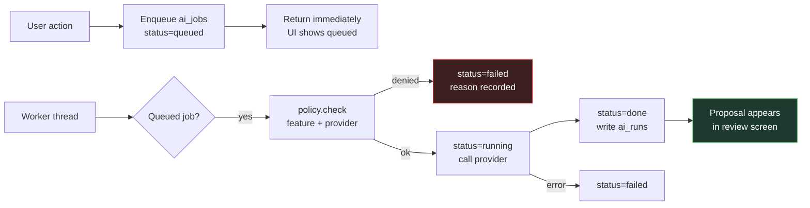

# PersonalOS — AI Subsystem

Local model hosting, provider abstraction, the data-boundary policy, the request queue, and the AI features.

**Two rules govern everything here:**

1. **The model never writes to the database.** Every output is a proposal in a review screen.
2. **Fallback never crosses a data boundary.** A dead local provider fails the job; it does not silently escalate to a cloud one.

---

## 1. Why a Separate Process

The model host runs as its own process speaking an OpenAI-compatible API, not as a library imported into Flask.

```
┌─ personalos_ai.py serve ────────────┐      ┌─ PersonalOS (Flask) ──┐
│  127.0.0.1:5151                     │◀─────│  app/core/ai/client   │
│  /v1/models                         │ HTTP │  base_url from        │
│  /v1/chat/completions  (SSE stream) │      │  ai_providers         │
│  /v1/embeddings                     │      └───────────────────────┘
│  /healthz                           │
│  ── ONNX Runtime GenAI ─────────────│      Model stays resident
│     Phi-4-mini INT4    ~2.5 GB      │      across Flask restarts
│     bge-small-en-v1.5  ~130 MB      │
└─────────────────────────────────────┘
```

| Reason | Consequence of not doing it |
|---|---|
| A 2.5GB load takes 5–20s | Flask workers block on startup and on model switch |
| Generation is long-running | A runaway generation takes the web app down with it |
| Model stays warm across restarts | Every code edit costs a full model reload |
| Speaks a standard API | Approving Ollama or LM Studio later would be a rewrite instead of a settings change |

That last row is the strategic one. Because the contract is the OpenAI API, the built-in server is just the default implementation of it.

---

## 2. Backends

| Backend | Install | Models | Status |
|---|---|---|---|
| `onnxruntime-genai` | Pre-built wheels, **no compiler** | ONNX-converted (Phi, Qwen, Llama) | **Primary** |
| `llama-cpp-python` | Often a source build on Windows | Any GGUF | Optional, if a wheel exists |
| `fastembed` | Pre-built wheels | ONNX embedding models | Embeddings |

ONNX Runtime is primary because the constraint is *pip works, compilers do not*. `llama-cpp-python` frequently falls back to a CMake/MSVC build on Windows, which that constraint rules out.

Backend selection is at runtime: whichever provider module imports successfully wins, in configured priority order. `preflight.py` reports what the machine actually supports rather than guessing.

### Model tiers for CPU-only, 16GB

| Tier | Model | Size | Use |
|---|---|---|---|
| `small` | Phi-4-mini-instruct INT4 | ~2.5 GB | Extraction, classification, triage |
| `large` | Qwen2.5-7B-Instruct INT4 | ~4.7 GB | Drafting, where quality matters more than latency |
| `embedding` | bge-small-en-v1.5 | ~130 MB | Semantic search |

A `small` and an `embedding` model stay resident together comfortably. Per-task routing means extraction uses the fast model while drafting can use the larger one.

### Honest performance expectations

At roughly 5–15 tokens/sec on CPU with a 3–4B model:

| Feature | Verdict |
|---|---|
| Semantic search | **Excellent** — embeddings are cheap; small models are genuinely strong at retrieval |
| Extraction, classification, triage | **Good** — short structured outputs, and the schema constrains the task |
| Long-form drafting | **Weakest** — a 500-token status report takes 30–100s and will need editing |

Build all four features, but expect retrieval and extraction to earn their keep well before drafting does.

---

## 3. Provider Abstraction

```
app/core/ai/
├── client.py            AIRequest / AIResponse — the only shape features see
├── registry.py          provider selection, task routing, fallback chain
├── policy.py            boundary enforcement
├── jobs.py              durable queue + worker
├── catalog.yaml         model catalog with checksums
├── providers/
│   ├── openai_compat.py local server · Ollama · LM Studio · vLLM
│   ├── anthropic.py     Claude — Messages API
│   ├── google.py        Gemini — generateContent
│   └── null.py          AI disabled; satisfies the interface, returns nothing
└── prompts/             versioned templates
```

### The internal contract

```python
@dataclass
class AIRequest:
    feature_key: str
    system: str | None
    messages: list[dict]
    max_tokens: int = 1024
    temperature: float = 0.2
    response_schema: dict | None = None   # structured output when supported
    stream: bool = False

@dataclass
class AIResponse:
    text: str
    structured: dict | None
    tokens_in: int
    tokens_out: int
    provider_key: str
    model_key: str
    boundary: str
    latency_ms: int
```

Features never see a vendor shape. Each adapter translates — Anthropic's `system` is a top-level parameter rather than a message, Gemini uses `contents` with `parts`, OpenAI-compatible uses `messages`. Roughly forty lines each, and **no vendor SDK**: both cloud APIs are plain REST over `requests`, which keeps two dependency trees and their version churn out of the project.

### Capability declaration

Each provider declares what it supports:

```json
{"streaming": true, "embeddings": true, "structured_output": false,
 "vision": false, "context_window": 4096}
```

The registry **refuses to route** a task to a provider that cannot serve it, rather than discovering the failure mid-call.

### Routing

| Task prefix | Default |
|---|---|
| `extract.*`, `triage.*` | local, `small` tier |
| `draft.*` | local, `large` tier if present, else `small` |
| `embed.*` | **local, always — enforced in code** |

Per-feature overrides in Admin via `ai_feature_policy`.

### Fallback

Fallback chains operate **within a boundary, never across one**.

```python
for provider in chain:
    if provider.boundary not in policy.allowed_boundaries(feature_key):
        continue                      # never escalate past policy
    try:
        return provider.complete(request)
    except ProviderUnavailable:
        continue
raise AIUnavailable(feature_key)      # visible failure, not a silent upgrade
```

> Silent escalation from a dead local model to a cloud provider is the one failure mode that would quietly turn a confidentiality guarantee into a breach. **The code path must not exist.**

---

## 4. Data Boundary Policy

### Classification

| Boundary | Meaning |
|---|---|
| `local` | Never leaves the machine |
| `external:<vendor>` | Leaves the machine, to a named vendor |

`boundary` appears on three tables, and the repetition is deliberate:

| Table | Records |
|---|---|
| `ai_providers.boundary` | what a provider **is** |
| `ai_feature_policy.max_boundary` | what a feature is **allowed** to use |
| `ai_runs.boundary` | what actually **happened** |

The gap between the second and third is the audit. It answers "did client data leave this machine, and to whom" from recorded fact rather than from configuration you hope was correct at the time.

### Defaults

All features seed `max_boundary = 'local'` and `is_enabled = 0`.

| Feature | Default | Notes |
|---|---|---|
| `triage.email` | local | Reads client correspondence |
| `triage.meeting` | local | Reads client meeting content |
| `extract.meeting_notes` | local | Reads client meeting content |
| `draft.status_report` | local | Reads engagement financials |
| `draft.comms` | local | Reads stakeholder context |
| `search.semantic` | local | Queries the vault |
| `embed.notes` | **local — hard-pinned** | Not merely defaulted; see below |

Raising a feature's boundary is a per-feature action in Admin behind a confirmation naming exactly what would be sent.

### Why embeddings are pinned rather than defaulted

Embedding the vault sends **every note in it**, not a selected excerpt. There is no scenario in which that is an acceptable side effect of a configuration change, so `embed.*` rejects a non-local provider in `policy.py` regardless of settings.

### Visibility

A **boundary badge** appears before every AI action, on every queue row, and in every run record. It sits in the same visual family as status and priority badges — a normal, visible property of a request rather than something you have to go looking for.

### Secrets and proxies

API keys live in `app/data/secrets.json`, referenced by `ai_providers.key_ref`. **No key is ever stored in the database**, logged, or rendered — masked in the UI.

`HTTPS_PROXY` and `REQUESTS_CA_BUNDLE` are honoured. The connectivity diagnostic reports which providers are actually reachable.

---

## 5. The Job Queue

Generation is long-running, so nothing blocks a request.



**One worker thread by default.** CPU inference serialises anyway; concurrency would only thrash a 16GB machine. Configurable higher for cloud-only workloads where parallelism genuinely helps.

Jobs are durable rows, so a crash or restart resumes the queue rather than losing it. Cancellation sets `status = 'cancelled'`; a running job is checked at token boundaries.

---

## 6. The Queue Page

One screen serving as both operations console and audit view — "what is my model doing" and "what has been sent where" are the same question asked twice.

**Table:** queued-at · feature · task · target record (linked) · provider with **boundary badge** · model · status · duration · tokens in/out · cost

**Aggregate strip:** queued / running / failed counts · average latency by provider · token and spend totals by provider and month

**Row expand:** the rendered prompt with template name and version, and the full response.

**Actions:** cancel · retry · retry with a different provider or model · delete

**Live output:** running jobs stream via SSE. At 5–15 tok/s this matters more than it sounds — a generation that shows text appearing is working; the same generation behind a spinner looks hung.

**Cost:** `ai_models.price_in_per_mtok` / `price_out_per_mtok` × token counts. Local models cost zero, which makes the local-versus-cloud tradeoff visible rather than theoretical.

---

## 7. Prompts

Versioned files on disk under `app/core/ai/prompts/`:

```
prompts/
├── triage.email.v1.md
├── extract.meeting_notes.v1.md
├── draft.status_report.v1.md
└── draft.comms.v1.md
```

Jinja2-rendered with an explicit context. `ai_runs` records template name and version, so any output can be traced to the exact prompt that produced it — and a prompt change is a new version file, never an edit in place.

### Structured output

Extraction prompts request JSON against a schema. Where the provider supports structured output natively, use it; otherwise instruct in-prompt and validate on return.

**A response that fails schema validation is a failed job, not a partial write.** Retry once with a repair instruction, then fail visibly.

---

## 8. Features

All four produce **proposals**, never writes.

### 8.1 Email and meeting triage

Input: subject, sender, date, body excerpt, plus candidate projects and charge codes for grounding.

Output: proposed task title, owner, due date, project, charge code · extracted dates · a suggested reply draft.

Review screen presents each element with accept/reject. Accepting creates the real record through the normal path, so validation, activity logging and links all behave identically to manual creation.

### 8.2 Meeting notes → structured records

Input: raw notes, plus the meeting's attendee list.

Output: decisions · action items with owner and date · candidate RAID entries.

Presented as a checklist. This is the highest-value extraction task in the application — it converts the worst part of running meetings into a review task.

### 8.3 Semantic vault search

`note_embeddings` holds float32 vectors as SQLite blobs; scoring is a numpy cosine pass. For a personal vault this is sub-100ms and needs no vector database.

Chunking: ~512 tokens with ~64 token overlap, split on heading boundaries where possible so a chunk rarely straddles two topics.

Merged with FTS5 (`NOTES_VAULT_SPEC.md` §7). Each result shows which engine matched it.

`sqlite-vec` is noted as an optional upgrade if the vault ever outgrows brute force — it will not soon.

### 8.4 Status and comms drafting

**The safest use, because the model sources nothing.** The generator assembles RAG, milestones, budget variance, RAID items and stakeholder context from live queries, then asks the model to turn *assembled facts* into prose.

The prompt contains the numbers. The model is never asked to compute, recall or infer one.

Output lands in the editor for revision before it is saved to the project folder as a status note.

---

## 9. Safety Rules

| Rule | Enforcement |
|---|---|
| No direct database writes | No AI code path calls a write model function; proposals go to review screens |
| Nothing blocks a request | All generation through `ai_jobs` |
| Never sources numbers | Grounding prompts contain the figures; verified in prompt review |
| Off by default | `ai_enabled = 0`; every feature disabled at seed |
| Degrades to nothing | `null` provider satisfies the interface; every flow has a manual path |
| Provably local | `health_check.py` asserts the server binds `127.0.0.1` |
| Fully audited | Every call writes `ai_runs` with provider, boundary and vendor |
| No key leakage | Keys in `secrets.json`, never in DB, logs, or HTML |

---

## 10. Preflight

`preflight.py` — run on the Windows machine **before committing to Phase 20**.

Reports:

1. Python version and architecture
2. Which of `onnxruntime-genai`, `llama-cpp-python`, `fastembed`, `numpy` import successfully
3. Whether installing them requires a compiler
4. Available RAM and CPU count; GPU/DirectML availability
5. Whether `huggingface.co` is reachable through the proxy
6. A short timed generation, if a model is present → measured tokens/sec

Output is a table plus a recommended model tier. **This is the one part of the design resting on an environment that could not be inspected during specification** — wheel availability and proxy reachability are informed expectation, not verified fact. Verify before building.

---

## 11. Adding a Provider

1. New module in `providers/` implementing `complete()`, `embed()`, `capabilities()`
2. Translate `AIRequest` → vendor shape and vendor response → `AIResponse`
3. Register a row in `ai_providers` with the correct `boundary`
4. Add models to `ai_models` with pricing if metered
5. Add a `key_ref` entry to `secrets.json` if authenticated
6. Confirm it appears in the connectivity diagnostic
7. Run the interface conformance test against a stub

No feature code changes. That is the point of the abstraction.
