# PersonalOS — Build Sequence

24 phases. Each lists its migration, what gets built, and a manual acceptance checklist.

**Milestone 1 is Phase 4** — the first point where the application is genuinely useful day to day, and the right moment to judge whether the object grammar, navigation and keyboard layer feel right before that shape is replicated across twenty more modules.

There is no automated test suite. Validation is `health_check.py` plus the checklist for the phase.

## Every phase ends the same way

Before marking any phase complete:

1. `python health_check.py` exits 0
2. `python run.py` starts with no traceback
3. Affected pages load; no 500s in the log
4. The phase checklist below is walked
5. The **Key Principles checklist** in `CLAUDE.md` passes for any new UI
6. Docs updated — `DATABASE_SCHEMA.md` (with its mermaid diagram) if schema changed, `PersonalOS_Spec.md` if behaviour changed, this file's phase marked done

---

## Phase Map

```mermaid
flowchart LR
    subgraph M1["Milestone 1 — usable app"]
        P0[0 Foundation] --> P1[1 People]
        P1 --> P2[2 Work]
        P2 --> P3[3 Notes Vault]
        P3 --> P4[4 Tasks + Command Center]
    end
    subgraph M2["Milestone 2 — time &amp; comms"]
        P4 --> P5[5 Calendar]
        P5 --> P6[6 Outlook + Meetings]
        P6 --> P7[7 Intake + GAL]
        P7 --> P8[8 Timeline]
        P8 --> P9[9 Budgets]
    end
    subgraph M3["Milestone 3 — resources"]
        P9 --> P10[10 Smartsheet]
        P10 --> P11[11 Assignments]
        P11 --> P12[12 Skills + Coverage]
        P12 --> P13[13 Staffing Board]
    end
    subgraph M4["Milestone 4 — governance &amp; programs"]
        P13 --> P14[14 RAID + Stakeholders]
        P14 --> P15[15 Comms + Status]
        P15 --> P16[16 Templates]
        P16 --> P17[17 Performance]
        P17 --> P18[18 Training]
        P18 --> P19[19 Innovation]
    end
    subgraph M5["Milestone 5 — AI &amp; polish"]
        P19 --> P20[20 AI infra]
        P20 --> P21[21 AI features]
        P21 --> P22[22 Admin + CC v2]
        P22 --> P23[23 Quick Steps]
    end

    style P4 fill:#1e3a5f,stroke:#4a9eff,color:#fff
    style P13 fill:#1e3a5f,stroke:#4a9eff,color:#fff
    style P23 fill:#2a2f36,stroke:#8b98a5,color:#fff
```

---

## Module Registry Map

Every module in the IA (`PersonalOS_Spec.md` §5), its `module_key`, and the phase that builds it. This table **is** the `module_registry` seed.

| module_key | Label | Nav group | URL prefix | Phase |
|---|---|---|---|---|
| `command_center` | Command Center | Command | `/` | 0 / 4 |
| `tasks` | Tasks | Command | `/tasks` | 4 |
| `calendar` | Calendar | Command | `/calendar` | 5 |
| `portfolios` | Portfolios | Work | `/portfolios` | 2 |
| `projects` | Projects & Workstreams | Work | `/projects` | 2 |
| `timeline` | Portfolio Timeline | Work | `/timeline` | 8 |
| `milestones` | Milestones | Work | `/milestones` | 8 |
| `templates` | Template Library | Work | `/templates` | 16 |
| `raid` | RAID & Decisions | Governance | `/raid` | 14 |
| `stakeholders` | Stakeholders | Governance | `/stakeholders` | 14 |
| `changes` | Change Control | Governance | `/changes` | 14 |
| `status_reports` | Status Reports | Governance | `/status` | 15 |
| `charge_codes` | Charge Codes | Money | `/charge-codes` | 2 |
| `rates` | Budgets & Rates | Money | `/rates` | 1 / 9 |
| `time_import` | Time Import | Money | `/time-import` | 9 |
| `financials` | Financial Analysis | Money | `/financials` | 9 |
| `staffing_board` | Staffing Board | Resources | `/staffing` | 13 |
| `morning_report` | Morning Report | Resources | `/morning-report` | 13 |
| `horizon` | Resource Horizon | Resources | `/horizon` | 11 |
| `assignments` | Assignments | Resources | `/assignments` | 11 |
| `skills` | Skills | Resources | `/skills` | 12 |
| `pipeline` | Pipeline & Demand | Resources | `/pipeline` | 10 |
| `notes` | Notes Vault | Knowledge | `/notes` | 3 |
| `search` | Search | Knowledge | `/search` | 3 / 21 |
| `people` | **Contacts** | People | `/people` | 1 |
| `org_chart` | Org Chart | People | `/org-chart` | 1 |
| `performance` | Performance | People | `/performance` | 17 |
| `training` | Training | People | `/training` | 18 |
| `innovation` | Innovation Network | People | `/innovation` | 19 |
| `email_intake` | Email Intake | Intake | `/intake` | 7 |
| `meeting_import` | Meeting Import | Intake | `/meetings` | 6 |
| `gal_sync` | GAL Sync | Intake | `/gal` | 1 |
| `smartsheet_sync` | Smartsheet Sync | Intake | `/smartsheet` | 10 |
| `drafts` | Draft Center | Intake | `/drafts` | 7 |
| `admin` | Admin | System | `/admin` | 22 |
| `ai_models` | AI Providers & Models | System | `/ai/models` | 20 |
| `ai_queue` | AI Queue | System | `/ai/queue` | 20 |
| `backups` | Backups | System | `/backups` | 22 |
| `activity` | Activity Log | System | `/activity` | 0 |
| `help` | Help | System | `/help` | 22 |

**Note the label/key split:** the module_key is `people` but the nav label is **Contacts**, because that is what a Public Accountant calls it (P9). The registry stores both; code uses the key, the sidebar shows the label.

Modules with two phases are built in stages — `rates` gets its rate cards at Phase 1 and its budget views at Phase 9; `search` gets FTS5 at Phase 3 and semantic search at Phase 21.

A module registers as **disabled** until its phase lands, so the sidebar only ever shows what works.

---

# Milestone 1 — A Usable Application

## Phase 0 — Foundation · **BUILT**

**Migration:** `0001_init.sql` — 5 tables, 40 module rows, 17 settings, 11 option sets

**Prerequisite, done first:** relocate the tree to a Windows path (`C:\Users\bsims\PersonalOS`) and verify Windows-native Python runs it. Development continues in the WSL repo; git is the sync mechanism. `app/data/` is gitignored and exists only on the Windows side.

**Build**

- `run.py`, `requirements.txt`, `.gitignore`, `Start PersonalOS.bat`
- `app/__init__.py` — `create_app()` factory, blueprint registration, teardown, same-origin guard, security headers
- `app/core/database.py` — `get_db()`, migration runner with `PRAGMA user_version`, **pre-migration backup that aborts the migration if the backup fails**
- `app/core/backup.py`, `config.py`, `module_registry.py`, `links.py`, `activity.py`, `paths.py`, `formatting.py`, `shell.py`
- `app/templates/base.html` + `partials/_nav.html`, `_topbar.html`, `_flash.html`, `_breadcrumb.html`, `_palette.html`, `_hotkeys.html`, `_empty_state.html`, **`_object_page.html`** (the object grammar shell)
- `app/static/vendor/bootstrap/`, `app/static/css/personalos.css` with the full token set, dark-first
- `app/static/js/palette.js` — command palette · `app.js` — hotkey registry and `?` overlay · `tables.js` — sort/filter/export
- `health_check.py` — DB, tables, config, blueprint imports, **asserts the app binds `127.0.0.1` only**
- `apply_migrations.py`, `vendor_assets.py`
- **`command_center`** — placeholder showing build state, replaced at Phase 4
- **`activity`** — pulled forward from Phase 22. The `activity_log` table exists from `0001`, and rule 13 ("activity log every mutation") cannot be verified during Phases 1–4 without somewhere to read it. It also gives the shell a second module, which is what makes the enable/disable behaviour testable at all.

**Two deviations from the original plan, both deliberate:**

- **Maintenance scripts sit at the repository root**, not in `scripts/`. Each is a single self-contained file invoked as `python <name>.py`, and `verify_docs.py` already lived there.
- **Bootstrap is fetched by `vendor_assets.py`, not committed by hand.** A managed laptop's proxy usually blocks jsdelivr, so `--from <folder>` copies files downloaded elsewhere — the same manual-first pattern as the model installer. `personalos.css` styles the entire shell on its own, so the application looks correct before Bootstrap arrives and the icon font degrades to letter placeholders.

**Acceptance**

- [x] `0001_init.sql` executes; 5 tables, 40 modules, 17 settings, 11 option sets
- [x] Registry seed matches this document's Module Registry Map exactly, key for key
- [x] Fresh database migrates to version 1; re-running is a no-op
- [x] Deliberately break the backup path → migration **refuses to run**, says why, and leaves `user_version` and the schema untouched
- [x] A migration that fails half-way rolls back completely — no partial tables
- [x] A misnamed migration, a duplicate version number, and a migration carrying its own `COMMIT` are each refused with a specific message
- [x] A backup is restorable: reopening the copy reads all 40 module rows
- [x] Path confinement rejects `../`, absolute paths, and `..\` on both platforms
- [x] Slugs handle `CON`, `COM4`, illegal characters, trailing dots and collisions
- [x] Money and hours round half-up via `Decimal`, negatives in parentheses, nulls as `—`
- [x] Every template compiles; no template uses `| safe`
- [x] The object grammar renders all five bands; a page with no primary action is flagged visibly
- [x] No SQL is assembled by interpolation anywhere in `app/`
- [ ] `python run.py` opens `127.0.0.1:5000` and renders the shell
- [ ] `personalos.db` created on first run; `PRAGMA user_version` = 1
- [ ] Sidebar renders nav groups from `module_registry`; disabling a module hides it and its routes 404
- [ ] `Ctrl-K` opens the palette; `?` lists every binding; `g`+`c` navigates
- [ ] Theme toggle persists and applies before first paint — no flash of light theme
- [ ] `health_check.py` exits 0
- [ ] Tab through the shell — every interactive element shows a visible focus ring

> The unticked items need a running Flask, which needs `pip install -r requirements.txt` on a machine that can reach PyPI. Everything above them was verified offline.

---

## Phase 1 — People, Levels & Rates · **BUILT**

**Migrations:** `0002_people.sql`, `0003_rates.sql`, `0007_imports.sql`

**Build**

- `people` module: list (sortable, filterable, exportable), detail on the object grammar, create/edit
- Seed `person_levels` — the **9 rate card levels**, including the two tenure splits with `auto_promote_after_months` (36 / 60) — and `job_title_map` (13 rows) per `DATABASE_SCHEMA.md`
- **Excel seed importer** — label-driven `openpyxl` parse of `AASppl.xlsx`, dedup on `email`, preview-then-commit wizard, `import_batches` row. **A one-time load, run by hand:** nothing reads a spreadsheet at startup or on a schedule, and `UNIQUE (batch_type, file_sha256)` makes a repeat load a database-level refusal rather than a convention
- `person_level_history` editor; promotions as dated rows, maintaining `people.level_start_date` and `people.last_promoted_on` on write
- `person_capacity`, `person_status_events`
- **GAL enrichment** — `_helper_gal.py` subprocess, attribute map to conformed columns
- **Manager chain resolver** — queued job: resolve `manager_email` → `manager_person_id`, auto-import missing managers with depth cap, cycle detection, `import_source='gal_manager_chain'`
- **Org chart** — recursive CTE reports: chain up, downline, direct reports, span of control, rendered tree
- `rate_cards` (standard and negotiated), `rate_card_entries`, `person_rate_overrides` CRUD
- `app/core/rates.py` — `resolve_rates()` returning standard rate, ERP %, engagement rate and cost rate
- **Tenure transition check** — surface people at or past 36 months as Director / 60 months as Partner

**Acceptance**

- [x] The importer reads all **450 rows** of `AASppl.xlsx`, matches all 13 columns by header text, and ignores none
- [x] Empty `Home Phone` and `Manager Email` columns import as `NULL` without error
- [x] All **13 observed job titles** are covered by the `job_title_map` seed — nobody imports unpriced through a missing mapping
- [x] `resolve_rates()` reproduces the promotion example from `FINANCIAL_MODEL.md` §2 **exactly**: $242.25 before 1 April, $318.75 after, on a single history row
- [x] ERP reduces the bill rate and **leaves the cost rate untouched** ($162.00 either side)
- [x] 8 hours on 1 April prices at $2,550.00 revenue and $1,296.00 cost
- [x] A person past 36 months as Director is flagged, with the right target level and due date, and is **not** auto-promoted
- [x] Passing a `as_of` before the threshold does not flag them — the date is a parameter, not `date.today()`
- [x] Recording a promotion updates **both** `level_start_date` and `last_promoted_on`
- [x] Recording a `correction` updates `level_start_date` but **leaves `last_promoted_on` alone**
- [x] An unpriced person returns `None`, **not zero**; pricing their hours returns `None`, not `0.00`
- [x] A `Contractor` with no rate card row prices as unpriced; adding a person-level override prices them
- [x] `level_at()` reads `person_level_history`, not the denormalised column
- [x] Loading `AASppl.xlsx` creates **450 people**, every one levelled from job title, and writes one `import_batches` row
- [x] Re-loading the same file is refused — the preview says when it was loaded, the commit button is disabled, and a forced commit rolls back on the unique constraint
- [x] A **genuinely refreshed** extract still loads: 1 new person and 1 changed field, 451 people total, not 901
- [x] Nothing reads a spreadsheet at startup — the seed file is named in the importer and nowhere else
- [ ] Person page shows job title, mapped level, function, company
- [ ] GAL sync on one person fills phone, city, state, manager email *(Phase 1 remainder — needs Outlook)*
- [ ] Manager chain: a person whose manager is absent triggers auto-import; the new record is tagged `gal_manager_chain` *(needs Outlook)*
- [ ] Chain walk stops at the depth cap and does **not** loop on a circular reference
- [ ] Org chart renders; span of control is correct for a known manager
- [ ] A project with a negotiated card uses card rates directly

> **Not built in this pass:** GAL enrichment and the manager-chain walk. Both
> need Outlook COM, which is unreachable from the development environment, and
> the seed file's `Manager Email` column is empty — so there is nothing to
> resolve until GAL runs. The resolver that matches an existing
> `manager_email` to a person **is** built and wired to a button; the recursive
> CTEs behind the org chart are built and bounded against cycles.

---

## Phase 2 — Portfolios, Projects, Workstreams & Charge Codes · **BUILT**

**Migration:** `0004_work.sql`

**Build**

- Seed 4 portfolios; seed `service_offering` and `project_type` config options
- `projects` module — list, object-grammar detail with tabs (Overview, Workstreams, Charge Codes, Team, Notes)
- `workstreams` nested under project
- **`charge_codes`** — CRUD, status lifecycle, per-code leadership with project fallback
- **Folder provisioning** — creating a project creates `projects/<Portfolio>/<Project-Slug>/`; creating a workstream creates its subfolder. Slugs handle Windows reserved names (`CON`, `PRN`, `AUX`, `NUL`), illegal characters, and path length
- Rename-with-move, preserving folder contents
- "Open folder in Explorer" action
- **`locations`** — physical sites with building, floor, room, access and logistics notes; linked to workstreams via `entity_links`
- **`work_resources`** — pointers to folders, files, scripts, repos, chat channels and email threads, classified by `resource_role` (input / working / output / communication / reference). **Paths only, never contents.** Includes a "verify resources" action that checks local paths and records `verify_status`
- **`dependencies`** — directional, with `from_workstream_id` (needs) and either `to_workstream_id` (internal) or `external_party`. Inbound and outbound views per workstream

**Acceptance**

- [x] Create a project → folder appears on disk at the right path, with `meetings/`, `attachments/` and `status/` inside
- [x] Create a workstream → subfolder appears inside the project folder
- [x] Rename a project → **folder moves, contents intact**, subfolders survive, `folder_path` updated
- [x] A second project with a colliding name gets its own folder, not a clash
- [x] Try to name a project `CON`, `COM4`, `Q1/Q2: Review*` or a trailing dot → slug is sanitised, no crash
- [x] A path escaping the vault root — `../`, absolute, or `..\` — is rejected on both platforms
- [ ] A project with three charge codes under different partners displays each correctly; a null code-level partner falls back to the project's
- [ ] Charge code list filters by status; closed codes are hidden from booking pickers
- [ ] Archive a project → it disappears from active lists, folder is **not** deleted
- [ ] Add a location with building/floor/room and access notes; link it to two workstreams
- [ ] Add work resources of each role; "verify resources" marks a deleted local path as `missing` and a URL as `not_verifiable`
- [ ] Create a cross-workstream dependency; it appears as **inbound** on the needing workstream and **outbound** on the providing one
- [ ] Create a dependency on an external party (no `to_workstream_id`) — renders correctly in both views

---

## Phase 3 — Notes Vault · **BUILT**

**Migration:** `0005_notes.sql`

**Build**

- Seed `vault_roots`: `projects` (writable), `docs` (writable), `template_library` (read-only)
- `app/core/notes_index.py` — mtime + SHA-256 walker, frontmatter parse, link extraction, FTS5 sync
- `reindex_notes.py`
- Markdown renderer — server-side `markdown` + `nh3`, single renderer for both preview and read view
- **Editor** — split edit/preview, debounced preview via server endpoint, `[[` autocomplete over notes *and* records
- Wikilink grammar: `[[note]]`, `[[folder/note|alias]]`, typed record links `[[project:slug]]`, `[[task:412]]`, `[[person:Name]]`, `[[charge:CODE]]`
- Backlinks panel on notes **and** on project/workstream/person pages
- Unresolved-links report
- FTS5 search with snippet highlighting
- Path confinement enforced on every read and write
- **Managed blocks** (`NOTES_VAULT_SPEC.md` §5A) — `<!-- personalos:team -->` regions refreshed from live data, with exact-match marker parsing, hash check before write, and graceful placeholders when the source data does not exist yet
- **Workstream charter** — generated automatically on workstream create from the built-in start-up template, with all live blocks wired

**Acceptance**

- [x] Frontmatter, wikilinks and tags parse; links and tags **inside code fences are ignored**
- [x] Typed record links classify correctly — `project:`, `person:`, `charge:`, `task:`
- [x] An unknown namespace is treated as plain text, not an error
- [x] Attempt a path traversal (`../../etc/passwd`) → rejected
- [x] Write prose between two managed blocks, refresh → **the prose is byte-for-byte unchanged**
- [x] Remove a block's closing marker → block is skipped and reported; the file is **not** corrupted
- [x] A managed-block marker inside a fenced code block is **not** treated as a block
- [x] Marker parsing works against CRLF line endings
- [x] The renderer returns sanitised `Markup`, so no template marks content trusted
- [ ] Create a note in the app → `.md` file appears on disk with correct frontmatter
- [ ] Edit the file in VS Code → rescan picks up the change, index updates
- [ ] `[[project:acme-sell-side]]` resolves and appears in the project page's backlinks
- [ ] A wikilink to a non-existent note shows as unresolved and appears in the report
- [ ] Search finds text inside a note body
- [ ] `docs/DATABASE_SCHEMA.md` is browsable and editable in-app
- [ ] Delete a file on disk → rescan marks the note missing rather than crashing
- [ ] Refresh with no team assigned → placeholder text, not an empty table or an error
- [ ] Editing a note whose file changed on disk underneath is **refused**, not clobbered

> **Not built in this pass:** the workstream charter is generated on demand
> rather than automatically on workstream create — the template and its live
> blocks exist and refresh correctly, but wiring generation into the create
> path is deferred so the block engine could be verified on its own first.

---

## Phase 4 — Tasks & Command Center v1 · **MILESTONE 1** · **BUILT**

**Migration:** `0006_tasks.sql`

**Build**

- `tasks` module — list with bulk multi-select, object-grammar detail, quick-add
- Task types, statuses, priorities; project / workstream / charge-code / assignee binding
- `task_recurrences` with RRULE via `python-dateutil`
- **Command Center** — action strip and zones per `PersonalOS_Spec.md` §6.1, every number a live query
- "My Active Charge Codes" card
- Traceable-number drawer component (`UI_DESIGN_SYSTEM.md` §3.6) — first real use
- Quick-capture from the palette

**Acceptance**

- [x] Overdue, due-today, due-this-week, blocked and open counts are correct against hand-checked data
- [x] Changing `as_of` changes what counts as overdue — the date is a parameter throughout
- [x] Completed tasks are excluded from open counts
- [x] Every action-strip number is a link to the filtered list behind it
- [ ] Create a task from a project → project, workstream and charge code **pre-filled** (P8)
- [ ] A recurring task regenerates on completion at the right next date *(needs python-dateutil, absent from the build sandbox)*
- [ ] Command Center loads in under 200ms with realistic data
- [ ] "My Active Charge Codes" lists only `active` codes
- [ ] Bulk-select five tasks, change status in one action, get a **specific** confirmation naming the count
- [ ] Whole flow — create project, add workstream, add charge code, add task, complete it — is possible **without touching the mouse**

> **Stop here and review.** This is the shape everything else inherits.

---

# Milestone 2 — Time & Communication

## Phase 5 — Calendar Engine

**Migration:** `0009_calendar.sql`

**Build**

- `calendar_events`, occurrence expansion into `calendar_event_occurrences` over a rolling horizon, `calendar_exceptions`
- RRULE builder UI — daily/weekly/monthly/yearly, interval, count/until, weekday selection
- Calendar views: month, week, agenda
- Per-occurrence complete / skip / move
- In-app reminders surfaced on the Command Center
- `/calendar.ics` read-only feed

**Acceptance**

- [ ] A weekly recurring reminder expands correctly across a DST boundary
- [ ] Completing one occurrence does not affect the series
- [ ] Moving one occurrence writes a `calendar_exceptions` row and the series is otherwise unchanged
- [ ] `until` and `count` both terminate the series correctly
- [ ] The `.ics` feed validates and opens in a calendar client

---

## Phase 6 — Outlook Calendar & Meetings

**Migration:** `0010_meetings.sql`

**Build**

- `app/integrations/outlook/client.py` — subprocess runner with timeouts, JSON parsing, graceful degradation when `pywin32` is absent
- `_helper_calendar.py` — read a date range, dedup by `EntryID`, change-detect by `LastModificationTime`
- `_helper_write_events.py` — create the `PersonalOS` calendar folder, write **zero-attendee** appointments, stamp `UserProperties["PersonalOSId"]`, set `ReminderMinutesBeforeStart`
- `meetings` module — object grammar, prep fields, attendees, decisions, linked notes file
- Meeting → follow-up task generation
- Sync status UI and `outlook_sync_log`

**Acceptance**

- [ ] Import a week of real calendar items; recurring series dedup correctly
- [ ] Re-import → no duplicates
- [ ] A PersonalOS reminder appears in the `PersonalOS` Outlook folder with **zero attendees**
- [ ] Verify in Outlook that the written item cannot send an invitation
- [ ] Native Outlook reminder fires with PersonalOS closed
- [ ] Delete in PersonalOS → removed from Outlook; delete in Outlook → next sync re-creates it
- [ ] Uninstall/hide `pywin32` → Outlook features show a clear message and **nothing else breaks**
- [ ] Confirm `win32com` is never imported inside a Flask request

---

## Phase 7 — Email Intake, GAL Sync & Draft Center

**Migration:** `0011_intake.sql`

**Build**

- `_helper_mail.py` — metadata-only read over a folder and date range
- `emails`, `email_recipients`; opt-in body storage
- Triage actions → task, note, calendar event, draft reply
- `contact_candidates` — scraped addresses queued for review, promote with GAL enrichment
- `extracted_dates` — date detection with promote-to-task/milestone
- Draft Center — compose, `Display()` in Outlook, **never `Send()`**

**Acceptance**

- [ ] Import 20 emails; bodies are **not** stored unless opted in
- [ ] Triage one into a task; the task links back to the email
- [ ] A new sender appears in `contact_candidates`, **not** silently in `people`
- [ ] Promote a candidate → GAL enrichment fills attributes
- [ ] A draft opens in Outlook for review; grep the codebase to confirm no `.Send(` call exists
- [ ] An extracted date promotes to a task with the right due date

---

## Phase 8 — Milestones, Baselines & Portfolio Timeline

**Migration:** `0012_milestones.sql`

**Build**

- `milestones` with `is_major`, baseline/forecast/actual dates
- `baselines` with JSON snapshot and versioning
- `project_status_updates` with RAG history
- `app/core/health.py` — on-time computation
- **Portfolio Timeline** — server-rendered SVG, baseline-vs-forecast bars, major-milestone diamonds, status chips, horizon selector, today line, print stylesheet
- Drag a milestone to change `forecast_date`, with keyboard equivalent

**Acceptance**

- [ ] Timeline renders 20 projects legibly; expanding shows workstreams
- [ ] Only `is_major` milestones render as diamonds
- [ ] Approve a baseline, move a forecast date → schedule variance appears and the on-time chip changes
- [ ] Timeline prints landscape without clipping
- [ ] Drag a milestone → date updates; the same change is achievable by keyboard
- [ ] Schedule-variance figure is traceable to the milestones behind it

---

## Phase 9 — Rates, Budgets & Timesheet Import

**Migration:** `0013_financials.sql`

**Build**

- **Fee model** — `fee_types`, `fee_type_rules`, `project_fees`; seed admin 12%, tech 3%, Kinergy 8% Sell Side / 5% Buy Side; resolver on project create and project-type change; Admin UI for adding fee types
- `budget_lines` with `task_id` — **WBS-driven budgets**, hours × level per task priced at the engagement rate
- `budget_lines`, `expense_lines` CRUD at every grain
- `time_entries`, `import_batches`
- `app/integrations/timesheet/` — label-driven `openpyxl` parser, SHA-256 idempotency
- **Reconciliation queues** — unmatched charge codes, unrecognised people
- Import wizard: select → map → preview → commit
- Budget-to-actual views: burn, elapsed, burn ratio, EAC, margin, variance
- On-budget chip feeding the Timeline and Command Center
- Traceable drawers on every financial figure

**Acceptance**

- [ ] Import a real export; counts reconcile to the source file
- [ ] Re-import the identical file → no-op
- [ ] An unknown charge code lands in reconciliation and is **not** dropped
- [ ] Shift a column in the source file → parser still finds it by header
- [ ] Rates snapshot onto rows; editing a rate card afterward does **not** restate booked history
- [ ] Hours spanning a promotion price at two different rates
- [ ] Every money figure formats as USD with parentheses for negatives; no currency selector anywhere
- [ ] Click burn % → drawer shows inputs, formula, and a link to the entries
- [ ] A Sell Side project resolves admin + tech + Kinergy 8%; a Buy Side project resolves Kinergy 5%; an internal project resolves neither
- [ ] Fee totals match the worked example in `FINANCIAL_MODEL.md` §4 exactly
- [ ] Change a `fee_types` default rate → **existing projects are unaffected**; only new resolutions pick it up
- [ ] Add a brand-new fee type in Admin and see it apply to a new project **with no code change**
- [ ] A budget line traces to its WBS task, and shows standard rate × ERP = engagement rate

---

# Milestone 3 — Resources

## Phase 10 — Smartsheet Framework & Pipeline

**Migration:** `0014_smartsheet.sql`

**Build**

- `app/integrations/smartsheet/client.py` — `GET`-only, token from `secrets.json`, `HTTPS_PROXY` and custom CA support
- Admin column-mapping UI per source
- `pipeline_opportunities` sync and list
- `sync_runs` logging; divergence flagging
- Connectivity diagnostic
- `sync_smartsheet.py`

**Acceptance**

- [ ] Configure a sheet and map columns without code changes
- [ ] Sync upserts by `smartsheet_row_id`; re-sync is idempotent
- [ ] Edit a synced field locally, change it remotely → row flags as **diverged**, local value preserved
- [ ] Token never appears in logs, HTML, or error messages
- [ ] Confirm no `POST`/`PUT`/`DELETE` to `api.smartsheet.com` exists in the codebase
- [ ] Sync failure is reported clearly and does not corrupt prior data

---

## Phase 11 — Assignments & Resource Horizon

**Migration:** `0015_assignments.sql`

**Build**

- Roster and allocations sync from Smartsheet, feeding `people`, `person_status_events`, `weekly_allocations`
- `assignments` CRUD with extendable `end_date`
- `assignment_extensions` written on every extension
- `app/core/resourcing.py` — capacity, allocated, utilization, available
- **Resource Horizon** — person × week heat map, 4/8/12/26-week selector, demand overlay, drill-through
- Cliff detection in `health.py`

**Acceptance**

- [ ] Utilization matches a hand calculation for one person over four weeks
- [ ] Leave in `person_status_events` reduces that week's capacity
- [ ] Extend an assignment → `assignment_extensions` row written with prior and new end
- [ ] An assignment ending before its project's forecast end raises a **cliff** naming the week
- [ ] Horizon grid renders 50 people × 26 weeks without becoming unusable
- [ ] Utilization bands render with numerals, not colour alone

---

## Phase 12 — Skills, Staffing Requirements & Coverage

**Migration:** `0016_skills.sql`

**Build**

- `skills`, `person_skills`, `project_skill_requirements`
- `staffing_requirements` — the demand side
- Coverage computation in `resourcing.py`
- Skill-match query: who could fill this requirement
- Skill-gap detection

**Acceptance**

- [ ] A project needing 2.0 FTE with 1.5 assigned shows **75%** and trips the understaffed threshold
- [ ] Coverage recalculates when an assignment is added, extended or ended
- [ ] Skill match returns people at or above `min_proficiency`, ranked
- [ ] A requirement no one can meet surfaces as a skill gap
- [ ] Coverage figure is traceable to requirements and assignments

---

## Phase 13 — Master Staffing Board, Morning Report & Scenarios

**Migration:** `0017_scenarios.sql`

**Build**

- **Master Staffing Board** — left rail (daily summary + staff cards) and project tile grid per `PersonalOS_Spec.md` §6.3
- Project tiles: header image with deterministic fallback, badges, timeline strip, skill tags, coverage bar, avatars with allocation, burn chip, Assign Team
- Understaffed dashed border and label
- **Morning Report** — full-detail page sharing the rail's query
- `staffing_scenarios`; scenario selector; side-by-side comparison; apply-scenario transaction
- Drag person → tile; drag avatar between tiles; keyboard equivalents
- `alert_dismissals` and the notification bell

**Acceptance**

- [ ] Board renders 30 projects and 50 staff without lag
- [ ] Rail and Morning Report show identical numbers for the same person
- [ ] Drag a person onto a tile → Assign Team opens pre-filled; utilization preview shown before commit
- [ ] Same assignment is achievable entirely by keyboard
- [ ] Create a scenario, change staffing, compare → live plan unaffected until applied
- [ ] Apply a scenario → assignments promote to `scenario_id IS NULL` atomically
- [ ] Understaffed tiles are identifiable **without relying on colour**
- [ ] Bell count matches the underlying queries; dismissing persists

> **Second natural review point.** Requires your visual eye against the Stitch design.

---

# Milestone 4 — Governance & Programmes

## Phase 14 — RAID, Decisions, Stakeholders & Change Control

**Migration:** `0018_governance.sql`

**Build**

- `raid_items` with probability × impact → severity; register views per type
- `decisions` log
- `stakeholders` register; **power/interest grid**; contact cadence and overdue alerts
- `change_requests` with scope/schedule/hours/fee impact; approval creates a new `baselines` version

**Acceptance**

- [ ] Severity computes correctly and sorts the register
- [ ] Power/interest grid places stakeholders correctly in all four quadrants
- [ ] Overdue stakeholder contact appears on the Command Center
- [ ] Approving a change request creates baseline v2; variance now measures against it
- [ ] Prior baseline remains readable

---

## Phase 15 — Communications Plan & Status Reports

**Migration:** `0019_comms.sql`

**Build**

- `comms_plan_items` with RRULE; generates PersonalOS-owned calendar events
- **Status report generator** — assembles RAG, milestones, budget variance, RAID from live queries; renders markdown into the project folder

**Acceptance**

- [ ] A comms item creates a recurring calendar event in the PersonalOS folder
- [ ] Generated status report contains correct live figures
- [ ] Report is written as `.md` into the project folder and indexed by the vault
- [ ] Report prints cleanly

---

## Phase 16 — Template Library

**Migration:** `0020_templates.sql`

**Build**

- `template_library/` tree; indexer with validation
- Both parsers: `.xlsx` workbook (label-driven) and YAML/CSV pack
- Relative-date resolution: offsets, anchors, durations, dependencies, calendar-vs-working days
- Level → person mapping step; unstaffed roles become demand
- Budget pricing at import via `resolve_rates()`
- Note scaffold copy with placeholder substitution
- Governance starters and charge-code structure
- Five-stage wizard with dry-run diff; additive re-import
- **Workstream packs** (`pack_kind='workstream'`) — the charter becomes a versioned, customisable template; engagement-type variants override the shared default
- **Save-as-template** — generalise people to levels, dates to offsets

**Acceptance**

- [ ] Import a sell-side pack against a 1 March start → dated tasks, unstaffed level demand, priced budget lines
- [ ] Working-day flag shifts dates correctly across weekends
- [ ] Note scaffold copies with `{{project_name}}` substituted
- [ ] Re-import into the same project is additive, not duplicative
- [ ] Save an existing project as a template, then import it into a new one — round-trip holds
- [ ] Both pack formats produce identical results from equivalent content

---

## Phase 17 — Performance Management

**Migration:** `0021_performance.sql`

**Build**

- `performance_cycles` (seed current FY, Oct 1 – Sep 30), `performance_tracks`, `performance_items`
- Self track and counselee tracks
- Review builder — filtered, copy-paste-ready sections

**Acceptance**

- [ ] Create a counselee track; add goals, wins, feedback, 1:1 notes
- [ ] Review builder assembles a coherent draft from filtered items
- [ ] Items link to projects and tasks via `entity_links`
- [ ] Counselee relationship is independent of `manager_person_id` — verify with someone whose counsellor differs from their manager
- [ ] No field invites compensation or rating data

---

## Phase 18 — Training

**Migration:** `0022_training.sql`

**Build**

- `training_catalog`, `training_requirements`, `training_records`, `training_plans`
- Skill-gap → requirement generation
- Completion → `person_skills` proficiency update
- Team compliance dashboard; overdue feeds the Command Center

**Acceptance**

- [ ] An unmet project skill requirement generates a `skill_gap` training requirement
- [ ] Completing training raises proficiency and closes the gap
- [ ] Renewal months compute `expires_on`; expiring items surface before they lapse
- [ ] Compliance view shows the whole team, not just you

---

## Phase 19 — Innovation Network

**Migration:** `0023_innovation.sql`

**Build**

- `innovation_network_members`, `innovation_ideas`, `innovation_contributions`
- Idea funnel: idea → triage → pilot → scale → parked/rejected
- Promote idea to project in the Innovation portfolio

**Acceptance**

- [ ] Promote an idea → a project is created and `promoted_project_id` set
- [ ] The promoted project behaves like any other — milestones, budget, staffing
- [ ] Contribution history renders on a person's page

---

# Milestone 5 — AI & Polish

## Phase 20 — AI Infrastructure

**Migration:** `0024_ai.sql`

**Prerequisite:** run `preflight.py` on the Windows machine and confirm the wheels install without a compiler. **Do not start this phase until preflight passes.**

**Build**

- `preflight.py` — backend capability probe
- `personalos_ai.py serve` — OpenAI-compatible server: `/v1/models`, `/v1/chat/completions` (SSE), `/v1/embeddings`, `/healthz`
- `app/core/ai/` — `client.py`, `registry.py`, `policy.py`, `jobs.py`, `providers/`
- Model catalog, manual install scanner, checksum verification, install-sheet generator
- Boundary policy engine; `ai_feature_policy` seeded local-only and disabled
- Durable job queue and worker
- **AI Queue page** — operations console and audit view combined, with cost tracking

**Acceptance**

- [ ] `preflight.py` correctly reports available backends
- [ ] Manually place a model, scan, verify checksum, register
- [ ] Remove `model.onnx.data` → validator names **that specific file**
- [ ] Server generates text; Flask stays responsive during generation
- [ ] Restart Flask → model stays resident
- [ ] Queue page shows jobs live; cancel and retry work
- [ ] **Kill the local server with a local-only feature enabled → the job fails visibly and does not fall back to a cloud provider**
- [ ] `ai_runs` records provider, boundary and vendor for every call

---

## Phase 21 — AI Features & Cloud Adapters

**Build**

- Email and meeting triage → proposals with per-item accept/reject
- Meeting notes → structured records (decisions, actions, RAID candidates)
- Semantic vault search — `note_embeddings`, numpy cosine, merged with FTS5
- Status report and comms drafting — grounded on assembled facts
- Anthropic and Google adapters, built and **left dormant**

**Acceptance**

- [ ] Every AI output lands in a review screen; **nothing writes to the database directly**
- [ ] Reject a proposal → nothing persists
- [ ] Semantic search finds a note by meaning where keyword search fails
- [ ] `embed.notes` cannot be pointed at a cloud provider even by configuration
- [ ] Status drafting uses only assembled figures — verify it is never asked to source a number
- [ ] Cloud adapters pass an interface conformance test with a stub
- [ ] Disable AI entirely → every feature retains a working manual path

---

## Phase 22 — Admin, Backups, Help & Command Center v2

**Build**

- Admin: module registry toggles, config options, app settings, template management. The activity log viewer itself was built at Phase 0; what lands here is the Admin surface around it — retention, export and the entity-type filters that only make sense once every module is writing to it
- Backup management with retention
- Help pages
- Command Center v2 — full action strip with all alert sources
- Performance pass, print stylesheets, accessibility audit

**Acceptance**

- [ ] Every seeded taxonomy is editable in Admin without a migration
- [ ] Backups run at startup and manually; retention honoured
- [ ] Full accessibility sweep: contrast in both themes, focus rings, no colour-only state, keyboard reachability
- [ ] Command Center loads under 200ms with a full dataset

---

## Phase 23 — Quick Steps *(nice-to-have tier)*

**Migration:** `0025_quicksteps.sql`

**Build**

- `quick_steps`, `quick_step_runs`
- Seeded defaults: "Triage email → task + link project + file note + draft reply"; "Extend assignment 4 weeks + log extension + flag coverage"
- Bundle execution with per-action result reporting
- **Record-and-save** from the activity log

**Acceptance**

- [ ] A seeded Quick Step executes all actions and reports each result
- [ ] Partial failure reports which action failed without rolling back the successes silently
- [ ] Record a sequence and save it as a reusable Quick Step
- [ ] Quick Steps are bindable to hotkeys and appear in the palette
