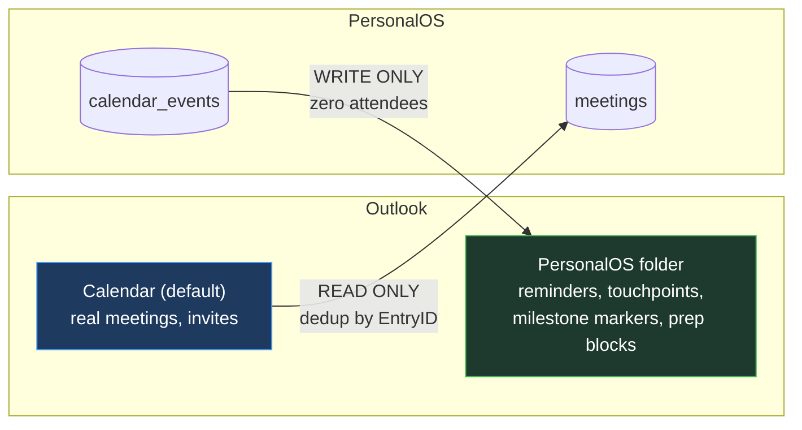
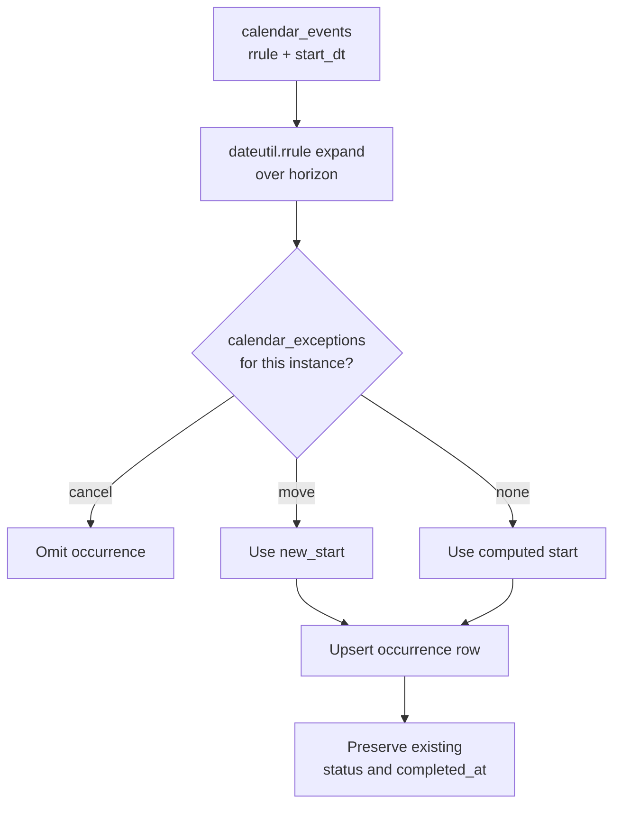

# PersonalOS — Calendar & Outlook Sync

Recurrence, occurrences, and the ownership-partitioned sync with Outlook.

---

## 1. The Ownership Partition

The trap in two-way calendar sync is conflict resolution: if both systems can edit the same item, you get duplicates, ghost events and clobbered edits, forever. Every merge rule you write generates a new failure mode.

**The escape is to make the problem impossible rather than to solve it: no item ever has two owners.**



| Direction | Owner | PersonalOS may |
|---|---|---|
| Default Calendar → `meetings` | **Outlook** | read only; never create, modify or delete |
| `calendar_events` → `PersonalOS` folder | **PersonalOS** | create, update, delete freely |

Because PersonalOS owns every item in its own folder, writes there are safe and idempotent. Because it owns nothing in the default calendar, it can never damage a real meeting.

### The safety property that makes write-back acceptable

**PersonalOS-owned items are appointments with zero attendees.**

An Outlook `AppointmentItem` with no recipients and `MeetingStatus = olNonMeeting` cannot generate an invitation. No email can leave the mailbox as a result of a sync bug, a retry loop, or a malformed record. This is what makes automated calendar writing acceptable in a client-work context at all.

The helper asserts this before every write:

```python
if appt.Recipients.Count > 0:
    raise RuntimeError("PersonalOS items must have zero attendees — refusing to save")
```

Never relax this. If a future feature genuinely needs to invite someone, it belongs in the Draft Center, where the user presses Send.

### Folder creation and adoption

On first sync, look for a folder named `PersonalOS` under the default Calendar; create it if absent via `Folders.Add`. Store its `EntryID` in `app_settings`.

If the folder is missing on a later run (the user deleted it), recreate it and re-sync every `calendar_events` row with `owner = 'personalos'` — PersonalOS is authoritative there, so rebuilding is correct.

### Identity and recovery

Each written item stores two identifiers:

- `outlook_entry_id` on the `calendar_events` row — the normal handle
- `UserProperties["PersonalOSId"]` on the Outlook item — the recovery handle

`EntryID` changes when an item is moved between folders or after certain mailbox operations, which would otherwise orphan the link and cause the next sync to create a duplicate. On mismatch, scan the folder for the `PersonalOSId` property and **re-adopt** rather than re-create.

### Delete semantics

| Deleted in | Result |
|---|---|
| PersonalOS | Outlook item deleted on next sync |
| Outlook | Item re-created on next sync (PersonalOS is authoritative) |

Re-creation is correct but occasionally not what the user meant, so every PersonalOS-owned event has an explicit **"Stop syncing this"** action which sets `sync_state = 'unsynced'` and leaves it out of future writes.

---

## 2. Recurrence

### Storage

RFC 5545 `RRULE` strings on `calendar_events.rrule`, expanded with `python-dateutil`.

```
FREQ=WEEKLY;BYDAY=MO;INTERVAL=1
FREQ=MONTHLY;BYMONTHDAY=1;COUNT=12
FREQ=MONTHLY;BYDAY=2FR
FREQ=DAILY;INTERVAL=1;UNTIL=20261231T235959Z
```

The builder UI covers daily, weekly, monthly by date, monthly by weekday, and yearly, with interval, count and until — which is the whole of what anyone actually uses. Hand-editing the raw RRULE is available for anything else.

### Occurrence materialisation

Occurrences are expanded into `calendar_event_occurrences` over a **rolling horizon** (default 180 days), refreshed on sync and on edit.

Materialising rather than computing on the fly is what lets each instance carry its own state — completed, skipped, or moved — which is precisely the behaviour a recurring *reminder* needs and a recurring *meeting* does not.



Re-expansion **preserves per-occurrence state**. Editing the series title must not silently un-complete last Tuesday.

### Exceptions

`calendar_exceptions` records `cancel` or `move` against an `original_start`. This is how "skip this one" and "move just this one to Thursday" work without breaking the series.

### DST and time zones

Store local wall-clock times. Expand recurrences in local time so a 9:00 weekly reminder stays at 9:00 across a DST boundary rather than drifting to 8:00 or 10:00 — which is what happens if you expand in UTC and convert back.

Test explicitly across both the spring-forward and autumn-back transitions.

---

## 3. Writing to Outlook

`_helper_write_events.py`, invoked as a subprocess.

```python
appt = outlook.CreateItem(1)                    # olAppointmentItem
appt.Subject  = title
appt.Start    = start_dt
appt.Duration = duration_minutes
appt.Body     = body
appt.ReminderSet = True
appt.ReminderMinutesBeforeStart = reminder_minutes
appt.MeetingStatus = 0                          # olNonMeeting — never a meeting request
appt.UserProperties.Add("PersonalOSId", 1).Value = str(event_id)

# recurrence, where the pattern is natively expressible
pattern = appt.GetRecurrencePattern()
pattern.RecurrenceType = 1                      # olRecursWeekly
pattern.Interval = 1
pattern.DayOfWeekMask = 2                       # olMonday
pattern.PatternStartDate = start_date
pattern.PatternEndDate = end_date

appt.Move(personalos_folder)
appt.Save()                                     # never Send()
```

### Native recurrence versus materialised occurrences

| Case | Approach |
|---|---|
| Daily, weekly, monthly-by-date, monthly-by-weekday, yearly — with interval and a simple end | **Native** Outlook recurrence — one item, displays properly, reminders behave |
| Anything else: multiple `BYDAY` values, `BYSETPOS`, irregular intervals, many exceptions | **Materialised** — write each occurrence in the horizon as a separate appointment |

Outlook's `RecurrencePattern` object is meaningfully less expressive than RFC 5545 and fails in confusing ways when pushed. Detect expressibility up front and fall back cleanly rather than attempting a lossy translation.

Materialised series carry `PersonalOSId` as `event_id:occurrence_iso` so each can be found and updated individually.

### Reminders

`ReminderMinutesBeforeStart` means **Outlook** fires the reminder. It works with PersonalOS closed, which is the entire reason for writing to Outlook rather than keeping reminders in-app.

---

## 4. Reading from Outlook

`_helper_calendar.py`, read-only.

```python
items = calendar.Items
items.IncludeRecurrences = True
items.Sort("[Start]")
restricted = items.Restrict(
    "[Start] >= '" + start.strftime("%m/%d/%Y %H:%M %p") + "' AND "
    "[Start] <= '" + end.strftime("%m/%d/%Y %H:%M %p") + "'"
)
```

- `IncludeRecurrences = True` **requires** sorting by `[Start]` first, or the restriction silently returns wrong results. This is a genuine COM trap.
- The date format in `Restrict` is locale-sensitive; `%m/%d/%Y %H:%M %p` matches a US-English Outlook.
- Malformed individual items are skipped rather than aborting the whole import — a single corrupt calendar entry should not cost you the week.

**Dedup** by `EntryID` (unique on `meetings`). **Change detection** by `LastModificationTime` against `meetings.outlook_modified` — unchanged items are skipped without a write.

**The PersonalOS folder is excluded from reads.** Reading back what you wrote would create phantom meetings and, worse, make PersonalOS-owned items look Outlook-owned.

---

## 5. Sync Triggering

| Mode | Default |
|---|---|
| Manual "Sync now" | **Always available** |
| On startup | Off |
| Interval | Off; configurable 15–240 minutes |

Interval sync is the **one sanctioned background job** in the application. It runs on a single timer thread that spawns the same subprocess helpers, never touching COM in a Flask worker.

Every run writes to `outlook_sync_log`. Failures are surfaced in the UI with the actual error, and never retried in a tight loop.

---

## 6. Failure Handling

| Failure | Behaviour |
|---|---|
| `pywin32` absent | Outlook features hidden with a clear explanation; everything else works |
| Outlook not running | COM starts it, or reports clearly if it cannot |
| Security prompt | Documented in Help; the user accepts once |
| Subprocess timeout | Killed at 120s; logged; reported |
| Malformed item | Skipped, counted, listed in the run summary |
| Folder missing | Recreated; owned events re-synced |
| `EntryID` orphaned | Re-adopt by `PersonalOSId` before ever creating a duplicate |

**COM never runs inside a Flask request.** Every call goes through `subprocess.run` with a timeout, communicating by JSON on stdout. COM's threading model conflicts with Flask's worker pool in ways that produce intermittent, unreproducible failures — the subprocess boundary makes the whole class of problem go away.

---

## 7. The `.ics` Feed

`GET /calendar.ics` serves PersonalOS-owned events as a standard iCalendar file, so they can be subscribed to from any client.

Read-only, bound to `127.0.0.1`, no authentication (single-user, localhost). Regenerated per request — a personal calendar is small enough that caching would add a staleness bug for no measurable gain.

This is a convenience, not the sync mechanism. Outlook refreshes subscribed internet calendars on its own slow schedule and handles their reminders unreliably, which is exactly why the COM path exists.

---

## 8. Checklist for Any Calendar Change

- [ ] Does this write to Outlook? If so, only into the `PersonalOS` folder
- [ ] Zero attendees asserted before save
- [ ] `Save()` used, never `Send()`
- [ ] COM in a subprocess, never in a request
- [ ] Dedup by `EntryID`; recovery by `PersonalOSId`
- [ ] Occurrence state preserved across re-expansion
- [ ] DST tested across both transitions
- [ ] Graceful when `pywin32` is unavailable
- [ ] Written to `outlook_sync_log`
- [ ] `INTEGRATION_RULES.md` updated if a new action type is introduced
