# PersonalOS — Database Schema

**Database:** `app/data/personalos.db` · **Engine:** SQLite via stdlib `sqlite3` · **Access:** always `get_db()`

Every connection sets:

```sql
PRAGMA journal_mode = WAL;
PRAGMA foreign_keys = ON;
```

## Conventions

| Convention | Rule |
|---|---|
| Primary key | `id INTEGER PRIMARY KEY AUTOINCREMENT` |
| Naming | `snake_case`, singular column names, plural table names |
| Timestamps | `created_at` / `updated_at DATETIME NOT NULL DEFAULT (datetime('now'))` |
| Soft delete | `archived_at DATETIME` — null means active. Archive, never delete |
| Booleans | `INTEGER NOT NULL DEFAULT 0` with a `CHECK (col IN (0,1))` |
| Money | `REAL`. **All amounts are USD** — `currency` columns exist, default `'USD'`, and are system-managed rather than user-facing. No conversion logic. See `FINANCIAL_MODEL.md` §8 |
| Dates | `DATE` as ISO `YYYY-MM-DD` text; `DATETIME` as `YYYY-MM-DD HH:MM:SS` |
| Enums | `TEXT` with a `CHECK` constraint; values documented under each table |
| Containment | Real foreign keys with explicit `ON DELETE` behaviour |
| Cross-cutting links | `entity_links`, never a polymorphic FK column |

## Migration Ownership

Migration number tracks build phase. Each table is created by exactly one migration.

| Migration | Phase | Contents |
|---|---|---|
| `0001_init.sql` | 0 | System: settings, config, registry, activity, links |
| `0002_people.sql` | 1 | People, levels, title map, capacity, status events |
| `0003_rates.sql` | 1 | Rate cards (standard + negotiated), entries, overrides |
| `0004_work.sql` | 2 | Portfolios, projects, workstreams, charge codes, **locations, work resources, dependencies** |
| `0005_notes.sql` | 3 | Notes, note links, FTS5, vault roots |
| `0006_tasks.sql` | 4 | Tasks, recurrences |
| `0007_imports.sql` | 1 | **Import batches** — the ledger of every file loaded
| `0008_calendar.sql` | 5 | Calendar events, occurrences, exceptions |
| `0009_meetings.sql` | 6 | Meetings, attendees, Outlook sync log |
| `0010_intake.sql` | 7 | Emails, recipients, contact candidates, drafts, extracted dates |
| `0011_milestones.sql` | 8 | Milestones, baselines, status updates |
| `0012_financials.sql` | 9 | **Fee types, fee rules, project fees**, budget lines, expenses, time entries, import batches |
| `0013_smartsheet.sql` | 10 | Sources, sync runs, pipeline opportunities |
| `0014_assignments.sql` | 11 | Assignments, extensions, weekly allocations |
| `0015_skills.sql` | 12 | Skills, person skills, staffing requirements |
| `0016_scenarios.sql` | 13 | Staffing scenarios, alert dismissals |
| `0017_governance.sql` | 14 | Risks/assumptions/issues, decisions, stakeholders, change requests |
| `0018_comms.sql` | 15 | Communications plan items |
| `0019_templates.sql` | 16 | Project templates, template imports |
| `0020_performance.sql` | 17 | Cycles, tracks, items |
| `0021_training.sql` | 18 | Catalog, requirements, records, plans |
| `0022_innovation.sql` | 19 | Network members, ideas, contributions |
| `0023_ai.sql` | 20 | Providers, models, policy, jobs, runs, embeddings |
| `0024_quicksteps.sql` | 23 | Quick steps, quick step runs |

---

## Schema Map

The spine of the application: a portfolio holds projects, a project holds workstreams and charge codes, and **time books against the charge code** — which is why the charge code, not the project, is the financial reconciliation key.

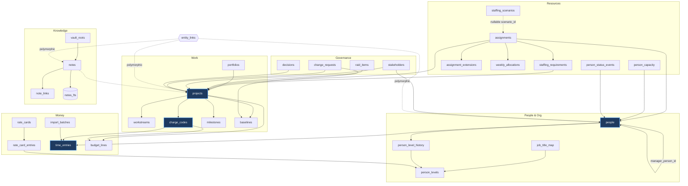
```mermaid
flowchart TB
    subgraph WORK["Work"]
        PORT[portfolios] --> PROJ[projects]
        PROJ --> WS[workstreams]
        PROJ --> CC[charge_codes]
        PROJ --> MS[milestones]
        PROJ --> BASE[baselines]
    end

    subgraph PEOPLE["People &amp; Org"]
        PPL[people]
        LVL[person_levels]
        PLH[person_level_history]
        JTM[job_title_map]
        PPL -->|manager_person_id| PPL
        JTM --> LVL
        PPL --> PLH
        PLH --> LVL
    end

    subgraph MONEY["Money"]
        RC[rate_cards] --> RCE[rate_card_entries]
        RCE --> LVL
        CC --> TE[time_entries]
        PPL --> TE
        PROJ --> BL[budget_lines]
        CC --> BL
        IB[import_batches] --> TE
    end

    subgraph RES["Resources"]
        SR[staffing_requirements] --> PROJ
        ASG[assignments] --> PROJ
        ASG --> PPL
        ASG --> SR
        ASG --> AEX[assignment_extensions]
        ASG --> WA[weekly_allocations]
        SCN[staffing_scenarios] -.->|nullable scenario_id| ASG
        PCAP[person_capacity] --> PPL
        PSE[person_status_events] --> PPL
    end

    subgraph KNOW["Knowledge"]
        VR[vault_roots] --> NOTE[notes]
        NOTE --> NL[note_links]
        NOTE --> FTS[(notes_fts)]
        NOTE -.-> PROJ
    end

    subgraph GOV["Governance"]
        RAID[raid_items] --> PROJ
        STK[stakeholders] --> PROJ
        STK --> PPL
        CR[change_requests] --> PROJ
        CR --> BASE
        DEC[decisions] --> PROJ
    end

    EL{{entity_links}}
    EL -.->|polymorphic| NOTE
    EL -.->|polymorphic| PPL
    EL -.->|polymorphic| PROJ

    classDef key fill:#1e3a5f,stroke:#4a9eff,color:#fff,stroke-width:2px
    class CC,TE,PPL,PROJ key
```

**Reading the map:** solid arrows are real foreign keys (containment and money). Dotted arrows are soft or polymorphic associations. Highlighted nodes are the four tables most queries route through.

---

# 0001 — System

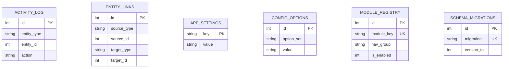
```mermaid
erDiagram
    ACTIVITY_LOG {
        int id PK
        string entity_type
        int entity_id
        string action
    }
    ENTITY_LINKS {
        int id PK
        string source_type
        int source_id
        string target_type
        int target_id
    }
    APP_SETTINGS {
        string key PK
        string value
    }
    CONFIG_OPTIONS {
        int id PK
        string option_set
        string value
    }
    MODULE_REGISTRY {
        int id PK
        string module_key UK
        string nav_group
        int is_enabled
    }
    SCHEMA_MIGRATIONS {
        int id PK
        string migration UK
        int version_to
    }
```

These five tables have **no foreign keys to anything** — deliberately. `entity_links` is polymorphic by design, and `activity_log` must survive the deletion of whatever it describes.


### schema_migrations

Created by the migration runner itself, not by a migration file.

```sql
CREATE TABLE schema_migrations (
    id           INTEGER PRIMARY KEY AUTOINCREMENT,
    migration    TEXT NOT NULL UNIQUE,
    applied_at   DATETIME NOT NULL DEFAULT (datetime('now')),
    version_from INTEGER NOT NULL DEFAULT 0,
    version_to   INTEGER NOT NULL DEFAULT 0
);
```

`PRAGMA user_version` holds the current schema version; this table is the human-readable audit trail.

### app_settings

```sql
CREATE TABLE app_settings (
    key         TEXT PRIMARY KEY,
    value       TEXT,
    value_type  TEXT NOT NULL DEFAULT 'string'
                CHECK (value_type IN ('string','int','float','bool','json')),
    description TEXT,
    updated_at  DATETIME NOT NULL DEFAULT (datetime('now'))
);
```

**Seed keys:** `app_name`, `owner_name`, `self_person_id`, `theme` (`dark`), `fiscal_year_start` (`10-01`), `default_currency` (`USD`), `vault_root`, `template_library_root`, `backup_count_to_keep`, `meeting_prep_lookahead_days`, `resource_horizon_weeks`, `understaffed_threshold` (`1.0`), `utilization_bands`, `manager_chain_depth_cap` (`10`), `ai_enabled` (`0`), `ai_base_url`.

### config_options

User-editable dropdown vocabularies, so taxonomy changes need no migration.

```sql
CREATE TABLE config_options (
    id         INTEGER PRIMARY KEY AUTOINCREMENT,
    option_set TEXT NOT NULL,
    value      TEXT NOT NULL,
    label      TEXT NOT NULL,
    sort_order INTEGER NOT NULL DEFAULT 0,
    is_active  INTEGER NOT NULL DEFAULT 1 CHECK (is_active IN (0,1)),
    UNIQUE (option_set, value)
);
CREATE INDEX idx_config_options_set ON config_options(option_set, sort_order);
```

**Seeded option sets:** `service_offering`, `project_type`, `portfolio_kind`, `task_type`, `priority`, `rag_status`, `raid_type`, `stakeholder_stance`, `disposition`, `skill_category`, `function`.

### module_registry

```sql
CREATE TABLE module_registry (
    id          INTEGER PRIMARY KEY AUTOINCREMENT,
    module_key  TEXT NOT NULL UNIQUE,
    label       TEXT NOT NULL,
    nav_group   TEXT NOT NULL,
    url_prefix  TEXT NOT NULL,
    icon        TEXT,
    is_enabled  INTEGER NOT NULL DEFAULT 1 CHECK (is_enabled IN (0,1)),
    sort_order  INTEGER NOT NULL DEFAULT 0
);
```

**nav_group values:** Command, Work, Governance, Money, Resources, Knowledge, People, Intake, System.

### activity_log

```sql
CREATE TABLE activity_log (
    id          INTEGER PRIMARY KEY AUTOINCREMENT,
    entity_type TEXT NOT NULL,
    entity_id   INTEGER,
    action      TEXT NOT NULL
                CHECK (action IN ('created','updated','deleted','archived',
                                  'restored','imported','exported','synced','ran')),
    summary     TEXT NOT NULL,
    detail_json TEXT,
    created_at  DATETIME NOT NULL DEFAULT (datetime('now'))
);
CREATE INDEX idx_activity_entity  ON activity_log(entity_type, entity_id);
CREATE INDEX idx_activity_created ON activity_log(created_at DESC);
```

Never write passwords, file contents, or secret values here.

### entity_links

The single join table for every cross-cutting relationship. **Not** for containment — see `CLAUDE.md` rule 9.

```sql
CREATE TABLE entity_links (
    id          INTEGER PRIMARY KEY AUTOINCREMENT,
    source_type TEXT NOT NULL,
    source_id   INTEGER NOT NULL,
    target_type TEXT NOT NULL,
    target_id   INTEGER NOT NULL,
    link_label  TEXT,
    created_at  DATETIME NOT NULL DEFAULT (datetime('now')),
    UNIQUE (source_type, source_id, target_type, target_id)
);
CREATE INDEX idx_links_source ON entity_links(source_type, source_id);
CREATE INDEX idx_links_target ON entity_links(target_type, target_id);
```

**Direction convention — the linking subject is always the source.** Linking a note to a project stores `('note', n, 'project', p)`.

| Subject | source_type | Typical targets |
|---|---|---|
| Note | `note` | project, workstream, task, meeting, person, charge_code, raid_item |
| Person | `person` | project, task, meeting, note, stakeholder |
| Meeting | `meeting` | project, workstream, task, note |
| Email | `email` | project, task, meeting, person, note |
| Performance item | `performance_item` | person, project, task, meeting, note |

---

# 0002 — People & Org

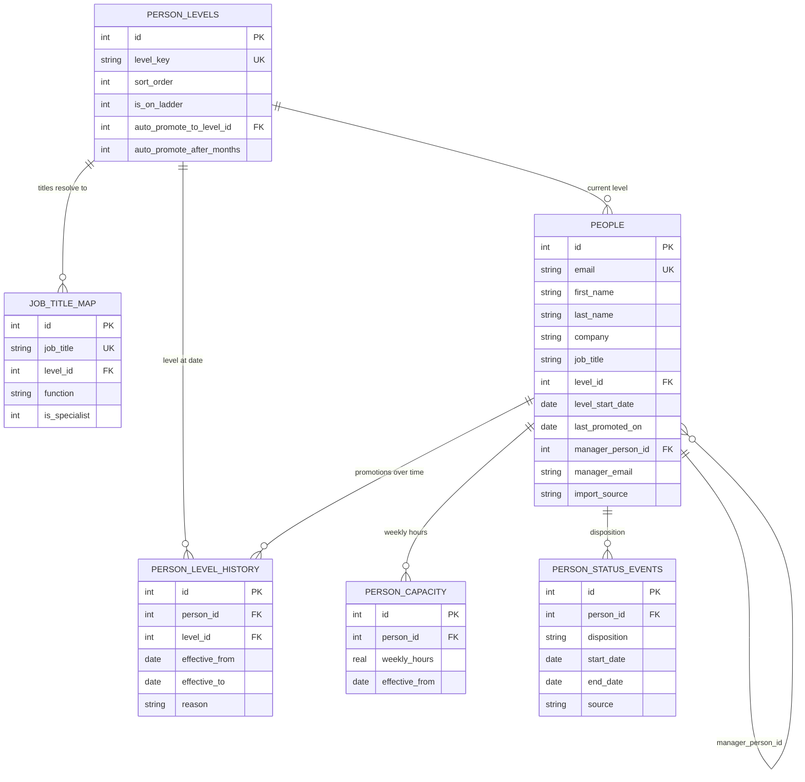
```mermaid
erDiagram
    PERSON_LEVELS ||--o{ JOB_TITLE_MAP : "titles resolve to"
    PERSON_LEVELS ||--o{ PEOPLE : "current level"
    PERSON_LEVELS ||--o{ PERSON_LEVEL_HISTORY : "level at date"
    PEOPLE ||--o{ PERSON_LEVEL_HISTORY : "promotions over time"
    PEOPLE ||--o{ PERSON_CAPACITY : "weekly hours"
    PEOPLE ||--o{ PERSON_STATUS_EVENTS : "disposition"
    PEOPLE ||--o{ PEOPLE : "manager_person_id"

    PEOPLE {
        int id PK
        string email UK
        string first_name
        string last_name
        string company
        string job_title
        int level_id FK
        date level_start_date
        date last_promoted_on
        int manager_person_id FK
        string manager_email
        string import_source
    }
    PERSON_LEVELS {
        int id PK
        string level_key UK
        int sort_order
        int is_on_ladder
        int auto_promote_to_level_id FK
        int auto_promote_after_months
    }
    JOB_TITLE_MAP {
        int id PK
        string job_title UK
        int level_id FK
        string function
        int is_specialist
    }
    PERSON_LEVEL_HISTORY {
        int id PK
        int person_id FK
        int level_id FK
        date effective_from
        date effective_to
        string reason
    }
    PERSON_CAPACITY {
        int id PK
        int person_id FK
        real weekly_hours
        date effective_from
    }
    PERSON_STATUS_EVENTS {
        int id PK
        int person_id FK
        string disposition
        date start_date
        date end_date
        string source
    }
```

Three things this diagram is meant to make obvious: `people.manager_person_id` is **self-referencing** (the org chart), `job_title_map` sits *between* the raw directory title and the billing level, and `person_level_history` is what makes a promotion reprice hours correctly.

### person_levels

The rate-bearing ladder. Distinct from job title.

```sql
CREATE TABLE person_levels (
    id           INTEGER PRIMARY KEY AUTOINCREMENT,
    level_key    TEXT NOT NULL UNIQUE,
    label        TEXT NOT NULL,
    sort_order   INTEGER NOT NULL,
    is_on_ladder INTEGER NOT NULL DEFAULT 1 CHECK (is_on_ladder IN (0,1)),
    auto_promote_to_level_id  INTEGER REFERENCES person_levels(id),
    auto_promote_after_months INTEGER,
    created_at   DATETIME NOT NULL DEFAULT (datetime('now'))
);
```

**Seed — the rate card ladder (sort ascending = junior to senior):**

| sort | level_key | label | auto-promote |
|---|---|---|---|
| 10 | `intern_paraprofessional` | Intern / Paraprofessional | — |
| 20 | `associate` | Associate | — |
| 30 | `senior_associate` | Senior Associate | — |
| 40 | `manager` | Manager | — |
| 50 | `director_lt3` | Director (< 3 years) | → `senior_director` after **36** months |
| 60 | `senior_director` | Senior Director (3+ years) | — |
| 70 | `managing_director` | Managing Director | — |
| 80 | `partner_lt5` | Partner / Principal (< 5 years) | → `partner_gte5` after **60** months |
| 90 | `partner_gte5` | Partner / Principal (5+ years) | — |
| 5 | `contractor` | Contractor | off ladder — needs a rate override or its own card entry |

**These nine levels are the rate card rows.** Every rate hangs off one of them.

### Tenure-split levels

Director and Partner split on **time in role**, not title. `Director Advisory` in the directory could be either `director_lt3` or `senior_director` depending on when they made Director — so **job title alone cannot determine level**, and `person_level_history` is authoritative.

Three fields carry the tenure clock:

| Field | On | Meaning |
|---|---|---|
| `auto_promote_after_months` | `person_levels` | The **rule** — 36 for Director, 60 for Partner |
| `level_start_date` | `people` | When this person entered their **current** level — the clock's start |
| `last_promoted_on` | `people` | Date of their most recent **promotion**, any level |

```
due_date = level_start_date + auto_promote_after_months
```

**Why `level_start_date` is a column and not derived.** It could be computed as the `effective_from` of the current `person_level_history` row — but only when that history is complete and every row is correctly typed. On a 450-person import from a spreadsheet with no history at all, it is not. The column is authoritative and maintained on write; the history table remains the audit trail.

**Why `last_promoted_on` is separate.** They are usually the same date and occasionally not: a level history row with `reason = 'correction'` changes the current level without being a promotion, and a `reason = 'hire'` row starts a level without one either. Conflating them would mean a data correction resets someone's promotion clock, or shows in a review as though they were just promoted.

Both are denormalised onto `people` so the tenure check is a single indexed scan across the whole roster rather than a correlated subquery per person.

`auto_promote_after_months` lets the application *flag* a due transition rather than perform one:

> *"Jane Doe reaches 36 months as Director on 1 March. Move to Senior Director?"*

Surfaced on the Command Center and in a Rates admin view. **Never applied automatically** — a level change reprices every subsequent hour, and that should be a decision.

Missing a tenure transition is one of the quieter ways this model goes wrong: the person keeps billing at the junior rate for months and nothing announces it. This is one instance of a broader pattern — see `docs/TEMPORAL_MODEL.md`.

### job_title_map

Raw directory titles resolve to a level and a function. Rates hang off level, never title — otherwise every title variant HR invents would silently price at zero.

```sql
CREATE TABLE job_title_map (
    id         INTEGER PRIMARY KEY AUTOINCREMENT,
    job_title  TEXT NOT NULL UNIQUE,
    level_id   INTEGER NOT NULL REFERENCES person_levels(id),
    function   TEXT,
    is_specialist INTEGER NOT NULL DEFAULT 0 CHECK (is_specialist IN (0,1)),
    created_at DATETIME NOT NULL DEFAULT (datetime('now'))
);
```

**Seed, from the 13 titles observed in `AASppl.xlsx`:**

| job_title | default level | function | specialist | confidence |
|---|---|---|---|---|
| Advisory Managing Director | `managing_director` | Advisory | 0 | high |
| Specialist MD, Advisory | `managing_director` | Advisory | 1 | **check** |
| Director Advisory | `director_lt3` | Advisory | 0 | **tenure** |
| Specialist Dir, Analytics | `director_lt3` | Analytics | 1 | **tenure + check** |
| Manager Advisory | `manager` | Advisory | 0 | high |
| Assistant Manager | `manager` | Advisory | 0 | **check** |
| Sr Associate Advisory | `senior_associate` | Advisory | 0 | high |
| Sr Associate Audit | `senior_associate` | Audit | 0 | high |
| Associate Advisory | `associate` | Advisory | 0 | high |
| Associate Audit | `associate` | Audit | 0 | high |
| Associate Consultant | `associate` | Advisory | 0 | high |
| Consultant | `associate` | Advisory | 0 | **check** |
| Contractor | `contractor` | Advisory | 0 | **needs a rate** |

> **Four entries need confirmation before Phase 9** — they are defaults, not knowledge:
>
> - **`Assistant Manager`** has no row on the rate card. Defaulted to `manager`; could equally be `senior_associate`.
> - **`Consultant`** likewise. Defaulted to `associate`.
> - **`Contractor`** is off ladder with no card rate — needs a `person_rate_overrides` row per contractor or its own card entry, or every contractor hour prices as unpriced.
> - **The two Specialist titles** — whether they bill at their ladder level or carry their own rates.
>
> **Director and Partner titles are tenure-dependent.** `job_title_map` supplies a *default* on import; `person_level_history` is authoritative and must be corrected for anyone past the 3-year or 5-year mark. Import flags these for review rather than assuming.

Unmapped titles encountered during GAL sync are inserted with a null-safe fallback level and surfaced in Admin for resolution.

### people

```sql
CREATE TABLE people (
    id                INTEGER PRIMARY KEY AUTOINCREMENT,
    external_ref      TEXT,
    first_name        TEXT NOT NULL,
    last_name         TEXT NOT NULL,
    preferred_name    TEXT,
    full_name         TEXT NOT NULL,
    email             TEXT UNIQUE,
    upn               TEXT,
    company           TEXT,
    department        TEXT,
    job_title         TEXT,
    level_id          INTEGER REFERENCES person_levels(id),
    level_start_date  DATE,
    last_promoted_on  DATE,
    function          TEXT,
    relationship_type TEXT NOT NULL DEFAULT 'colleague'
                      CHECK (relationship_type IN ('self','colleague','counselee','direct_report',
                                                   'client','vendor','stakeholder','mentor','other')),
    status            TEXT NOT NULL DEFAULT 'active'
                      CHECK (status IN ('active','inactive','departed')),
    business_phone    TEXT,
    home_phone        TEXT,
    mobile_phone      TEXT,
    city              TEXT,
    state_province    TEXT,
    location          TEXT,
    manager_email     TEXT,
    manager_person_id INTEGER REFERENCES people(id) ON DELETE SET NULL,
    import_source     TEXT NOT NULL DEFAULT 'manual'
                      CHECK (import_source IN ('manual','excel_seed','gal_direct',
                                               'gal_manager_chain','email_scrape','smartsheet')),
    outlook_entry_id  TEXT,
    smartsheet_row_id TEXT,
    gal_synced_at     DATETIME,
    notes             TEXT,
    strengths         TEXT,
    development_areas TEXT,
    tags              TEXT,
    last_interaction_date DATE,
    next_follow_up_date   DATE,
    created_at        DATETIME NOT NULL DEFAULT (datetime('now')),
    updated_at        DATETIME NOT NULL DEFAULT (datetime('now')),
    archived_at       DATETIME
);
CREATE INDEX idx_people_email    ON people(email);
CREATE INDEX idx_people_manager  ON people(manager_person_id);
CREATE INDEX idx_people_level    ON people(level_id, level_start_date);
CREATE INDEX idx_people_company  ON people(company);
CREATE INDEX idx_people_archived ON people(archived_at);
```

`full_name` is derived on write from `first_name`/`last_name`, never hand-entered. `email` is the natural key for import dedup and manager resolution.

`relationship_type = 'self'` is reserved for the app owner; the id is stored in `app_settings.self_person_id`.

**Org chart** queries run as recursive CTEs over `manager_person_id`. `manager_person_id` is the *administrative* reporting line and is deliberately distinct from the counselee relationship in `performance_tracks`.

### person_level_history

Effective-dated level. This is what makes promotions reprice correctly.

```sql
CREATE TABLE person_level_history (
    id             INTEGER PRIMARY KEY AUTOINCREMENT,
    person_id      INTEGER NOT NULL REFERENCES people(id) ON DELETE CASCADE,
    level_id       INTEGER NOT NULL REFERENCES person_levels(id),
    effective_from DATE NOT NULL,
    effective_to   DATE,
    reason         TEXT NOT NULL DEFAULT 'annual'
                   CHECK (reason IN ('hire','annual','promotion','correction','departure')),
    note           TEXT,
    created_at     DATETIME NOT NULL DEFAULT (datetime('now'))
);
CREATE INDEX idx_level_hist_person ON person_level_history(person_id, effective_from);
```

`effective_to` null means current. Ranges must not overlap for a person; enforced in application code on write.

### person_capacity

```sql
CREATE TABLE person_capacity (
    id             INTEGER PRIMARY KEY AUTOINCREMENT,
    person_id      INTEGER NOT NULL REFERENCES people(id) ON DELETE CASCADE,
    weekly_hours   REAL NOT NULL DEFAULT 40.0,
    fte            REAL NOT NULL DEFAULT 1.0,
    effective_from DATE NOT NULL,
    effective_to   DATE,
    note           TEXT,
    created_at     DATETIME NOT NULL DEFAULT (datetime('now'))
);
CREATE INDEX idx_capacity_person ON person_capacity(person_id, effective_from);
```

### person_status_events

Disposition for the Morning Report. Dated, sourced, overlapping-safe.

```sql
CREATE TABLE person_status_events (
    id          INTEGER PRIMARY KEY AUTOINCREMENT,
    person_id   INTEGER NOT NULL REFERENCES people(id) ON DELETE CASCADE,
    disposition TEXT NOT NULL
                CHECK (disposition IN ('available','leave','sick','training',
                                       'rotation','loa','holiday','other')),
    start_date  DATE NOT NULL,
    end_date    DATE,
    detail      TEXT,
    source      TEXT NOT NULL DEFAULT 'manual'
                CHECK (source IN ('manual','smartsheet','outlook_oof')),
    created_at  DATETIME NOT NULL DEFAULT (datetime('now')),
    updated_at  DATETIME NOT NULL DEFAULT (datetime('now'))
);
CREATE INDEX idx_status_person ON person_status_events(person_id, start_date);
CREATE INDEX idx_status_dates  ON person_status_events(start_date, end_date);
```

Absence of any event for a date means `available`.

---

# 0003 — Rates

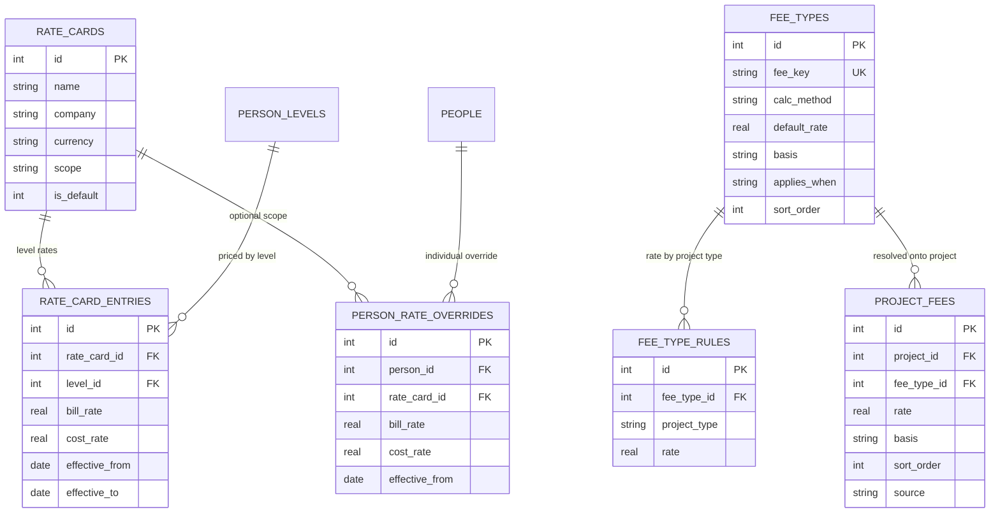
```mermaid
erDiagram
    RATE_CARDS ||--o{ RATE_CARD_ENTRIES : "level rates"
    RATE_CARDS ||--o{ PERSON_RATE_OVERRIDES : "optional scope"
    PERSON_LEVELS ||--o{ RATE_CARD_ENTRIES : "priced by level"
    PEOPLE ||--o{ PERSON_RATE_OVERRIDES : "individual override"

    RATE_CARDS {
        int id PK
        string name
        string company
        string currency
        string scope
        int is_default
    }
    RATE_CARD_ENTRIES {
        int id PK
        int rate_card_id FK
        int level_id FK
        real bill_rate
        real cost_rate
        date effective_from
        date effective_to
    }
    FEE_TYPES {
        int id PK
        string fee_key UK
        string calc_method
        real default_rate
        string basis
        string applies_when
        int sort_order
    }
    FEE_TYPE_RULES {
        int id PK
        int fee_type_id FK
        string project_type
        real rate
    }
    PROJECT_FEES {
        int id PK
        int project_id FK
        int fee_type_id FK
        real rate
        string basis
        int sort_order
        string source
    }
    FEE_TYPES ||--o{ FEE_TYPE_RULES : "rate by project type"
    FEE_TYPES ||--o{ PROJECT_FEES : "resolved onto project"
    PERSON_RATE_OVERRIDES {
        int id PK
        int person_id FK
        int rate_card_id FK
        real bill_rate
        real cost_rate
        date effective_from
    }
```

**Resolution order** (`app/core/rates.py`): person override → level-at-date on the card → default card. Rates attach to **level**, never to job title, and `rate_cards.company` separates KPMG US from offshore cost.

The card gives a **standard rate**. The **engagement rate** is that standard rate reduced by the project's ERP — or, where a negotiated card is in use, the negotiated rate itself. Fees then apply on top of labour revenue. Full chain in `FINANCIAL_MODEL.md` §2–§4.

### rate_cards

```sql
CREATE TABLE rate_cards (
    id          INTEGER PRIMARY KEY AUTOINCREMENT,
    name        TEXT NOT NULL,
    company     TEXT,
    currency    TEXT NOT NULL DEFAULT 'USD',
    scope       TEXT NOT NULL DEFAULT 'standard'
                CHECK (scope IN ('standard','negotiated','internal','offshore')),
    project_id  INTEGER REFERENCES projects(id) ON DELETE CASCADE,
    is_default  INTEGER NOT NULL DEFAULT 0 CHECK (is_default IN (0,1)),
    note        TEXT,
    created_at  DATETIME NOT NULL DEFAULT (datetime('now')),
    updated_at  DATETIME NOT NULL DEFAULT (datetime('now')),
    archived_at DATETIME,
    UNIQUE (name, company)
);
```

`company` scopes the card. KPMG US and KPMG Global Services cost rates differ by a large multiple; mis-scoping understates cost on every blended engagement.

**Two kinds of card:**

| scope | Meaning |
|---|---|
| `standard` | Firm rate card, one per fiscal year, `project_id` null |
| `negotiated` | Project-specific card agreed with the client, `project_id` set |

A project either uses the standard card with an **ERP** applied, or a negotiated card that already *is* the engagement rate. See `FINANCIAL_MODEL.md` §2.

### rate_card_entries

```sql
CREATE TABLE rate_card_entries (
    id             INTEGER PRIMARY KEY AUTOINCREMENT,
    rate_card_id   INTEGER NOT NULL REFERENCES rate_cards(id) ON DELETE CASCADE,
    level_id       INTEGER NOT NULL REFERENCES person_levels(id),
    bill_rate      REAL,
    cost_rate      REAL,
    effective_from DATE NOT NULL,
    effective_to   DATE,
    created_at     DATETIME NOT NULL DEFAULT (datetime('now'))
);
CREATE INDEX idx_rate_entries ON rate_card_entries(rate_card_id, level_id, effective_from);
```

### person_rate_overrides

```sql
CREATE TABLE person_rate_overrides (
    id             INTEGER PRIMARY KEY AUTOINCREMENT,
    person_id      INTEGER NOT NULL REFERENCES people(id) ON DELETE CASCADE,
    rate_card_id   INTEGER REFERENCES rate_cards(id) ON DELETE CASCADE,
    bill_rate      REAL,
    cost_rate      REAL,
    effective_from DATE NOT NULL,
    effective_to   DATE,
    reason         TEXT,
    created_at     DATETIME NOT NULL DEFAULT (datetime('now'))
);
CREATE INDEX idx_rate_override ON person_rate_overrides(person_id, effective_from);
```

`rate_card_id` null means the override applies on every card.

**Resolution order** — see `docs/FINANCIAL_MODEL.md`: override → level-at-date on the card → default card.

---

# 0004 — Work

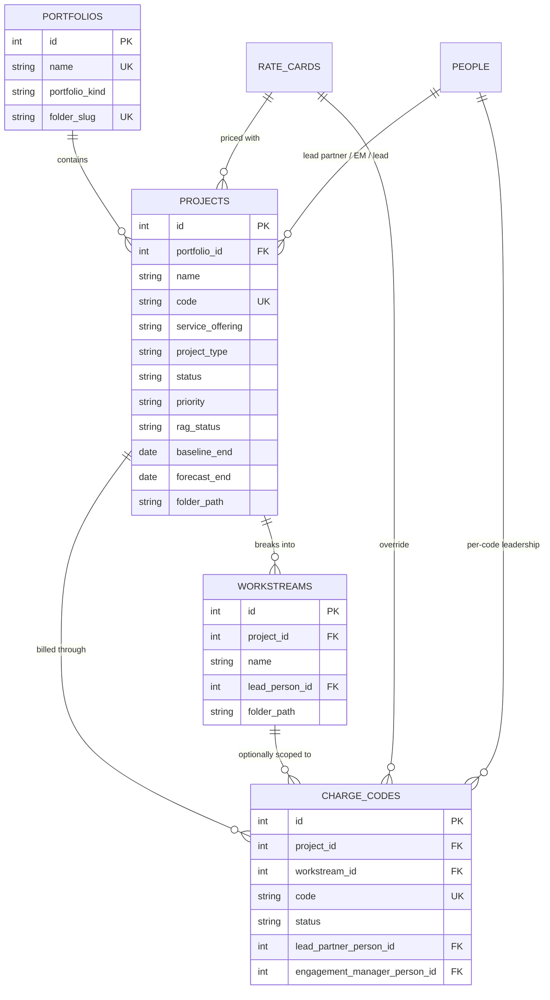
```mermaid
erDiagram
    PORTFOLIOS ||--o{ PROJECTS : contains
    PROJECTS ||--o{ WORKSTREAMS : "breaks into"
    PROJECTS ||--o{ CHARGE_CODES : "billed through"
    WORKSTREAMS ||--o{ CHARGE_CODES : "optionally scoped to"
    RATE_CARDS ||--o{ PROJECTS : "priced with"
    RATE_CARDS ||--o{ CHARGE_CODES : "override"
    PEOPLE ||--o{ PROJECTS : "lead partner / EM / lead"
    PEOPLE ||--o{ CHARGE_CODES : "per-code leadership"

    PORTFOLIOS {
        int id PK
        string name UK
        string portfolio_kind
        string folder_slug UK
    }
    PROJECTS {
        int id PK
        int portfolio_id FK
        string name
        string code UK
        string service_offering
        string project_type
        string status
        string priority
        string rag_status
        date baseline_end
        date forecast_end
        string folder_path
    }
    WORKSTREAMS {
        int id PK
        int project_id FK
        string name
        int lead_person_id FK
        string folder_path
    }
    CHARGE_CODES {
        int id PK
        int project_id FK
        int workstream_id FK
        string code UK
        string status
        int lead_partner_person_id FK
        int engagement_manager_person_id FK
    }
```

`baseline_*` versus `forecast_*` on both projects and workstreams is what makes "on time" measurable — variance against an approved baseline rather than a moving target.

### The workstream context tables

Everything a workstream charter needs to answer "where does this work happen and what is it waiting on":

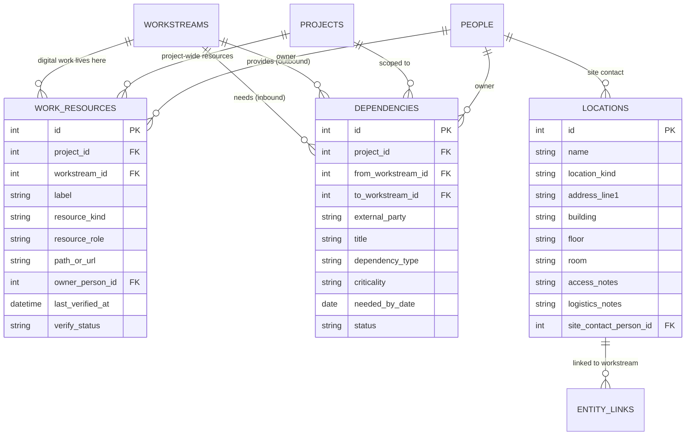
```mermaid
erDiagram
    WORKSTREAMS ||--o{ WORK_RESOURCES : "digital work lives here"
    PROJECTS ||--o{ WORK_RESOURCES : "project-wide resources"
    WORKSTREAMS ||--o{ DEPENDENCIES : "needs (inbound)"
    WORKSTREAMS ||--o{ DEPENDENCIES : "provides (outbound)"
    PROJECTS ||--o{ DEPENDENCIES : "scoped to"
    LOCATIONS ||--o{ ENTITY_LINKS : "linked to workstream"
    PEOPLE ||--o{ LOCATIONS : "site contact"
    PEOPLE ||--o{ WORK_RESOURCES : owner
    PEOPLE ||--o{ DEPENDENCIES : owner

    LOCATIONS {
        int id PK
        string name
        string location_kind
        string address_line1
        string building
        string floor
        string room
        string access_notes
        string logistics_notes
        int site_contact_person_id FK
    }
    WORK_RESOURCES {
        int id PK
        int project_id FK
        int workstream_id FK
        string label
        string resource_kind
        string resource_role
        string path_or_url
        int owner_person_id FK
        datetime last_verified_at
        string verify_status
    }
    DEPENDENCIES {
        int id PK
        int project_id FK
        int from_workstream_id FK
        int to_workstream_id FK
        string external_party
        string title
        string dependency_type
        string criticality
        date needed_by_date
        string status
    }
```

`DEPENDENCIES` has **two** edges to `WORKSTREAMS` and that is the point: `from_workstream_id` needs, `to_workstream_id` provides. For workstream W, inbound is `from = W` and outbound is `to = W`.

### portfolios

```sql
CREATE TABLE portfolios (
    id           INTEGER PRIMARY KEY AUTOINCREMENT,
    name         TEXT NOT NULL UNIQUE,
    portfolio_kind TEXT NOT NULL DEFAULT 'client'
                 CHECK (portfolio_kind IN ('client','internal','innovation','training','admin')),
    description  TEXT,
    folder_slug  TEXT NOT NULL UNIQUE,
    sort_order   INTEGER NOT NULL DEFAULT 0,
    created_at   DATETIME NOT NULL DEFAULT (datetime('now')),
    archived_at  DATETIME
);
```

**Seed:** Client Delivery · Internal · Innovation & Development · Training.

### projects

```sql
CREATE TABLE projects (
    id                    INTEGER PRIMARY KEY AUTOINCREMENT,
    portfolio_id          INTEGER NOT NULL REFERENCES portfolios(id),
    name                  TEXT NOT NULL,
    code                  TEXT UNIQUE,
    client_org            TEXT,
    description           TEXT,
    service_offering      TEXT,
    project_type          TEXT,
    status                TEXT NOT NULL DEFAULT 'active'
                          CHECK (status IN ('pipeline','active','on_hold','completed','cancelled')),
    priority              TEXT NOT NULL DEFAULT 'medium'
                          CHECK (priority IN ('high','medium','low')),
    rag_status            TEXT CHECK (rag_status IN ('green','amber','red')),
    baseline_start        DATE,
    baseline_end          DATE,
    forecast_start        DATE,
    forecast_end          DATE,
    actual_start          DATE,
    actual_end            DATE,
    rate_card_id          INTEGER REFERENCES rate_cards(id),
    erp_pct               REAL NOT NULL DEFAULT 100.0,
    currency              TEXT NOT NULL DEFAULT 'USD',
    budget_hours          REAL,
    budget_fees           REAL,
    budget_expenses       REAL,
    lead_partner_person_id       INTEGER REFERENCES people(id),
    engagement_manager_person_id INTEGER REFERENCES people(id),
    project_lead_person_id       INTEGER REFERENCES people(id),
    folder_path           TEXT,
    cover_image           TEXT,
    smartsheet_row_id     TEXT,
    template_key          TEXT,
    template_version      TEXT,
    created_at            DATETIME NOT NULL DEFAULT (datetime('now')),
    updated_at            DATETIME NOT NULL DEFAULT (datetime('now')),
    archived_at           DATETIME
);
CREATE INDEX idx_projects_portfolio ON projects(portfolio_id);
CREATE INDEX idx_projects_status    ON projects(status);
CREATE INDEX idx_projects_archived  ON projects(archived_at);
```

`service_offering` and `project_type` draw from `config_options` and mirror the `template_library/` folder tree exactly.

### workstreams

```sql
CREATE TABLE workstreams (
    id             INTEGER PRIMARY KEY AUTOINCREMENT,
    project_id     INTEGER NOT NULL REFERENCES projects(id) ON DELETE CASCADE,
    name           TEXT NOT NULL,
    description    TEXT,
    lead_person_id INTEGER REFERENCES people(id),
    status         TEXT NOT NULL DEFAULT 'active'
                   CHECK (status IN ('planned','active','on_hold','completed','cancelled')),
    baseline_start DATE,
    baseline_end   DATE,
    forecast_start DATE,
    forecast_end   DATE,
    budget_hours   REAL,
    folder_path    TEXT,
    sort_order     INTEGER NOT NULL DEFAULT 0,
    created_at     DATETIME NOT NULL DEFAULT (datetime('now')),
    updated_at     DATETIME NOT NULL DEFAULT (datetime('now')),
    archived_at    DATETIME
);
CREATE INDEX idx_workstreams_project ON workstreams(project_id);
```

### charge_codes

The financial reconciliation key. See `PersonalOS_Spec.md` §7.2.

```sql
CREATE TABLE charge_codes (
    id            INTEGER PRIMARY KEY AUTOINCREMENT,
    project_id    INTEGER NOT NULL REFERENCES projects(id) ON DELETE CASCADE,
    workstream_id INTEGER REFERENCES workstreams(id) ON DELETE SET NULL,
    code          TEXT NOT NULL UNIQUE,
    name          TEXT NOT NULL,
    status        TEXT NOT NULL DEFAULT 'active'
                  CHECK (status IN ('active','inactive','closed')),
    opened_on     DATE,
    closed_on     DATE,
    lead_partner_person_id       INTEGER REFERENCES people(id),
    engagement_manager_person_id INTEGER REFERENCES people(id),
    rate_card_id  INTEGER REFERENCES rate_cards(id),
    erp_pct       REAL,
    currency      TEXT NOT NULL DEFAULT 'USD',
    budget_hours  REAL,
    budget_fees   REAL,
    external_ref  TEXT,
    is_default    INTEGER NOT NULL DEFAULT 0 CHECK (is_default IN (0,1)),
    notes         TEXT,
    created_at    DATETIME NOT NULL DEFAULT (datetime('now')),
    updated_at    DATETIME NOT NULL DEFAULT (datetime('now')),
    archived_at   DATETIME
);
CREATE INDEX idx_charge_project ON charge_codes(project_id);
CREATE INDEX idx_charge_status  ON charge_codes(status);
```

Leadership columns fall back to the project's defaults when null. `workstream_id` null means the code spans the whole project.

### locations

Physical places work happens. Reusable across workstreams — the same client site serves many — so linked via `entity_links` rather than owned.

```sql
CREATE TABLE locations (
    id             INTEGER PRIMARY KEY AUTOINCREMENT,
    name           TEXT NOT NULL,
    location_kind  TEXT NOT NULL DEFAULT 'client_site'
                   CHECK (location_kind IN ('client_site','firm_office','coworking','remote','other')),
    organization   TEXT,
    address_line1  TEXT,
    address_line2  TEXT,
    city           TEXT,
    state_province TEXT,
    postal_code    TEXT,
    country        TEXT,
    building       TEXT,
    floor          TEXT,
    room           TEXT,
    access_notes   TEXT,
    logistics_notes TEXT,
    site_contact_person_id INTEGER REFERENCES people(id) ON DELETE SET NULL,
    map_url        TEXT,
    notes          TEXT,
    created_at     DATETIME NOT NULL DEFAULT (datetime('now')),
    updated_at     DATETIME NOT NULL DEFAULT (datetime('now')),
    archived_at    DATETIME
);
CREATE INDEX idx_locations_kind ON locations(location_kind);
```

`access_notes` carries badge requirements, escort rules, security desk procedure and wifi. `logistics_notes` carries parking, hours, transit and catering. Both free text, because building access is exactly the kind of information that refuses to fit a schema — and getting it wrong means someone stands in a lobby for forty minutes.

Linked to workstreams and projects via `entity_links` (`source_type='location'`).

### work_resources

Pointers to where the digital work lives. **Paths and links only — never file contents.**

```sql
CREATE TABLE work_resources (
    id             INTEGER PRIMARY KEY AUTOINCREMENT,
    project_id     INTEGER REFERENCES projects(id) ON DELETE CASCADE,
    workstream_id  INTEGER REFERENCES workstreams(id) ON DELETE CASCADE,
    label          TEXT NOT NULL,
    resource_kind  TEXT NOT NULL DEFAULT 'folder'
                   CHECK (resource_kind IN ('folder','file','script','repo','chat_channel',
                                            'email_thread','url','dashboard','mailbox','other')),
    resource_role  TEXT NOT NULL DEFAULT 'reference'
                   CHECK (resource_role IN ('input','working','output','reference','communication')),
    path_or_url    TEXT NOT NULL,
    description    TEXT,
    access_notes   TEXT,
    owner_person_id INTEGER REFERENCES people(id) ON DELETE SET NULL,
    last_verified_at DATETIME,
    verify_status  TEXT CHECK (verify_status IN ('ok','missing','unchecked','not_verifiable')),
    sort_order     INTEGER NOT NULL DEFAULT 0,
    is_active      INTEGER NOT NULL DEFAULT 1 CHECK (is_active IN (0,1)),
    created_at     DATETIME NOT NULL DEFAULT (datetime('now')),
    updated_at     DATETIME NOT NULL DEFAULT (datetime('now'))
);
CREATE INDEX idx_resources_workstream ON work_resources(workstream_id, resource_role);
CREATE INDEX idx_resources_project    ON work_resources(project_id);
```

`resource_role` is what makes this useful to someone onboarding: **input** (source data received), **working** (scripts and models in progress), **output** (deliverables produced), **communication** (the Teams channel and the email thread where decisions actually got made), **reference** (everything else).

`last_verified_at` and `verify_status` exist because **paths rot**. A "verify resources" action checks local paths for existence; URLs and chat channels record as `not_verifiable`. A workstream charter listing three dead folder paths is worse than one listing none, because it costs the reader time before it fails.

### dependencies

Directional, and deliberately its own table rather than a `raid_items` type.

```sql
CREATE TABLE dependencies (
    id                 INTEGER PRIMARY KEY AUTOINCREMENT,
    project_id         INTEGER NOT NULL REFERENCES projects(id) ON DELETE CASCADE,
    from_workstream_id INTEGER REFERENCES workstreams(id) ON DELETE CASCADE,
    to_workstream_id   INTEGER REFERENCES workstreams(id) ON DELETE SET NULL,
    external_party     TEXT,
    title              TEXT NOT NULL,
    description        TEXT,
    dependency_type    TEXT NOT NULL DEFAULT 'blocks'
                       CHECK (dependency_type IN ('blocks','provides_data','requires_signoff',
                                                  'informs','shares_resource')),
    criticality        TEXT NOT NULL DEFAULT 'important'
                       CHECK (criticality IN ('critical','important','minor')),
    needed_by_date     DATE,
    status             TEXT NOT NULL DEFAULT 'identified'
                       CHECK (status IN ('identified','confirmed','at_risk','satisfied','broken')),
    owner_person_id    INTEGER REFERENCES people(id) ON DELETE SET NULL,
    notes              TEXT,
    created_at         DATETIME NOT NULL DEFAULT (datetime('now')),
    updated_at         DATETIME NOT NULL DEFAULT (datetime('now')),
    archived_at        DATETIME
);
CREATE INDEX idx_deps_from ON dependencies(from_workstream_id, status);
CREATE INDEX idx_deps_to   ON dependencies(to_workstream_id, status);
CREATE INDEX idx_deps_due  ON dependencies(needed_by_date);
```

**Direction:** `from_workstream_id` is the workstream that *needs* something. The provider is either `to_workstream_id` (another workstream on this project) or `external_party` (client, third party, another engagement).

For workstream **W**, inbound dependencies are `from_workstream_id = W` and outbound are `to_workstream_id = W`. Both views matter — knowing what you owe others is how you avoid being the thing that blocks them.

> **Why not a `raid_items` type.** Dependencies need direction, a provider, and a needed-by date; risks, assumptions and issues do not. Forcing them into one table means four columns that are null for three of the four types, and it puts dependency capture behind Phase 14 when a workstream charter needs it at Phase 3. The RAID register displays this table as its D quadrant by union — one register in the UI, two tables underneath, no drift.

---

# 0005 — Notes Vault

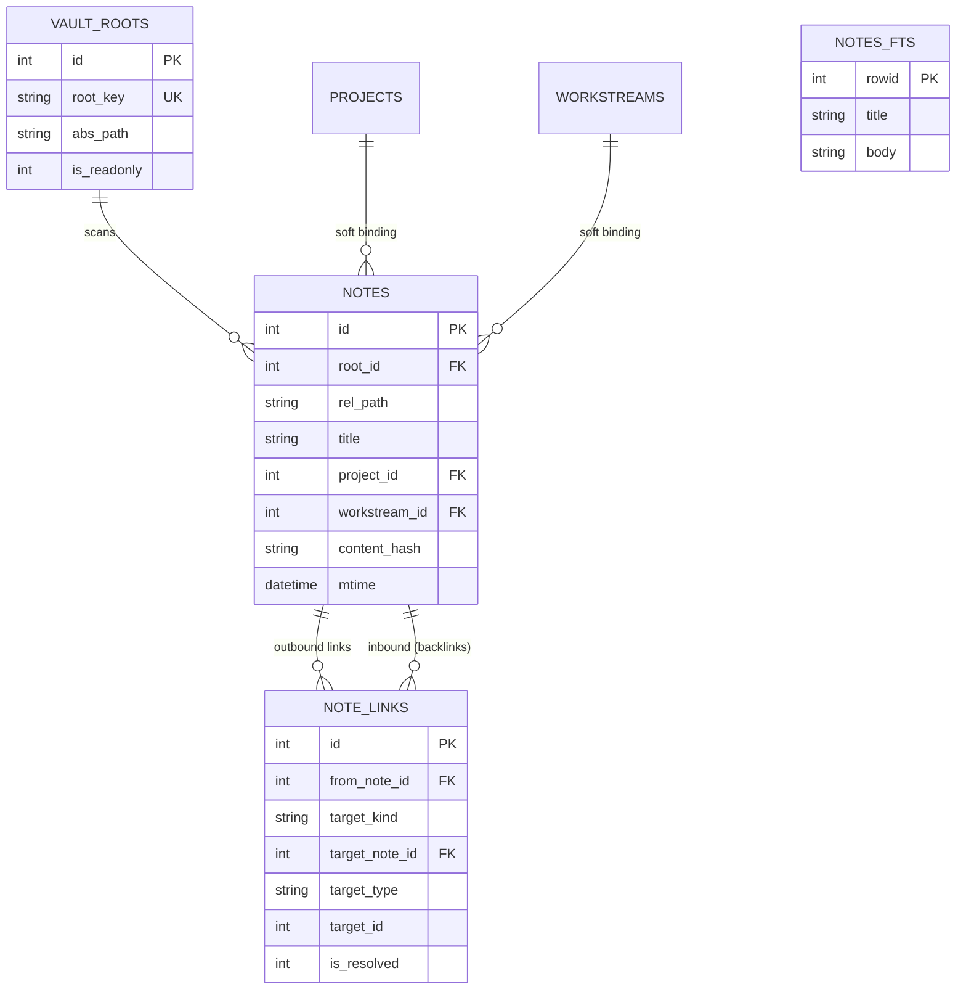
```mermaid
erDiagram
    VAULT_ROOTS ||--o{ NOTES : "scans"
    NOTES ||--o{ NOTE_LINKS : "outbound links"
    NOTES ||--o{ NOTE_LINKS : "inbound (backlinks)"
    PROJECTS ||--o{ NOTES : "soft binding"
    WORKSTREAMS ||--o{ NOTES : "soft binding"

    VAULT_ROOTS {
        int id PK
        string root_key UK
        string abs_path
        int is_readonly
    }
    NOTES {
        int id PK
        int root_id FK
        string rel_path
        string title
        int project_id FK
        int workstream_id FK
        string content_hash
        datetime mtime
    }
    NOTE_LINKS {
        int id PK
        int from_note_id FK
        string target_kind
        int target_note_id FK
        string target_type
        int target_id
        int is_resolved
    }
    NOTES_FTS {
        int rowid PK
        string title
        string body
    }
```

`notes` rows are a **rebuildable index**, not the content — the markdown file on disk is the truth. `note_links` carries both note-to-note wikilinks and typed record links (`[[project:acme]]`), which is what lets a project page show every note that mentions it.

### vault_roots

```sql
CREATE TABLE vault_roots (
    id          INTEGER PRIMARY KEY AUTOINCREMENT,
    root_key    TEXT NOT NULL UNIQUE,
    label       TEXT NOT NULL,
    abs_path    TEXT NOT NULL,
    is_readonly INTEGER NOT NULL DEFAULT 0 CHECK (is_readonly IN (0,1)),
    is_enabled  INTEGER NOT NULL DEFAULT 1 CHECK (is_enabled IN (0,1)),
    sort_order  INTEGER NOT NULL DEFAULT 0
);
```

**Seed:** `projects` → `<app_root>/projects` (writable) · `docs` → `<app_root>/docs` (writable) · `templates` → `<app_root>/template_library` (read-only).

### notes

```sql
CREATE TABLE notes (
    id             INTEGER PRIMARY KEY AUTOINCREMENT,
    root_id        INTEGER NOT NULL REFERENCES vault_roots(id) ON DELETE CASCADE,
    rel_path       TEXT NOT NULL,
    title          TEXT NOT NULL,
    note_type      TEXT,
    project_id     INTEGER REFERENCES projects(id) ON DELETE SET NULL,
    workstream_id  INTEGER REFERENCES workstreams(id) ON DELETE SET NULL,
    frontmatter_json TEXT,
    tags           TEXT,
    content_hash   TEXT NOT NULL,
    mtime          DATETIME NOT NULL,
    size_bytes     INTEGER NOT NULL DEFAULT 0,
    indexed_at     DATETIME NOT NULL DEFAULT (datetime('now')),
    created_at     DATETIME NOT NULL DEFAULT (datetime('now')),
    updated_at     DATETIME NOT NULL DEFAULT (datetime('now')),
    UNIQUE (root_id, rel_path)
);
CREATE INDEX idx_notes_project ON notes(project_id);
CREATE INDEX idx_notes_hash    ON notes(content_hash);
```

The row is an **index entry**, rebuildable by rescanning. The file on disk is the truth.

### note_links

```sql
CREATE TABLE note_links (
    id             INTEGER PRIMARY KEY AUTOINCREMENT,
    from_note_id   INTEGER NOT NULL REFERENCES notes(id) ON DELETE CASCADE,
    link_text      TEXT NOT NULL,
    target_kind    TEXT NOT NULL CHECK (target_kind IN ('note','record','external')),
    target_note_id INTEGER REFERENCES notes(id) ON DELETE SET NULL,
    target_type    TEXT,
    target_id      INTEGER,
    is_resolved    INTEGER NOT NULL DEFAULT 0 CHECK (is_resolved IN (0,1)),
    created_at     DATETIME NOT NULL DEFAULT (datetime('now'))
);
CREATE INDEX idx_note_links_from   ON note_links(from_note_id);
CREATE INDEX idx_note_links_target ON note_links(target_type, target_id);
CREATE INDEX idx_note_links_note   ON note_links(target_note_id);
```

Powers backlinks on notes and on structured record pages, and the unresolved-links report.

### notes_fts

```sql
CREATE VIRTUAL TABLE notes_fts USING fts5(
    title,
    body,
    tokenize = 'porter unicode61'
);
```

Contentless FTS5 — the indexer writes `rowid = notes.id` and re-inserts on change. Body text is not duplicated into `notes`.

---

# 0006 — Tasks

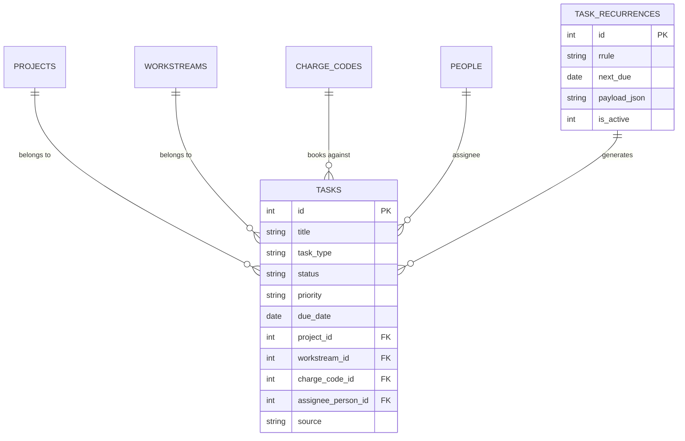
```mermaid
erDiagram
    PROJECTS ||--o{ TASKS : "belongs to"
    WORKSTREAMS ||--o{ TASKS : "belongs to"
    CHARGE_CODES ||--o{ TASKS : "books against"
    PEOPLE ||--o{ TASKS : "assignee"
    TASK_RECURRENCES ||--o{ TASKS : "generates"

    TASKS {
        int id PK
        string title
        string task_type
        string status
        string priority
        date due_date
        int project_id FK
        int workstream_id FK
        int charge_code_id FK
        int assignee_person_id FK
        string source
    }
    TASK_RECURRENCES {
        int id PK
        string rrule
        date next_due
        string payload_json
        int is_active
    }
```

### tasks

```sql
CREATE TABLE tasks (
    id             INTEGER PRIMARY KEY AUTOINCREMENT,
    title          TEXT NOT NULL,
    description    TEXT,
    task_type      TEXT NOT NULL DEFAULT 'my_task'
                   CHECK (task_type IN ('my_task','follow_up','delegated','waiting_on')),
    status         TEXT NOT NULL DEFAULT 'open'
                   CHECK (status IN ('open','in_progress','blocked','completed','cancelled')),
    priority       TEXT NOT NULL DEFAULT 'medium'
                   CHECK (priority IN ('high','medium','low')),
    due_date       DATE,
    start_date     DATE,
    completed_at   DATETIME,
    project_id     INTEGER REFERENCES projects(id) ON DELETE SET NULL,
    workstream_id  INTEGER REFERENCES workstreams(id) ON DELETE SET NULL,
    charge_code_id INTEGER REFERENCES charge_codes(id) ON DELETE SET NULL,
    assignee_person_id INTEGER REFERENCES people(id) ON DELETE SET NULL,
    estimate_hours REAL,
    source         TEXT NOT NULL DEFAULT 'manual'
                   CHECK (source IN ('manual','email','meeting','template','quick_step','ai_proposal')),
    source_ref     TEXT,
    recurrence_id  INTEGER,
    sort_order     INTEGER NOT NULL DEFAULT 0,
    created_at     DATETIME NOT NULL DEFAULT (datetime('now')),
    updated_at     DATETIME NOT NULL DEFAULT (datetime('now')),
    archived_at    DATETIME
);
CREATE INDEX idx_tasks_status   ON tasks(status);
CREATE INDEX idx_tasks_due      ON tasks(due_date);
CREATE INDEX idx_tasks_project  ON tasks(project_id);
CREATE INDEX idx_tasks_assignee ON tasks(assignee_person_id);
CREATE INDEX idx_tasks_archived ON tasks(archived_at);
```

### task_recurrences

```sql
CREATE TABLE task_recurrences (
    id            INTEGER PRIMARY KEY AUTOINCREMENT,
    template_title TEXT NOT NULL,
    rrule         TEXT NOT NULL,
    next_due      DATE,
    until_date    DATE,
    is_active     INTEGER NOT NULL DEFAULT 1 CHECK (is_active IN (0,1)),
    payload_json  TEXT NOT NULL,
    created_at    DATETIME NOT NULL DEFAULT (datetime('now'))
);
```

`rrule` is RFC 5545, expanded with `python-dateutil`. `payload_json` carries the field values each generated task inherits.

---

# 0007 — Imports

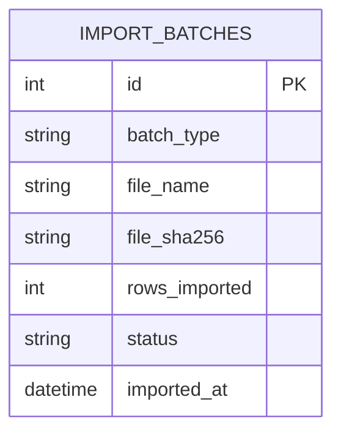
```mermaid
erDiagram
    IMPORT_BATCHES {
        int id PK
        string batch_type
        string file_name
        string file_sha256
        int rows_imported
        string status
        datetime imported_at
    }
```

One ledger for **every** file the application loads — the contact seed at Phase 1,
the timesheet export at Phase 9, template packs at Phase 16. It sits here rather
than with the financial tables because it is not a financial concept, and the
contact import needs it first.

`UNIQUE (batch_type, file_sha256)` is what makes a load **one-time**: importing
the same file twice is refused by the database, not by a convention somebody has
to remember. The row survives as the answer to "was this already loaded, when,
and what did it do."

### import_batches

```sql
CREATE TABLE import_batches (
    id           INTEGER PRIMARY KEY AUTOINCREMENT,
    batch_type   TEXT NOT NULL CHECK (batch_type IN ('timesheet','people','template','generic_csv')),
    file_name    TEXT NOT NULL,
    file_sha256  TEXT NOT NULL,
    rows_read    INTEGER NOT NULL DEFAULT 0,
    rows_imported INTEGER NOT NULL DEFAULT 0,
    rows_skipped INTEGER NOT NULL DEFAULT 0,
    rows_unmatched INTEGER NOT NULL DEFAULT 0,
    status       TEXT NOT NULL DEFAULT 'previewed'
                 CHECK (status IN ('previewed','committed','failed','rolled_back')),
    detail_json  TEXT,
    imported_at  DATETIME NOT NULL DEFAULT (datetime('now')),
    UNIQUE (batch_type, file_sha256)
);
```

The unique constraint makes re-importing an identical file a no-op.

---

# 0008 — Calendar

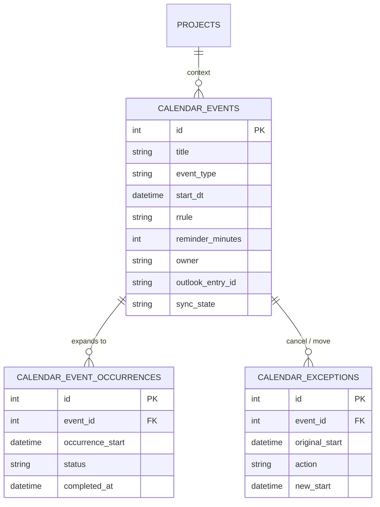
```mermaid
erDiagram
    CALENDAR_EVENTS ||--o{ CALENDAR_EVENT_OCCURRENCES : "expands to"
    CALENDAR_EVENTS ||--o{ CALENDAR_EXCEPTIONS : "cancel / move"
    PROJECTS ||--o{ CALENDAR_EVENTS : "context"

    CALENDAR_EVENTS {
        int id PK
        string title
        string event_type
        datetime start_dt
        string rrule
        int reminder_minutes
        string owner
        string outlook_entry_id
        string sync_state
    }
    CALENDAR_EVENT_OCCURRENCES {
        int id PK
        int event_id FK
        datetime occurrence_start
        string status
        datetime completed_at
    }
    CALENDAR_EXCEPTIONS {
        int id PK
        int event_id FK
        datetime original_start
        string action
        datetime new_start
    }
```

The `owner` column is the whole sync design in one field: `personalos` items are written to the dedicated Outlook folder with zero attendees; `outlook` items are read-only and never written back. **No item ever has two owners**, so there is no conflict class to resolve.

Occurrences are materialised so each instance of a recurring reminder can be completed or skipped independently.

### calendar_events

```sql
CREATE TABLE calendar_events (
    id             INTEGER PRIMARY KEY AUTOINCREMENT,
    title          TEXT NOT NULL,
    event_type     TEXT NOT NULL DEFAULT 'reminder'
                   CHECK (event_type IN ('reminder','block','milestone_marker',
                                         'prep','comms_touchpoint','stakeholder_contact')),
    body           TEXT,
    start_dt       DATETIME NOT NULL,
    end_dt         DATETIME,
    all_day        INTEGER NOT NULL DEFAULT 0 CHECK (all_day IN (0,1)),
    rrule          TEXT,
    rrule_until    DATE,
    reminder_minutes INTEGER,
    project_id     INTEGER REFERENCES projects(id) ON DELETE SET NULL,
    workstream_id  INTEGER REFERENCES workstreams(id) ON DELETE SET NULL,
    owner          TEXT NOT NULL DEFAULT 'personalos'
                   CHECK (owner IN ('personalos','outlook')),
    outlook_entry_id TEXT,
    outlook_folder   TEXT,
    sync_state     TEXT NOT NULL DEFAULT 'pending'
                   CHECK (sync_state IN ('pending','synced','error','unsynced')),
    sync_error     TEXT,
    created_at     DATETIME NOT NULL DEFAULT (datetime('now')),
    updated_at     DATETIME NOT NULL DEFAULT (datetime('now')),
    archived_at    DATETIME
);
CREATE INDEX idx_cal_events_start ON calendar_events(start_dt);
CREATE INDEX idx_cal_events_owner ON calendar_events(owner, sync_state);
```

`owner = 'personalos'` items are written to the dedicated Outlook folder with **zero attendees**. `owner = 'outlook'` is never written back.

### calendar_event_occurrences

Materialised occurrences over a rolling horizon, so each can be completed or skipped individually.

```sql
CREATE TABLE calendar_event_occurrences (
    id               INTEGER PRIMARY KEY AUTOINCREMENT,
    event_id         INTEGER NOT NULL REFERENCES calendar_events(id) ON DELETE CASCADE,
    occurrence_start DATETIME NOT NULL,
    occurrence_end   DATETIME,
    status           TEXT NOT NULL DEFAULT 'pending'
                     CHECK (status IN ('pending','done','skipped','moved')),
    completed_at     DATETIME,
    note             TEXT,
    UNIQUE (event_id, occurrence_start)
);
CREATE INDEX idx_cal_occ_start ON calendar_event_occurrences(occurrence_start, status);
```

### calendar_exceptions

```sql
CREATE TABLE calendar_exceptions (
    id             INTEGER PRIMARY KEY AUTOINCREMENT,
    event_id       INTEGER NOT NULL REFERENCES calendar_events(id) ON DELETE CASCADE,
    original_start DATETIME NOT NULL,
    action         TEXT NOT NULL CHECK (action IN ('cancel','move')),
    new_start      DATETIME,
    new_end        DATETIME,
    created_at     DATETIME NOT NULL DEFAULT (datetime('now')),
    UNIQUE (event_id, original_start)
);
```

---

# 0009 — Meetings

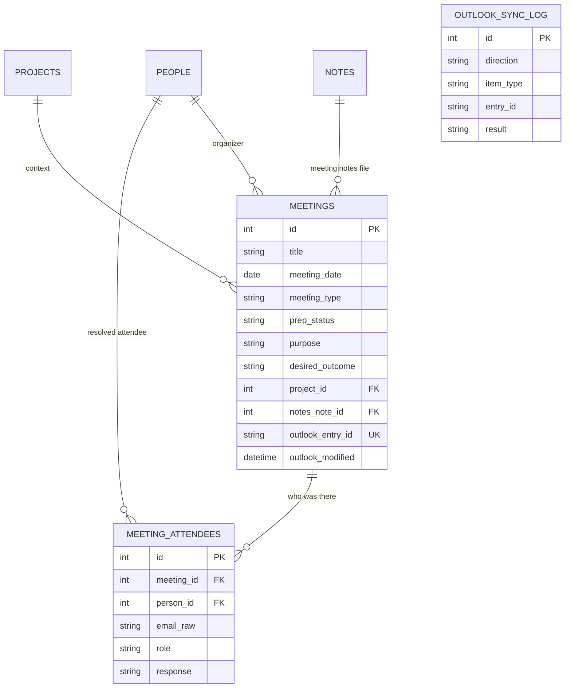
```mermaid
erDiagram
    MEETINGS ||--o{ MEETING_ATTENDEES : "who was there"
    PEOPLE ||--o{ MEETING_ATTENDEES : "resolved attendee"
    PEOPLE ||--o{ MEETINGS : organizer
    PROJECTS ||--o{ MEETINGS : "context"
    NOTES ||--o{ MEETINGS : "meeting notes file"

    MEETINGS {
        int id PK
        string title
        date meeting_date
        string meeting_type
        string prep_status
        string purpose
        string desired_outcome
        int project_id FK
        int notes_note_id FK
        string outlook_entry_id UK
        datetime outlook_modified
    }
    MEETING_ATTENDEES {
        int id PK
        int meeting_id FK
        int person_id FK
        string email_raw
        string role
        string response
    }
    OUTLOOK_SYNC_LOG {
        int id PK
        string direction
        string item_type
        string entry_id
        string result
    }
```

`outlook_entry_id` is unique — that is the dedup key. `outlook_modified` drives incremental change detection. `email_raw` on attendees holds addresses that have not yet been resolved to a person, which is what feeds `contact_candidates`.

### meetings

```sql
CREATE TABLE meetings (
    id               INTEGER PRIMARY KEY AUTOINCREMENT,
    title            TEXT NOT NULL,
    meeting_date     DATE NOT NULL,
    meeting_time     TIME,
    duration_minutes INTEGER,
    location         TEXT,
    meeting_link     TEXT,
    organizer_person_id INTEGER REFERENCES people(id) ON DELETE SET NULL,
    organizer_raw    TEXT,
    meeting_type     TEXT NOT NULL DEFAULT 'other'
                     CHECK (meeting_type IN ('client','internal','one_on_one','review',
                                             'workshop','outlook_import','other')),
    status           TEXT NOT NULL DEFAULT 'planned'
                     CHECK (status IN ('planned','held','cancelled')),
    prep_status      TEXT NOT NULL DEFAULT 'not_started'
                     CHECK (prep_status IN ('not_started','in_progress','prep_done')),
    purpose          TEXT,
    desired_outcome  TEXT,
    agenda           TEXT,
    prework          TEXT,
    decisions        TEXT,
    notes_note_id    INTEGER REFERENCES notes(id) ON DELETE SET NULL,
    project_id       INTEGER REFERENCES projects(id) ON DELETE SET NULL,
    workstream_id    INTEGER REFERENCES workstreams(id) ON DELETE SET NULL,
    outlook_entry_id TEXT UNIQUE,
    outlook_modified DATETIME,
    created_at       DATETIME NOT NULL DEFAULT (datetime('now')),
    updated_at       DATETIME NOT NULL DEFAULT (datetime('now')),
    archived_at      DATETIME
);
CREATE INDEX idx_meetings_date    ON meetings(meeting_date);
CREATE INDEX idx_meetings_project ON meetings(project_id);
```

### meeting_attendees

```sql
CREATE TABLE meeting_attendees (
    id         INTEGER PRIMARY KEY AUTOINCREMENT,
    meeting_id INTEGER NOT NULL REFERENCES meetings(id) ON DELETE CASCADE,
    person_id  INTEGER REFERENCES people(id) ON DELETE SET NULL,
    email_raw  TEXT,
    role       TEXT NOT NULL DEFAULT 'required'
               CHECK (role IN ('organizer','required','optional','resource')),
    response   TEXT CHECK (response IN ('none','accepted','declined','tentative')),
    UNIQUE (meeting_id, person_id, email_raw)
);
CREATE INDEX idx_attendees_meeting ON meeting_attendees(meeting_id);
CREATE INDEX idx_attendees_person  ON meeting_attendees(person_id);
```

### outlook_sync_log

```sql
CREATE TABLE outlook_sync_log (
    id          INTEGER PRIMARY KEY AUTOINCREMENT,
    direction   TEXT NOT NULL CHECK (direction IN ('read','write')),
    item_type   TEXT NOT NULL CHECK (item_type IN ('calendar','mail','contact','gal','draft')),
    entry_id    TEXT,
    action      TEXT NOT NULL,
    result      TEXT NOT NULL CHECK (result IN ('ok','skipped','error')),
    detail      TEXT,
    created_at  DATETIME NOT NULL DEFAULT (datetime('now'))
);
CREATE INDEX idx_outlook_sync_created ON outlook_sync_log(created_at DESC);
```

---

# 0010 — Intake

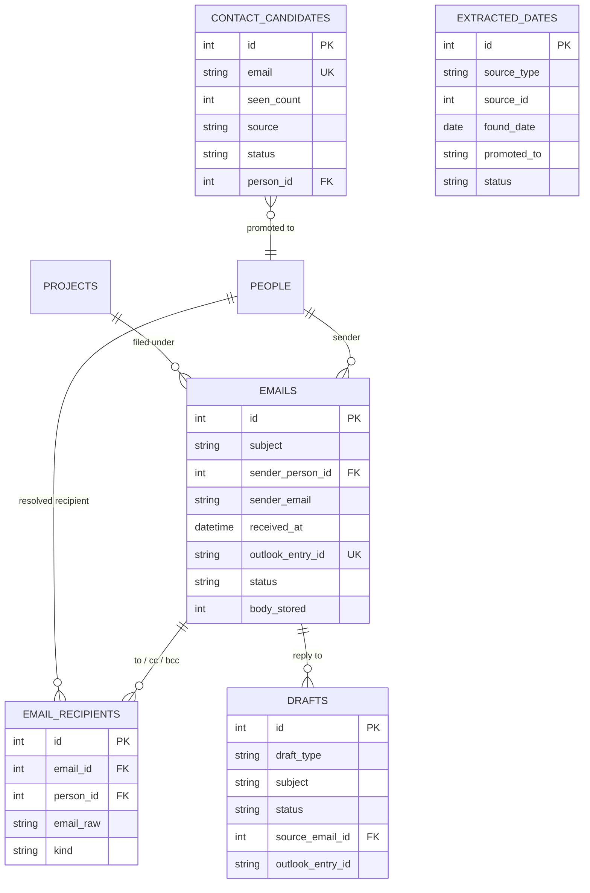
```mermaid
erDiagram
    EMAILS ||--o{ EMAIL_RECIPIENTS : "to / cc / bcc"
    PEOPLE ||--o{ EMAILS : sender
    PEOPLE ||--o{ EMAIL_RECIPIENTS : "resolved recipient"
    EMAILS ||--o{ DRAFTS : "reply to"
    PROJECTS ||--o{ EMAILS : "filed under"
    CONTACT_CANDIDATES }o--|| PEOPLE : "promoted to"

    EMAILS {
        int id PK
        string subject
        int sender_person_id FK
        string sender_email
        datetime received_at
        string outlook_entry_id UK
        string status
        int body_stored
    }
    EMAIL_RECIPIENTS {
        int id PK
        int email_id FK
        int person_id FK
        string email_raw
        string kind
    }
    CONTACT_CANDIDATES {
        int id PK
        string email UK
        int seen_count
        string source
        string status
        int person_id FK
    }
    DRAFTS {
        int id PK
        string draft_type
        string subject
        string status
        int source_email_id FK
        string outlook_entry_id
    }
    EXTRACTED_DATES {
        int id PK
        string source_type
        int source_id
        date found_date
        string promoted_to
        string status
    }
```

Two safety properties visible here: `body_stored` means full email bodies are opt-in, and `contact_candidates` is a **review queue** — scraped addresses never become people silently.

### emails

```sql
CREATE TABLE emails (
    id              INTEGER PRIMARY KEY AUTOINCREMENT,
    subject         TEXT NOT NULL,
    sender_person_id INTEGER REFERENCES people(id) ON DELETE SET NULL,
    sender_email    TEXT,
    received_at     DATETIME,
    folder          TEXT,
    conversation_id TEXT,
    outlook_entry_id TEXT UNIQUE,
    summary         TEXT,
    extracted_action TEXT,
    status          TEXT NOT NULL DEFAULT 'new'
                    CHECK (status IN ('new','triaged','archived')),
    project_id      INTEGER REFERENCES projects(id) ON DELETE SET NULL,
    body_stored     INTEGER NOT NULL DEFAULT 0 CHECK (body_stored IN (0,1)),
    body_text       TEXT,
    created_at      DATETIME NOT NULL DEFAULT (datetime('now')),
    updated_at      DATETIME NOT NULL DEFAULT (datetime('now'))
);
CREATE INDEX idx_emails_status   ON emails(status, received_at DESC);
CREATE INDEX idx_emails_project  ON emails(project_id);
```

`body_text` is populated only on explicit opt-in.

### email_recipients

```sql
CREATE TABLE email_recipients (
    id         INTEGER PRIMARY KEY AUTOINCREMENT,
    email_id   INTEGER NOT NULL REFERENCES emails(id) ON DELETE CASCADE,
    person_id  INTEGER REFERENCES people(id) ON DELETE SET NULL,
    email_raw  TEXT,
    kind       TEXT NOT NULL DEFAULT 'to' CHECK (kind IN ('to','cc','bcc'))
);
CREATE INDEX idx_email_recip ON email_recipients(email_id);
```

### contact_candidates

```sql
CREATE TABLE contact_candidates (
    id            INTEGER PRIMARY KEY AUTOINCREMENT,
    email         TEXT NOT NULL UNIQUE,
    display_name  TEXT,
    first_seen_at DATETIME NOT NULL DEFAULT (datetime('now')),
    seen_count    INTEGER NOT NULL DEFAULT 1,
    source        TEXT NOT NULL CHECK (source IN ('email','meeting')),
    status        TEXT NOT NULL DEFAULT 'pending'
                  CHECK (status IN ('pending','promoted','ignored')),
    person_id     INTEGER REFERENCES people(id) ON DELETE SET NULL
);
CREATE INDEX idx_candidates_status ON contact_candidates(status, seen_count DESC);
```

Scraped addresses land here for review. Never silently promoted — with the single documented exception of managers pulled to complete a reporting chain, which are created directly with `import_source = 'gal_manager_chain'`.

### drafts

```sql
CREATE TABLE drafts (
    id            INTEGER PRIMARY KEY AUTOINCREMENT,
    draft_type    TEXT NOT NULL CHECK (draft_type IN ('email','reply','meeting_invite')),
    subject       TEXT NOT NULL,
    body          TEXT,
    to_recipients TEXT,
    cc_recipients TEXT,
    status        TEXT NOT NULL DEFAULT 'draft'
                  CHECK (status IN ('draft','opened_in_outlook','discarded')),
    project_id    INTEGER REFERENCES projects(id) ON DELETE SET NULL,
    source_email_id INTEGER REFERENCES emails(id) ON DELETE SET NULL,
    outlook_entry_id TEXT,
    created_at    DATETIME NOT NULL DEFAULT (datetime('now')),
    updated_at    DATETIME NOT NULL DEFAULT (datetime('now')),
    archived_at   DATETIME
);
```

PersonalOS never calls `Send()`. Drafts are opened in Outlook with `Display()`.

### extracted_dates

```sql
CREATE TABLE extracted_dates (
    id           INTEGER PRIMARY KEY AUTOINCREMENT,
    source_type  TEXT NOT NULL CHECK (source_type IN ('email','meeting','note')),
    source_id    INTEGER NOT NULL,
    found_date   DATE NOT NULL,
    label        TEXT,
    confidence   REAL,
    promoted_to  TEXT CHECK (promoted_to IN ('task','milestone','calendar_event')),
    promoted_id  INTEGER,
    status       TEXT NOT NULL DEFAULT 'pending'
                 CHECK (status IN ('pending','promoted','dismissed')),
    created_at   DATETIME NOT NULL DEFAULT (datetime('now'))
);
CREATE INDEX idx_extracted_source ON extracted_dates(source_type, source_id);
```

---

# 0011 — Milestones & Baselines

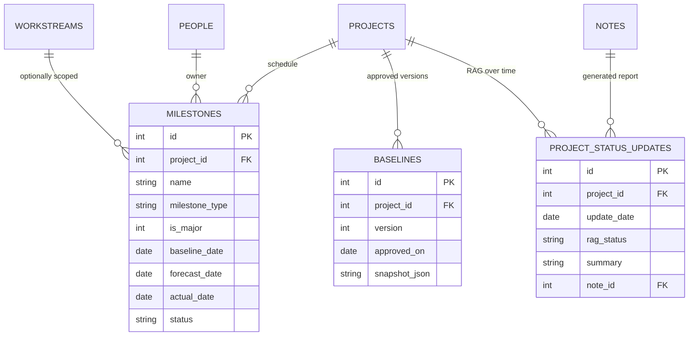
```mermaid
erDiagram
    PROJECTS ||--o{ MILESTONES : "schedule"
    PROJECTS ||--o{ BASELINES : "approved versions"
    PROJECTS ||--o{ PROJECT_STATUS_UPDATES : "RAG over time"
    WORKSTREAMS ||--o{ MILESTONES : "optionally scoped"
    PEOPLE ||--o{ MILESTONES : owner
    NOTES ||--o{ PROJECT_STATUS_UPDATES : "generated report"

    MILESTONES {
        int id PK
        int project_id FK
        string name
        string milestone_type
        int is_major
        date baseline_date
        date forecast_date
        date actual_date
        string status
    }
    BASELINES {
        int id PK
        int project_id FK
        int version
        date approved_on
        string snapshot_json
    }
    PROJECT_STATUS_UPDATES {
        int id PK
        int project_id FK
        date update_date
        string rag_status
        string summary
        int note_id FK
    }
```

`is_major` is the filter for the Portfolio Timeline — only major milestones render as diamonds. `baseline_date` versus `forecast_date` per milestone is the schedule-variance calculation.

### milestones

```sql
CREATE TABLE milestones (
    id            INTEGER PRIMARY KEY AUTOINCREMENT,
    project_id    INTEGER NOT NULL REFERENCES projects(id) ON DELETE CASCADE,
    workstream_id INTEGER REFERENCES workstreams(id) ON DELETE SET NULL,
    name          TEXT NOT NULL,
    milestone_type TEXT NOT NULL DEFAULT 'milestone'
                  CHECK (milestone_type IN ('milestone','deliverable','deadline','billing','gate')),
    is_major      INTEGER NOT NULL DEFAULT 0 CHECK (is_major IN (0,1)),
    baseline_date DATE,
    forecast_date DATE,
    actual_date   DATE,
    status        TEXT NOT NULL DEFAULT 'planned'
                  CHECK (status IN ('planned','at_risk','achieved','missed','cancelled')),
    owner_person_id INTEGER REFERENCES people(id) ON DELETE SET NULL,
    notes         TEXT,
    sort_order    INTEGER NOT NULL DEFAULT 0,
    created_at    DATETIME NOT NULL DEFAULT (datetime('now')),
    updated_at    DATETIME NOT NULL DEFAULT (datetime('now')),
    archived_at   DATETIME
);
CREATE INDEX idx_milestones_project ON milestones(project_id, forecast_date);
CREATE INDEX idx_milestones_major   ON milestones(is_major, forecast_date);
```

Only `is_major = 1` renders on the Portfolio Timeline.

### baselines

```sql
CREATE TABLE baselines (
    id           INTEGER PRIMARY KEY AUTOINCREMENT,
    project_id   INTEGER NOT NULL REFERENCES projects(id) ON DELETE CASCADE,
    version      INTEGER NOT NULL,
    approved_on  DATE NOT NULL,
    approved_by_person_id INTEGER REFERENCES people(id),
    snapshot_json TEXT NOT NULL,
    reason       TEXT,
    created_at   DATETIME NOT NULL DEFAULT (datetime('now')),
    UNIQUE (project_id, version)
);
```

`snapshot_json` freezes dates, budget and milestone set at approval. Variance is always measured against the latest approved baseline.

### project_status_updates

```sql
CREATE TABLE project_status_updates (
    id          INTEGER PRIMARY KEY AUTOINCREMENT,
    project_id  INTEGER NOT NULL REFERENCES projects(id) ON DELETE CASCADE,
    update_date DATE NOT NULL,
    rag_status  TEXT CHECK (rag_status IN ('green','amber','red')),
    summary     TEXT,
    accomplishments TEXT,
    next_period TEXT,
    risks       TEXT,
    asks        TEXT,
    note_id     INTEGER REFERENCES notes(id) ON DELETE SET NULL,
    created_at  DATETIME NOT NULL DEFAULT (datetime('now'))
);
CREATE INDEX idx_status_updates ON project_status_updates(project_id, update_date DESC);
```

---

# 0012 — Financials

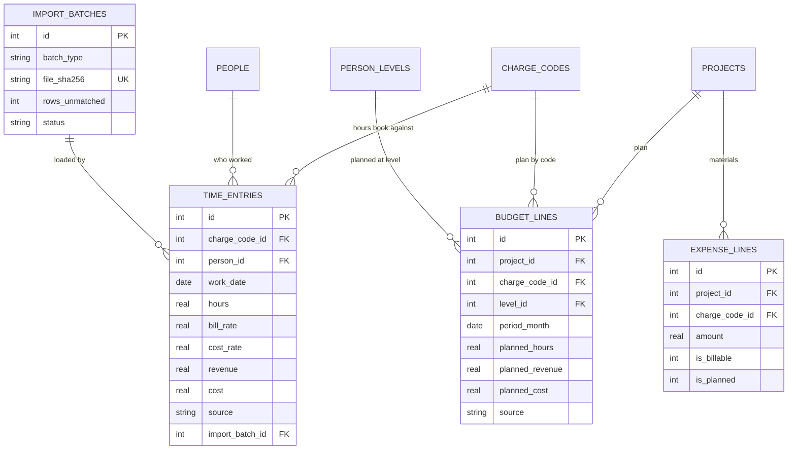
```mermaid
erDiagram
    CHARGE_CODES ||--o{ TIME_ENTRIES : "hours book against"
    PEOPLE ||--o{ TIME_ENTRIES : "who worked"
    IMPORT_BATCHES ||--o{ TIME_ENTRIES : "loaded by"
    PROJECTS ||--o{ BUDGET_LINES : plan
    CHARGE_CODES ||--o{ BUDGET_LINES : "plan by code"
    PERSON_LEVELS ||--o{ BUDGET_LINES : "planned at level"
    PROJECTS ||--o{ EXPENSE_LINES : materials

    TIME_ENTRIES {
        int id PK
        int charge_code_id FK
        int person_id FK
        date work_date
        real hours
        real bill_rate
        real cost_rate
        real revenue
        real cost
        string source
        int import_batch_id FK
    }
    BUDGET_LINES {
        int id PK
        int project_id FK
        int charge_code_id FK
        int level_id FK
        date period_month
        real planned_hours
        real planned_revenue
        real planned_cost
        string source
    }
    EXPENSE_LINES {
        int id PK
        int project_id FK
        int charge_code_id FK
        real amount
        int is_billable
        int is_planned
    }
    IMPORT_BATCHES {
        int id PK
        string batch_type
        string file_sha256 UK
        int rows_unmatched
        string status
    }
```

**The critical shape:** `time_entries` hangs off `charge_code_id`, not `project_id`. Project and workstream are derived by joining through the charge code, which is exactly how the timesheet export identifies work. Rates are snapshotted onto each row at `work_date`, so a promotion or annual rate change never restates history.

`import_batches.file_sha256` is unique per batch type, making a re-import of the same file a no-op.

### budget_lines

```sql
CREATE TABLE budget_lines (
    id             INTEGER PRIMARY KEY AUTOINCREMENT,
    project_id     INTEGER NOT NULL REFERENCES projects(id) ON DELETE CASCADE,
    workstream_id  INTEGER REFERENCES workstreams(id) ON DELETE SET NULL,
    charge_code_id INTEGER REFERENCES charge_codes(id) ON DELETE SET NULL,
    task_id        INTEGER REFERENCES tasks(id) ON DELETE SET NULL,
    level_id       INTEGER REFERENCES person_levels(id),
    person_id      INTEGER REFERENCES people(id) ON DELETE SET NULL,
    period_month   DATE,
    planned_hours  REAL NOT NULL DEFAULT 0,
    planned_standard_rate REAL,
    planned_erp_pct       REAL,
    planned_bill_rate REAL,
    planned_cost_rate REAL,
    planned_revenue REAL,
    planned_cost   REAL,
    source         TEXT NOT NULL DEFAULT 'manual'
                   CHECK (source IN ('manual','template','import')),
    note           TEXT,
    created_at     DATETIME NOT NULL DEFAULT (datetime('now')),
    updated_at     DATETIME NOT NULL DEFAULT (datetime('now'))
);
CREATE INDEX idx_budget_project ON budget_lines(project_id);
CREATE INDEX idx_budget_charge  ON budget_lines(charge_code_id);
```

Rates are snapshotted at creation via `resolve_rates()` so a later rate-card edit does not silently restate an approved budget. `planned_standard_rate` and `planned_erp_pct` are kept alongside `planned_bill_rate` so the derivation stays visible — a budget line that reads *"$500 standard × 85% ERP = $425"* is auditable in a way that a bare $425 is not.

**`task_id` is what makes a WBS-driven budget work.** A template's task plan carries hours and a level per task; on import each becomes a budget line bound to its task, so the budget is built bottom-up from the work breakdown and can be revised task by task as the plan firms up.

### expense_lines

```sql
CREATE TABLE expense_lines (
    id             INTEGER PRIMARY KEY AUTOINCREMENT,
    project_id     INTEGER NOT NULL REFERENCES projects(id) ON DELETE CASCADE,
    workstream_id  INTEGER REFERENCES workstreams(id) ON DELETE SET NULL,
    charge_code_id INTEGER REFERENCES charge_codes(id) ON DELETE SET NULL,
    description    TEXT NOT NULL,
    expense_date   DATE,
    amount         REAL NOT NULL,
    currency       TEXT NOT NULL DEFAULT 'USD',
    is_billable    INTEGER NOT NULL DEFAULT 1 CHECK (is_billable IN (0,1)),
    is_planned     INTEGER NOT NULL DEFAULT 0 CHECK (is_planned IN (0,1)),
    created_at     DATETIME NOT NULL DEFAULT (datetime('now'))
);
CREATE INDEX idx_expense_project ON expense_lines(project_id);
```

### fee_types

Uplifts applied on top of labour revenue — admin, technology, and engagement-type-specific fees. **Adding a new fee is a row here, never a code change.**

```sql
CREATE TABLE fee_types (
    id            INTEGER PRIMARY KEY AUTOINCREMENT,
    fee_key       TEXT NOT NULL UNIQUE,
    label         TEXT NOT NULL,
    calc_method   TEXT NOT NULL DEFAULT 'percent'
                  CHECK (calc_method IN ('percent','flat','per_hour')),
    default_rate  REAL,
    basis         TEXT NOT NULL DEFAULT 'labor_revenue'
                  CHECK (basis IN ('labor_revenue','labor_plus_prior_fees',
                                   'expenses','labor_plus_expenses')),
    applies_when  TEXT NOT NULL DEFAULT 'always'
                  CHECK (applies_when IN ('always','by_project_type','manual')),
    is_billable   INTEGER NOT NULL DEFAULT 1 CHECK (is_billable IN (0,1)),
    sort_order    INTEGER NOT NULL DEFAULT 0,
    is_active     INTEGER NOT NULL DEFAULT 1 CHECK (is_active IN (0,1)),
    notes         TEXT,
    created_at    DATETIME NOT NULL DEFAULT (datetime('now'))
);
```

**Seed:**

| sort | fee_key | label | method | rate | basis | applies |
|---|---|---|---|---|---|---|
| 10 | `admin` | Administrative Fee | percent | 12.0 | `labor_revenue` | always |
| 20 | `tech` | Technology Fee | percent | 3.0 | `labor_revenue` | always |
| 30 | `kinergy` | Kinergy Fee | percent | *(by rule)* | `labor_revenue` | by_project_type |

### fee_type_rules

Rate varies by project type — the Kinergy case.

```sql
CREATE TABLE fee_type_rules (
    id           INTEGER PRIMARY KEY AUTOINCREMENT,
    fee_type_id  INTEGER NOT NULL REFERENCES fee_types(id) ON DELETE CASCADE,
    project_type TEXT NOT NULL,
    rate         REAL NOT NULL,
    is_active    INTEGER NOT NULL DEFAULT 1 CHECK (is_active IN (0,1)),
    UNIQUE (fee_type_id, project_type)
);
```

**Seed:** `kinergy` × `Sell Side` → **8.0** · `kinergy` × `Buy Side` → **5.0**

A project type with no rule simply does not attract that fee.

### project_fees

The resolved, per-project instance. Materialised on project create and on project-type change, then editable.

```sql
CREATE TABLE project_fees (
    id             INTEGER PRIMARY KEY AUTOINCREMENT,
    project_id     INTEGER NOT NULL REFERENCES projects(id) ON DELETE CASCADE,
    charge_code_id INTEGER REFERENCES charge_codes(id) ON DELETE CASCADE,
    fee_type_id    INTEGER NOT NULL REFERENCES fee_types(id),
    calc_method    TEXT NOT NULL DEFAULT 'percent'
                   CHECK (calc_method IN ('percent','flat','per_hour')),
    rate           REAL NOT NULL,
    basis          TEXT NOT NULL DEFAULT 'labor_revenue'
                   CHECK (basis IN ('labor_revenue','labor_plus_prior_fees',
                                    'expenses','labor_plus_expenses')),
    sort_order     INTEGER NOT NULL DEFAULT 0,
    is_active      INTEGER NOT NULL DEFAULT 1 CHECK (is_active IN (0,1)),
    source         TEXT NOT NULL DEFAULT 'default'
                   CHECK (source IN ('default','rule','manual','template','negotiated')),
    effective_from DATE,
    effective_to   DATE,
    notes          TEXT,
    created_at     DATETIME NOT NULL DEFAULT (datetime('now')),
    updated_at     DATETIME NOT NULL DEFAULT (datetime('now'))
);
CREATE INDEX idx_project_fees ON project_fees(project_id, is_active, sort_order);
```

Rate, basis and sort order are **copied onto the project row at resolution**, not read live from `fee_types`. Changing the firm's admin fee next year must not silently restate a signed engagement — same discipline as rate snapshotting on `time_entries`.

`charge_code_id` null means the fee applies across the whole project.

**Resolution and application order:** `FINANCIAL_MODEL.md` §4.

### time_entries

The charge code is the foreign key; project and workstream are derived through it.

```sql
CREATE TABLE time_entries (
    id             INTEGER PRIMARY KEY AUTOINCREMENT,
    charge_code_id INTEGER NOT NULL REFERENCES charge_codes(id) ON DELETE CASCADE,
    person_id      INTEGER NOT NULL REFERENCES people(id) ON DELETE CASCADE,
    work_date      DATE NOT NULL,
    hours          REAL NOT NULL,
    description    TEXT,
    bill_rate      REAL,
    cost_rate      REAL,
    revenue        REAL,
    cost           REAL,
    source         TEXT NOT NULL DEFAULT 'import'
                   CHECK (source IN ('import','manual')),
    import_batch_id INTEGER REFERENCES import_batches(id) ON DELETE SET NULL,
    external_ref   TEXT,
    created_at     DATETIME NOT NULL DEFAULT (datetime('now')),
    UNIQUE (charge_code_id, person_id, work_date, external_ref)
);
CREATE INDEX idx_time_charge ON time_entries(charge_code_id, work_date);
CREATE INDEX idx_time_person ON time_entries(person_id, work_date);
```

Rates are resolved at `work_date` on insert, so hours before and after a promotion price differently and permanently.


---

# 0013 — Smartsheet

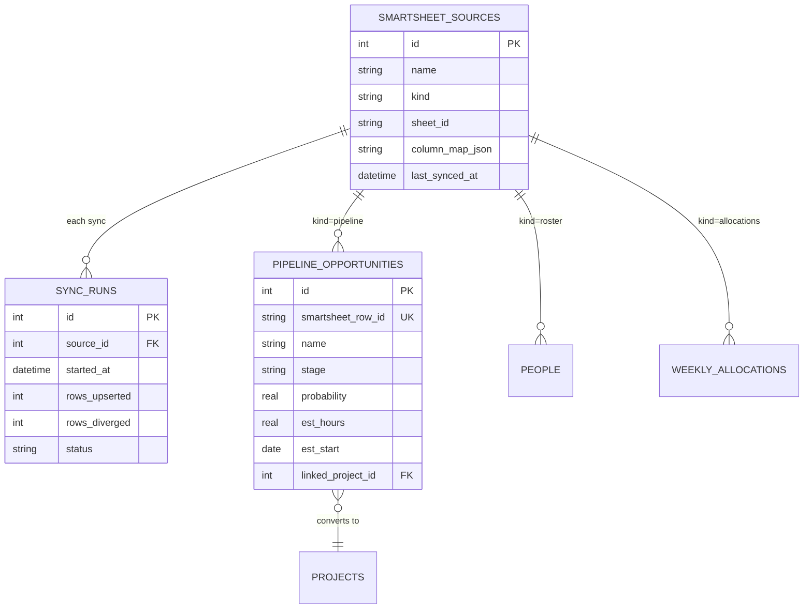
```mermaid
erDiagram
    SMARTSHEET_SOURCES ||--o{ SYNC_RUNS : "each sync"
    SMARTSHEET_SOURCES ||--o{ PIPELINE_OPPORTUNITIES : "kind=pipeline"
    SMARTSHEET_SOURCES ||--o{ PEOPLE : "kind=roster"
    SMARTSHEET_SOURCES ||--o{ WEEKLY_ALLOCATIONS : "kind=allocations"
    PIPELINE_OPPORTUNITIES }o--|| PROJECTS : "converts to"

    SMARTSHEET_SOURCES {
        int id PK
        string name
        string kind
        string sheet_id
        string column_map_json
        datetime last_synced_at
    }
    SYNC_RUNS {
        int id PK
        int source_id FK
        datetime started_at
        int rows_upserted
        int rows_diverged
        string status
    }
    PIPELINE_OPPORTUNITIES {
        int id PK
        string smartsheet_row_id UK
        string name
        string stage
        real probability
        real est_hours
        date est_start
        int linked_project_id FK
    }
```

`column_map_json` per source means a column rename in Smartsheet is an Admin edit, not a code change. `rows_diverged` counts locally-edited rows whose remote value changed — **flagged, never overwritten**.

Pipeline opportunities feed demand as `est_hours × probability`, which is how a resource cliff appears before the work is sold.

### smartsheet_sources

```sql
CREATE TABLE smartsheet_sources (
    id              INTEGER PRIMARY KEY AUTOINCREMENT,
    name            TEXT NOT NULL,
    kind            TEXT NOT NULL
                    CHECK (kind IN ('pipeline','roster','allocations','resources')),
    sheet_id        TEXT NOT NULL,
    column_map_json TEXT NOT NULL,
    is_enabled      INTEGER NOT NULL DEFAULT 1 CHECK (is_enabled IN (0,1)),
    last_synced_at  DATETIME,
    created_at      DATETIME NOT NULL DEFAULT (datetime('now')),
    UNIQUE (kind, sheet_id)
);
```

### sync_runs

```sql
CREATE TABLE sync_runs (
    id            INTEGER PRIMARY KEY AUTOINCREMENT,
    source_id     INTEGER REFERENCES smartsheet_sources(id) ON DELETE CASCADE,
    started_at    DATETIME NOT NULL DEFAULT (datetime('now')),
    finished_at   DATETIME,
    rows_in       INTEGER NOT NULL DEFAULT 0,
    rows_upserted INTEGER NOT NULL DEFAULT 0,
    rows_diverged INTEGER NOT NULL DEFAULT 0,
    status        TEXT NOT NULL DEFAULT 'running'
                  CHECK (status IN ('running','ok','partial','error')),
    error         TEXT
);
CREATE INDEX idx_sync_runs ON sync_runs(source_id, started_at DESC);
```

### pipeline_opportunities

```sql
CREATE TABLE pipeline_opportunities (
    id                INTEGER PRIMARY KEY AUTOINCREMENT,
    smartsheet_row_id TEXT UNIQUE,
    name              TEXT NOT NULL,
    client_org        TEXT,
    service_offering  TEXT,
    stage             TEXT,
    probability       REAL,
    est_value         REAL,
    currency          TEXT NOT NULL DEFAULT 'USD',
    est_start         DATE,
    est_end           DATE,
    est_hours         REAL,
    owner_person_id   INTEGER REFERENCES people(id) ON DELETE SET NULL,
    linked_project_id INTEGER REFERENCES projects(id) ON DELETE SET NULL,
    synced_at         DATETIME,
    created_at        DATETIME NOT NULL DEFAULT (datetime('now')),
    updated_at        DATETIME NOT NULL DEFAULT (datetime('now'))
);
CREATE INDEX idx_pipeline_stage ON pipeline_opportunities(stage, est_start);
```

---

# 0014 — Assignments

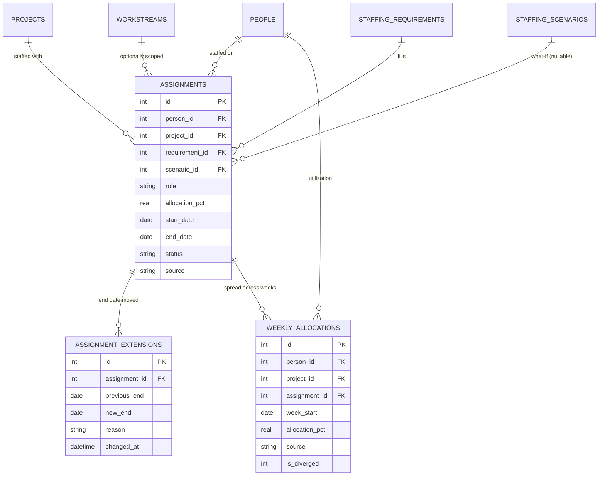
```mermaid
erDiagram
    PEOPLE ||--o{ ASSIGNMENTS : "staffed on"
    PROJECTS ||--o{ ASSIGNMENTS : "staffed with"
    WORKSTREAMS ||--o{ ASSIGNMENTS : "optionally scoped"
    STAFFING_REQUIREMENTS ||--o{ ASSIGNMENTS : fills
    STAFFING_SCENARIOS ||--o{ ASSIGNMENTS : "what-if (nullable)"
    ASSIGNMENTS ||--o{ ASSIGNMENT_EXTENSIONS : "end date moved"
    ASSIGNMENTS ||--o{ WEEKLY_ALLOCATIONS : "spread across weeks"
    PEOPLE ||--o{ WEEKLY_ALLOCATIONS : "utilization"

    ASSIGNMENTS {
        int id PK
        int person_id FK
        int project_id FK
        int requirement_id FK
        int scenario_id FK
        string role
        real allocation_pct
        date start_date
        date end_date
        string status
        string source
    }
    ASSIGNMENT_EXTENSIONS {
        int id PK
        int assignment_id FK
        date previous_end
        date new_end
        string reason
        datetime changed_at
    }
    WEEKLY_ALLOCATIONS {
        int id PK
        int person_id FK
        int project_id FK
        int assignment_id FK
        date week_start
        real allocation_pct
        string source
        int is_diverged
    }
```

`assignments.end_date` is the field that gets extended, and every extension writes an `assignment_extensions` row — the audit trail of how a three-month assignment became eleven. An assignment ending before its project's forecast end is precisely a **resource cliff**.

`scenario_id IS NULL` is the live plan; every existing query filters on it, so what-if planning adds no parallel table.

### assignments

```sql
CREATE TABLE assignments (
    id             INTEGER PRIMARY KEY AUTOINCREMENT,
    person_id      INTEGER NOT NULL REFERENCES people(id) ON DELETE CASCADE,
    project_id     INTEGER NOT NULL REFERENCES projects(id) ON DELETE CASCADE,
    workstream_id  INTEGER REFERENCES workstreams(id) ON DELETE SET NULL,
    charge_code_id INTEGER REFERENCES charge_codes(id) ON DELETE SET NULL,
    requirement_id INTEGER,
    scenario_id    INTEGER,
    role           TEXT,
    allocation_pct REAL NOT NULL DEFAULT 100.0,
    start_date     DATE NOT NULL,
    end_date       DATE NOT NULL,
    status         TEXT NOT NULL DEFAULT 'confirmed'
                   CHECK (status IN ('tentative','confirmed','completed','cancelled')),
    source         TEXT NOT NULL DEFAULT 'manual'
                   CHECK (source IN ('manual','smartsheet','template')),
    notes          TEXT,
    created_at     DATETIME NOT NULL DEFAULT (datetime('now')),
    updated_at     DATETIME NOT NULL DEFAULT (datetime('now')),
    archived_at    DATETIME
);
CREATE INDEX idx_assign_person   ON assignments(person_id, start_date, end_date);
CREATE INDEX idx_assign_project  ON assignments(project_id);
CREATE INDEX idx_assign_scenario ON assignments(scenario_id);
```

`scenario_id` null means the live plan. Every what-if query filters on it; every existing query gains `AND scenario_id IS NULL`.

### assignment_extensions

The audit trail of how a three-month assignment became eleven.

```sql
CREATE TABLE assignment_extensions (
    id            INTEGER PRIMARY KEY AUTOINCREMENT,
    assignment_id INTEGER NOT NULL REFERENCES assignments(id) ON DELETE CASCADE,
    previous_end  DATE NOT NULL,
    new_end       DATE NOT NULL,
    reason        TEXT,
    changed_at    DATETIME NOT NULL DEFAULT (datetime('now'))
);
CREATE INDEX idx_ext_assignment ON assignment_extensions(assignment_id, changed_at);
```

### weekly_allocations

Materialised weekly grain, fed by assignments and by the Smartsheet allocations sheet.

```sql
CREATE TABLE weekly_allocations (
    id             INTEGER PRIMARY KEY AUTOINCREMENT,
    person_id      INTEGER NOT NULL REFERENCES people(id) ON DELETE CASCADE,
    project_id     INTEGER REFERENCES projects(id) ON DELETE CASCADE,
    assignment_id  INTEGER REFERENCES assignments(id) ON DELETE CASCADE,
    week_start     DATE NOT NULL,
    allocation_pct REAL NOT NULL DEFAULT 0,
    hours          REAL,
    source         TEXT NOT NULL DEFAULT 'manual'
                   CHECK (source IN ('manual','smartsheet','derived')),
    is_diverged    INTEGER NOT NULL DEFAULT 0 CHECK (is_diverged IN (0,1)),
    UNIQUE (person_id, project_id, week_start, source)
);
CREATE INDEX idx_weekalloc ON weekly_allocations(week_start, person_id);
```

`is_diverged` marks a locally edited row whose Smartsheet counterpart has changed — flagged, never overwritten.

---

# 0015 — Skills & Staffing Requirements

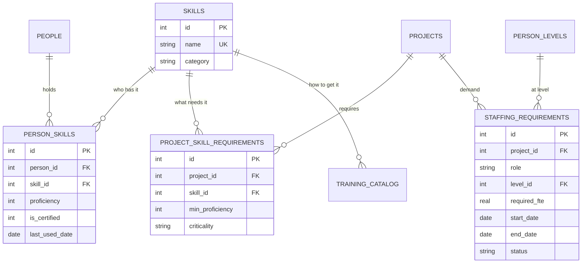
```mermaid
erDiagram
    SKILLS ||--o{ PERSON_SKILLS : "who has it"
    SKILLS ||--o{ PROJECT_SKILL_REQUIREMENTS : "what needs it"
    SKILLS ||--o{ TRAINING_CATALOG : "how to get it"
    PEOPLE ||--o{ PERSON_SKILLS : holds
    PROJECTS ||--o{ PROJECT_SKILL_REQUIREMENTS : requires
    PROJECTS ||--o{ STAFFING_REQUIREMENTS : "demand"
    PERSON_LEVELS ||--o{ STAFFING_REQUIREMENTS : "at level"

    SKILLS {
        int id PK
        string name UK
        string category
    }
    PERSON_SKILLS {
        int id PK
        int person_id FK
        int skill_id FK
        int proficiency
        int is_certified
        date last_used_date
    }
    PROJECT_SKILL_REQUIREMENTS {
        int id PK
        int project_id FK
        int skill_id FK
        int min_proficiency
        string criticality
    }
    STAFFING_REQUIREMENTS {
        int id PK
        int project_id FK
        string role
        int level_id FK
        real required_fte
        date start_date
        date end_date
        string status
    }
```

**Two computations live on this diagram.** Coverage is `Σ assigned FTE ÷ Σ required FTE` from `staffing_requirements` against `assignments` — which is what makes "understaffed" arithmetic rather than opinion. And a `project_skill_requirements` row with no `person_skills` match at `min_proficiency` is a **skill gap**, which generates a `training_requirements` row with `source = 'skill_gap'`.

### skills

```sql
CREATE TABLE skills (
    id         INTEGER PRIMARY KEY AUTOINCREMENT,
    name       TEXT NOT NULL UNIQUE,
    category   TEXT,
    description TEXT,
    is_active  INTEGER NOT NULL DEFAULT 1 CHECK (is_active IN (0,1))
);
```

### person_skills

```sql
CREATE TABLE person_skills (
    id          INTEGER PRIMARY KEY AUTOINCREMENT,
    person_id   INTEGER NOT NULL REFERENCES people(id) ON DELETE CASCADE,
    skill_id    INTEGER NOT NULL REFERENCES skills(id) ON DELETE CASCADE,
    proficiency INTEGER NOT NULL DEFAULT 3 CHECK (proficiency BETWEEN 1 AND 5),
    is_certified INTEGER NOT NULL DEFAULT 0 CHECK (is_certified IN (0,1)),
    last_used_date DATE,
    note        TEXT,
    UNIQUE (person_id, skill_id)
);
CREATE INDEX idx_person_skills ON person_skills(skill_id, proficiency DESC);
```

### project_skill_requirements

```sql
CREATE TABLE project_skill_requirements (
    id            INTEGER PRIMARY KEY AUTOINCREMENT,
    project_id    INTEGER NOT NULL REFERENCES projects(id) ON DELETE CASCADE,
    workstream_id INTEGER REFERENCES workstreams(id) ON DELETE SET NULL,
    skill_id      INTEGER NOT NULL REFERENCES skills(id) ON DELETE CASCADE,
    min_proficiency INTEGER NOT NULL DEFAULT 3 CHECK (min_proficiency BETWEEN 1 AND 5),
    criticality   TEXT NOT NULL DEFAULT 'important'
                  CHECK (criticality IN ('essential','important','nice_to_have')),
    UNIQUE (project_id, workstream_id, skill_id)
);
```

A required skill nobody holds at the needed level is a **skill gap**, which generates a training requirement (Phase 18).

### staffing_requirements

The demand side that assignments fill. Coverage is computed from this.

```sql
CREATE TABLE staffing_requirements (
    id            INTEGER PRIMARY KEY AUTOINCREMENT,
    project_id    INTEGER NOT NULL REFERENCES projects(id) ON DELETE CASCADE,
    workstream_id INTEGER REFERENCES workstreams(id) ON DELETE SET NULL,
    role          TEXT NOT NULL,
    level_id      INTEGER REFERENCES person_levels(id),
    required_fte  REAL NOT NULL DEFAULT 1.0,
    required_hours REAL,
    start_date    DATE NOT NULL,
    end_date      DATE NOT NULL,
    status        TEXT NOT NULL DEFAULT 'open'
                  CHECK (status IN ('open','partially_filled','filled','cancelled')),
    source        TEXT NOT NULL DEFAULT 'manual'
                  CHECK (source IN ('manual','template')),
    notes         TEXT,
    created_at    DATETIME NOT NULL DEFAULT (datetime('now')),
    updated_at    DATETIME NOT NULL DEFAULT (datetime('now'))
);
CREATE INDEX idx_staffreq_project ON staffing_requirements(project_id, start_date, end_date);
```

---

# 0016 — Scenarios & Alerts

### staffing_scenarios

```sql
CREATE TABLE staffing_scenarios (
    id          INTEGER PRIMARY KEY AUTOINCREMENT,
    name        TEXT NOT NULL UNIQUE,
    description TEXT,
    status      TEXT NOT NULL DEFAULT 'draft'
                CHECK (status IN ('draft','active','applied','discarded')),
    created_at  DATETIME NOT NULL DEFAULT (datetime('now')),
    applied_at  DATETIME
);
```

Applying a scenario promotes its assignments to `scenario_id = NULL` inside a transaction.

### alert_dismissals

Read state only. The alerts themselves stay live queries, so there is no second copy of truth to drift.

```sql
CREATE TABLE alert_dismissals (
    id           INTEGER PRIMARY KEY AUTOINCREMENT,
    alert_key    TEXT NOT NULL UNIQUE,
    dismissed_at DATETIME NOT NULL DEFAULT (datetime('now'))
);
```

`alert_key` is a deterministic identity such as `cliff:project:14:2026-11-09`.

---

# 0017 — Governance

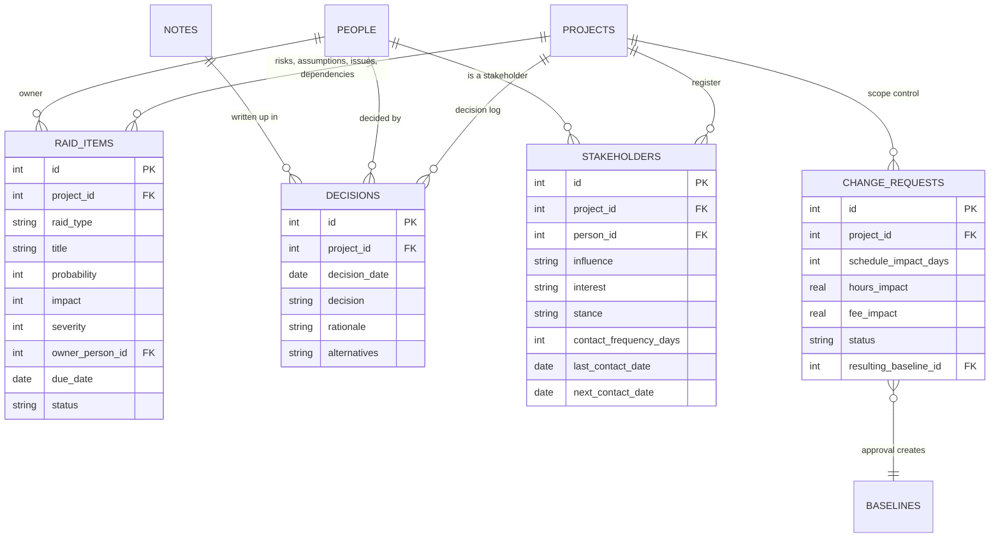
```mermaid
erDiagram
    PROJECTS ||--o{ RAID_ITEMS : "risks, assumptions, issues, dependencies"
    PROJECTS ||--o{ DECISIONS : "decision log"
    PROJECTS ||--o{ STAKEHOLDERS : register
    PROJECTS ||--o{ CHANGE_REQUESTS : "scope control"
    PEOPLE ||--o{ STAKEHOLDERS : "is a stakeholder"
    PEOPLE ||--o{ RAID_ITEMS : owner
    PEOPLE ||--o{ DECISIONS : "decided by"
    CHANGE_REQUESTS }o--|| BASELINES : "approval creates"
    NOTES ||--o{ DECISIONS : "written up in"

    RAID_ITEMS {
        int id PK
        int project_id FK
        string raid_type
        string title
        int probability
        int impact
        int severity
        int owner_person_id FK
        date due_date
        string status
    }
    STAKEHOLDERS {
        int id PK
        int project_id FK
        int person_id FK
        string influence
        string interest
        string stance
        int contact_frequency_days
        date last_contact_date
        date next_contact_date
    }
    DECISIONS {
        int id PK
        int project_id FK
        date decision_date
        string decision
        string rationale
        string alternatives
    }
    CHANGE_REQUESTS {
        int id PK
        int project_id FK
        int schedule_impact_days
        real hours_impact
        real fee_impact
        string status
        int resulting_baseline_id FK
    }
```

The `CHANGE_REQUESTS → BASELINES` edge is the governance loop that makes variance meaningful: an approved change request is the only legitimate way a new baseline version comes into existence. Without it, "on time" drifts because the target moved quietly.

`stakeholders.influence × interest` renders the power/interest grid; `next_contact_date` in the past drives a Command Center alert.

### raid_items

```sql
CREATE TABLE raid_items (
    id            INTEGER PRIMARY KEY AUTOINCREMENT,
    project_id    INTEGER NOT NULL REFERENCES projects(id) ON DELETE CASCADE,
    workstream_id INTEGER REFERENCES workstreams(id) ON DELETE SET NULL,
    raid_type     TEXT NOT NULL
                  CHECK (raid_type IN ('risk','assumption','issue')),
    title         TEXT NOT NULL,
    description   TEXT,
    probability   INTEGER CHECK (probability BETWEEN 1 AND 5),
    impact        INTEGER CHECK (impact BETWEEN 1 AND 5),
    severity      INTEGER,
    owner_person_id INTEGER REFERENCES people(id) ON DELETE SET NULL,
    due_date      DATE,
    mitigation    TEXT,
    status        TEXT NOT NULL DEFAULT 'open'
                  CHECK (status IN ('open','mitigating','closed','accepted','realised')),
    source        TEXT NOT NULL DEFAULT 'manual'
                  CHECK (source IN ('manual','template','ai_proposal')),
    created_at    DATETIME NOT NULL DEFAULT (datetime('now')),
    updated_at    DATETIME NOT NULL DEFAULT (datetime('now')),
    archived_at   DATETIME
);
CREATE INDEX idx_raid_project ON raid_items(project_id, raid_type, status);
CREATE INDEX idx_raid_due     ON raid_items(due_date);
```

`severity` is computed as `probability * impact` on write.

> **The D in RAID lives in `dependencies` (migration 0004), not here.** Dependencies need direction, a provider and a needed-by date that risks, assumptions and issues do not — and a workstream charter needs to capture them at Phase 3, long before this migration runs. The RAID register view unions the two tables so the user sees one register; the storage is split because the shapes genuinely differ.

### decisions

```sql
CREATE TABLE decisions (
    id            INTEGER PRIMARY KEY AUTOINCREMENT,
    project_id    INTEGER REFERENCES projects(id) ON DELETE CASCADE,
    title         TEXT NOT NULL,
    decision_date DATE NOT NULL,
    decision      TEXT NOT NULL,
    rationale     TEXT,
    alternatives  TEXT,
    decided_by_person_id INTEGER REFERENCES people(id) ON DELETE SET NULL,
    note_id       INTEGER REFERENCES notes(id) ON DELETE SET NULL,
    created_at    DATETIME NOT NULL DEFAULT (datetime('now'))
);
CREATE INDEX idx_decisions_project ON decisions(project_id, decision_date DESC);
```

### stakeholders

```sql
CREATE TABLE stakeholders (
    id            INTEGER PRIMARY KEY AUTOINCREMENT,
    project_id    INTEGER NOT NULL REFERENCES projects(id) ON DELETE CASCADE,
    person_id     INTEGER NOT NULL REFERENCES people(id) ON DELETE CASCADE,
    role          TEXT,
    influence     TEXT NOT NULL DEFAULT 'medium' CHECK (influence IN ('high','medium','low')),
    interest      TEXT NOT NULL DEFAULT 'medium' CHECK (interest IN ('high','medium','low')),
    stance        TEXT NOT NULL DEFAULT 'neutral'
                  CHECK (stance IN ('champion','supporter','neutral','skeptic','blocker')),
    engagement_strategy TEXT,
    contact_frequency_days INTEGER,
    last_contact_date DATE,
    next_contact_date DATE,
    owner_person_id INTEGER REFERENCES people(id) ON DELETE SET NULL,
    notes         TEXT,
    created_at    DATETIME NOT NULL DEFAULT (datetime('now')),
    updated_at    DATETIME NOT NULL DEFAULT (datetime('now')),
    archived_at   DATETIME,
    UNIQUE (project_id, person_id)
);
CREATE INDEX idx_stake_project ON stakeholders(project_id);
CREATE INDEX idx_stake_next    ON stakeholders(next_contact_date);
```

Influence × interest renders the power/interest grid. `next_contact_date` past due drives a Command Center alert.

### change_requests

```sql
CREATE TABLE change_requests (
    id            INTEGER PRIMARY KEY AUTOINCREMENT,
    project_id    INTEGER NOT NULL REFERENCES projects(id) ON DELETE CASCADE,
    reference     TEXT,
    title         TEXT NOT NULL,
    description   TEXT,
    scope_impact  TEXT,
    schedule_impact_days INTEGER,
    hours_impact  REAL,
    fee_impact    REAL,
    currency      TEXT NOT NULL DEFAULT 'USD',
    status        TEXT NOT NULL DEFAULT 'draft'
                  CHECK (status IN ('draft','submitted','approved','rejected','withdrawn')),
    raised_on     DATE,
    decided_on    DATE,
    decided_by_person_id INTEGER REFERENCES people(id) ON DELETE SET NULL,
    resulting_baseline_id INTEGER REFERENCES baselines(id) ON DELETE SET NULL,
    created_at    DATETIME NOT NULL DEFAULT (datetime('now')),
    updated_at    DATETIME NOT NULL DEFAULT (datetime('now'))
);
CREATE INDEX idx_cr_project ON change_requests(project_id, status);
```

An approved change request is what legitimately creates a new baseline version.

---

# 0018 — Communications Plan

### comms_plan_items

```sql
CREATE TABLE comms_plan_items (
    id            INTEGER PRIMARY KEY AUTOINCREMENT,
    project_id    INTEGER NOT NULL REFERENCES projects(id) ON DELETE CASCADE,
    audience      TEXT NOT NULL,
    message       TEXT,
    channel       TEXT,
    rrule         TEXT,
    owner_person_id INTEGER REFERENCES people(id) ON DELETE SET NULL,
    next_due      DATE,
    calendar_event_id INTEGER REFERENCES calendar_events(id) ON DELETE SET NULL,
    is_active     INTEGER NOT NULL DEFAULT 1 CHECK (is_active IN (0,1)),
    created_at    DATETIME NOT NULL DEFAULT (datetime('now')),
    updated_at    DATETIME NOT NULL DEFAULT (datetime('now'))
);
CREATE INDEX idx_comms_project ON comms_plan_items(project_id, next_due);
```

Each active item with an `rrule` generates a PersonalOS-owned calendar event.

---

# 0019 — Templates

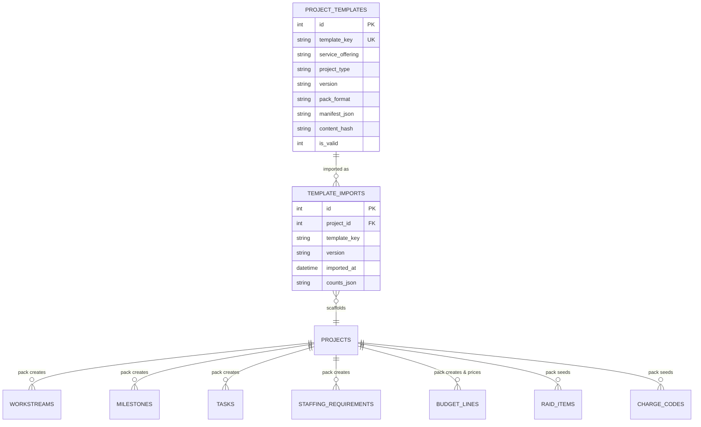
```mermaid
erDiagram
    PROJECT_TEMPLATES ||--o{ TEMPLATE_IMPORTS : "imported as"
    TEMPLATE_IMPORTS }o--|| PROJECTS : "scaffolds"
    PROJECTS ||--o{ WORKSTREAMS : "pack creates"
    PROJECTS ||--o{ MILESTONES : "pack creates"
    PROJECTS ||--o{ TASKS : "pack creates"
    PROJECTS ||--o{ STAFFING_REQUIREMENTS : "pack creates"
    PROJECTS ||--o{ BUDGET_LINES : "pack creates &amp; prices"
    PROJECTS ||--o{ RAID_ITEMS : "pack seeds"
    PROJECTS ||--o{ CHARGE_CODES : "pack seeds"

    PROJECT_TEMPLATES {
        int id PK
        string template_key UK
        string service_offering
        string project_type
        string version
        string pack_format
        string manifest_json
        string content_hash
        int is_valid
    }
    TEMPLATE_IMPORTS {
        int id PK
        int project_id FK
        string template_key
        string version
        datetime imported_at
        string counts_json
    }
```

One import writes across eight tables, which is why the Template Library lands at Phase 16 — everything it touches must already exist. `template_imports` records provenance so you can see which engagements came from which version of a pack and spot drift.

### project_templates

```sql
CREATE TABLE project_templates (
    id               INTEGER PRIMARY KEY AUTOINCREMENT,
    template_key     TEXT NOT NULL UNIQUE,
    rel_path         TEXT NOT NULL,
    pack_kind        TEXT NOT NULL DEFAULT 'project'
                     CHECK (pack_kind IN ('project','workstream','note')),
    service_offering TEXT,
    project_type     TEXT,
    name             TEXT NOT NULL,
    version          TEXT NOT NULL DEFAULT '1.0',
    description      TEXT,
    pack_format      TEXT NOT NULL CHECK (pack_format IN ('xlsx','yaml_csv')),
    manifest_json    TEXT NOT NULL,
    content_hash     TEXT NOT NULL,
    is_valid         INTEGER NOT NULL DEFAULT 1 CHECK (is_valid IN (0,1)),
    validation_error TEXT,
    indexed_at       DATETIME NOT NULL DEFAULT (datetime('now'))
);
CREATE INDEX idx_templates_taxonomy ON project_templates(service_offering, project_type);
```

### template_imports

```sql
CREATE TABLE template_imports (
    id            INTEGER PRIMARY KEY AUTOINCREMENT,
    project_id    INTEGER NOT NULL REFERENCES projects(id) ON DELETE CASCADE,
    template_key  TEXT NOT NULL,
    version       TEXT NOT NULL,
    imported_at   DATETIME NOT NULL DEFAULT (datetime('now')),
    options_json  TEXT,
    counts_json   TEXT
);
CREATE INDEX idx_tmpl_imports ON template_imports(project_id, imported_at DESC);
```

---

# 0020 — Performance

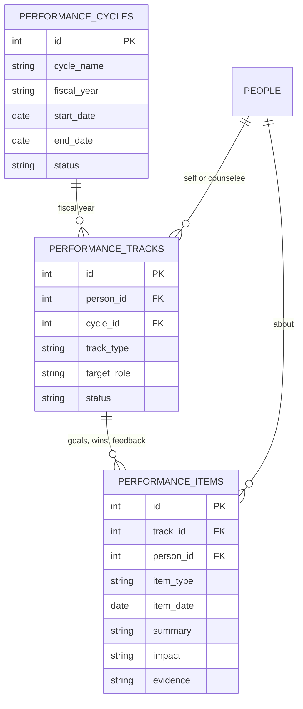
```mermaid
erDiagram
    PERFORMANCE_CYCLES ||--o{ PERFORMANCE_TRACKS : "fiscal year"
    PEOPLE ||--o{ PERFORMANCE_TRACKS : "self or counselee"
    PERFORMANCE_TRACKS ||--o{ PERFORMANCE_ITEMS : "goals, wins, feedback"
    PEOPLE ||--o{ PERFORMANCE_ITEMS : about

    PERFORMANCE_CYCLES {
        int id PK
        string cycle_name
        string fiscal_year
        date start_date
        date end_date
        string status
    }
    PERFORMANCE_TRACKS {
        int id PK
        int person_id FK
        int cycle_id FK
        string track_type
        string target_role
        string status
    }
    PERFORMANCE_ITEMS {
        int id PK
        int track_id FK
        int person_id FK
        string item_type
        date item_date
        string summary
        string impact
        string evidence
    }
```

> **The counselee relationship lives in `performance_tracks`, not in `people.manager_person_id`.** The org chart is the administrative reporting line from the directory; counselling is a separate assignment. People routinely report to one person and are counselled by another, and merging the two would corrupt both.

### performance_cycles

```sql
CREATE TABLE performance_cycles (
    id          INTEGER PRIMARY KEY AUTOINCREMENT,
    cycle_name  TEXT NOT NULL,
    fiscal_year TEXT NOT NULL,
    start_date  DATE,
    end_date    DATE,
    status      TEXT NOT NULL DEFAULT 'active' CHECK (status IN ('active','closed')),
    notes       TEXT,
    created_at  DATETIME NOT NULL DEFAULT (datetime('now')),
    UNIQUE (fiscal_year, cycle_name)
);
```

### performance_tracks

```sql
CREATE TABLE performance_tracks (
    id          INTEGER PRIMARY KEY AUTOINCREMENT,
    person_id   INTEGER NOT NULL REFERENCES people(id) ON DELETE CASCADE,
    cycle_id    INTEGER NOT NULL REFERENCES performance_cycles(id) ON DELETE CASCADE,
    track_name  TEXT NOT NULL,
    track_type  TEXT NOT NULL DEFAULT 'counselee'
                CHECK (track_type IN ('self','counselee','promotion','stakeholder_feedback')),
    target_role TEXT,
    status      TEXT NOT NULL DEFAULT 'active' CHECK (status IN ('active','closed')),
    notes       TEXT,
    created_at  DATETIME NOT NULL DEFAULT (datetime('now')),
    UNIQUE (person_id, cycle_id, track_type)
);
CREATE INDEX idx_perf_tracks ON performance_tracks(cycle_id, track_type);
```

The counselee relationship lives here, deliberately separate from `people.manager_person_id`.

### performance_items

```sql
CREATE TABLE performance_items (
    id          INTEGER PRIMARY KEY AUTOINCREMENT,
    track_id    INTEGER NOT NULL REFERENCES performance_tracks(id) ON DELETE CASCADE,
    person_id   INTEGER NOT NULL REFERENCES people(id) ON DELETE CASCADE,
    item_type   TEXT NOT NULL
                CHECK (item_type IN ('goal','win','feedback_received','feedback_given',
                                     'development_area','one_on_one','coaching_note',
                                     'promotion_evidence','risk_concern','other')),
    item_title  TEXT NOT NULL,
    item_date   DATE,
    summary     TEXT,
    details     TEXT,
    impact      TEXT,
    evidence    TEXT,
    next_action TEXT,
    status      TEXT NOT NULL DEFAULT 'active'
                CHECK (status IN ('draft','active','reviewed','closed')),
    tags        TEXT,
    created_at  DATETIME NOT NULL DEFAULT (datetime('now')),
    updated_at  DATETIME NOT NULL DEFAULT (datetime('now')),
    archived_at DATETIME
);
CREATE INDEX idx_perf_items ON performance_items(track_id, item_type, item_date);
```

**Never store** compensation, formal ratings or disciplinary records here.

---

# 0021 — Training

```mermaid
erDiagram
    TRAINING_CATALOG ||--o{ TRAINING_REQUIREMENTS : "assigned as"
    TRAINING_CATALOG ||--o{ TRAINING_RECORDS : "completed as"
    SKILLS ||--o{ TRAINING_CATALOG : "teaches"
    PEOPLE ||--o{ TRAINING_REQUIREMENTS : "must complete"
    PEOPLE ||--o{ TRAINING_RECORDS : completed
    PEOPLE ||--o{ TRAINING_PLANS : "development plan"
    PERFORMANCE_CYCLES ||--o{ TRAINING_PLANS : "within cycle"

    TRAINING_CATALOG {
        int id PK
        string name
        string provider
        string delivery
        real hours
        int renewal_months
        int skill_id FK
    }
    TRAINING_REQUIREMENTS {
        int id PK
        int person_id FK
        int catalog_id FK
        date due_date
        string source
        string status
    }
    TRAINING_RECORDS {
        int id PK
        int person_id FK
        int catalog_id FK
        date completed_on
        date expires_on
    }
    TRAINING_PLANS {
        int id PK
        int person_id FK
        int cycle_id FK
        string objective
        string status
    }
```

The `SKILLS → TRAINING_CATALOG` edge closes the loop opened in 0014: an unmet project skill requirement becomes a training requirement with `source = 'skill_gap'`, and completing it writes a `training_records` row that raises the person's `person_skills` proficiency.

### training_catalog

```sql
CREATE TABLE training_catalog (
    id             INTEGER PRIMARY KEY AUTOINCREMENT,
    name           TEXT NOT NULL,
    provider       TEXT,
    category       TEXT,
    delivery       TEXT CHECK (delivery IN ('elearning','instructor_led','self_study','certification')),
    hours          REAL,
    renewal_months INTEGER,
    url            TEXT,
    skill_id       INTEGER REFERENCES skills(id) ON DELETE SET NULL,
    is_active      INTEGER NOT NULL DEFAULT 1 CHECK (is_active IN (0,1)),
    UNIQUE (name, provider)
);
```

### training_requirements

```sql
CREATE TABLE training_requirements (
    id          INTEGER PRIMARY KEY AUTOINCREMENT,
    person_id   INTEGER NOT NULL REFERENCES people(id) ON DELETE CASCADE,
    catalog_id  INTEGER NOT NULL REFERENCES training_catalog(id) ON DELETE CASCADE,
    due_date    DATE,
    source      TEXT NOT NULL DEFAULT 'firm_mandate'
                CHECK (source IN ('firm_mandate','role_based','development_plan','skill_gap')),
    status      TEXT NOT NULL DEFAULT 'assigned'
                CHECK (status IN ('assigned','in_progress','completed','waived','overdue')),
    notes       TEXT,
    created_at  DATETIME NOT NULL DEFAULT (datetime('now')),
    UNIQUE (person_id, catalog_id, due_date)
);
CREATE INDEX idx_train_req ON training_requirements(person_id, status, due_date);
```

`source = 'skill_gap'` rows are generated from unmet `project_skill_requirements`.

### training_records

```sql
CREATE TABLE training_records (
    id           INTEGER PRIMARY KEY AUTOINCREMENT,
    person_id    INTEGER NOT NULL REFERENCES people(id) ON DELETE CASCADE,
    catalog_id   INTEGER NOT NULL REFERENCES training_catalog(id) ON DELETE CASCADE,
    completed_on DATE NOT NULL,
    expires_on   DATE,
    hours        REAL,
    evidence     TEXT,
    created_at   DATETIME NOT NULL DEFAULT (datetime('now'))
);
CREATE INDEX idx_train_rec ON training_records(person_id, completed_on DESC);
```

### training_plans

```sql
CREATE TABLE training_plans (
    id          INTEGER PRIMARY KEY AUTOINCREMENT,
    person_id   INTEGER NOT NULL REFERENCES people(id) ON DELETE CASCADE,
    cycle_id    INTEGER REFERENCES performance_cycles(id) ON DELETE SET NULL,
    objective   TEXT NOT NULL,
    detail      TEXT,
    status      TEXT NOT NULL DEFAULT 'active'
                CHECK (status IN ('draft','active','achieved','deferred')),
    target_date DATE,
    created_at  DATETIME NOT NULL DEFAULT (datetime('now'))
);
CREATE INDEX idx_train_plan ON training_plans(person_id, status);
```

---

# 0022 — Innovation

Innovation *initiatives* are `projects` in the Innovation portfolio. These tables cover the network and the pre-project idea funnel.

```mermaid
erDiagram
    PEOPLE ||--o| INNOVATION_NETWORK_MEMBERS : "belongs to network"
    PEOPLE ||--o{ INNOVATION_IDEAS : submits
    PEOPLE ||--o{ INNOVATION_CONTRIBUTIONS : contributes
    INNOVATION_IDEAS ||--o{ INNOVATION_CONTRIBUTIONS : "work toward"
    INNOVATION_IDEAS }o--|| PROJECTS : "promoted to"
    PROJECTS ||--o{ INNOVATION_CONTRIBUTIONS : "work on"

    INNOVATION_NETWORK_MEMBERS {
        int id PK
        int person_id UK
        string network_role
        string focus_areas
        string status
    }
    INNOVATION_IDEAS {
        int id PK
        string title
        int submitter_person_id FK
        string stage
        real score
        int promoted_project_id FK
    }
    INNOVATION_CONTRIBUTIONS {
        int id PK
        int person_id FK
        int project_id FK
        int idea_id FK
        string contribution
        real hours
    }
```

The funnel is `idea → triage → pilot → scale`, and promotion sets `promoted_project_id` — at which point the initiative becomes an ordinary project and inherits milestones, budget and staffing like any other.

### innovation_network_members

```sql
CREATE TABLE innovation_network_members (
    id           INTEGER PRIMARY KEY AUTOINCREMENT,
    person_id    INTEGER NOT NULL REFERENCES people(id) ON DELETE CASCADE,
    network_role TEXT NOT NULL DEFAULT 'member'
                 CHECK (network_role IN ('sponsor','champion','contributor','member')),
    focus_areas  TEXT,
    joined_on    DATE,
    status       TEXT NOT NULL DEFAULT 'active' CHECK (status IN ('active','inactive')),
    notes        TEXT,
    UNIQUE (person_id)
);
```

### innovation_ideas

```sql
CREATE TABLE innovation_ideas (
    id                  INTEGER PRIMARY KEY AUTOINCREMENT,
    title               TEXT NOT NULL,
    submitter_person_id INTEGER REFERENCES people(id) ON DELETE SET NULL,
    problem             TEXT,
    value_hypothesis    TEXT,
    stage               TEXT NOT NULL DEFAULT 'idea'
                        CHECK (stage IN ('idea','triage','pilot','scale','parked','rejected')),
    score               REAL,
    submitted_on        DATE,
    promoted_project_id INTEGER REFERENCES projects(id) ON DELETE SET NULL,
    notes               TEXT,
    created_at          DATETIME NOT NULL DEFAULT (datetime('now')),
    updated_at          DATETIME NOT NULL DEFAULT (datetime('now'))
);
CREATE INDEX idx_ideas_stage ON innovation_ideas(stage, score DESC);
```

### innovation_contributions

```sql
CREATE TABLE innovation_contributions (
    id           INTEGER PRIMARY KEY AUTOINCREMENT,
    person_id    INTEGER NOT NULL REFERENCES people(id) ON DELETE CASCADE,
    project_id   INTEGER REFERENCES projects(id) ON DELETE SET NULL,
    idea_id      INTEGER REFERENCES innovation_ideas(id) ON DELETE SET NULL,
    contribution TEXT NOT NULL,
    contributed_on DATE,
    hours        REAL,
    created_at   DATETIME NOT NULL DEFAULT (datetime('now'))
);
CREATE INDEX idx_contrib_person ON innovation_contributions(person_id, contributed_on DESC);
```

---

# 0023 — AI

```mermaid
erDiagram
    AI_PROVIDERS ||--o{ AI_MODELS : hosts
    AI_PROVIDERS ||--o{ AI_FEATURE_POLICY : "routed to"
    AI_MODELS ||--o{ AI_FEATURE_POLICY : "preferred model"
    AI_PROVIDERS ||--o{ AI_JOBS : "executed by"
    AI_MODELS ||--o{ AI_JOBS : "executed on"
    AI_JOBS ||--o{ AI_RUNS : "audit record"
    NOTES ||--o{ NOTE_EMBEDDINGS : "semantic index"

    AI_PROVIDERS {
        int id PK
        string provider_key UK
        string kind
        string base_url
        string boundary
        string vendor
        string key_ref
        int is_enabled
    }
    AI_MODELS {
        int id PK
        int provider_id FK
        string model_key
        string backend
        string local_path
        string sha256
        string task_tier
        real price_in_per_mtok
        string status
    }
    AI_FEATURE_POLICY {
        int id PK
        string feature_key UK
        string max_boundary
        int provider_id FK
        int model_id FK
        int is_enabled
    }
    AI_JOBS {
        int id PK
        string feature_key
        int provider_id FK
        int model_id FK
        string status
        string result_json
    }
    AI_RUNS {
        int id PK
        int job_id FK
        string prompt_template
        string prompt_version
        string provider_key
        string boundary
        string vendor
        int tokens_in
        int tokens_out
        real cost
    }
    NOTE_EMBEDDINGS {
        int note_id FK
        int chunk_index
        blob vector
        int dims
        string model_key
    }
```

**`boundary` appears on three tables, and that repetition is deliberate.** `ai_providers.boundary` declares what a provider *is*; `ai_feature_policy.max_boundary` declares what a feature is *allowed* to use; `ai_runs.boundary` records what actually *happened*. The gap between the second and third is the audit — it answers "did client data leave this machine, and to whom" from recorded fact rather than from configuration you hope was correct at the time.

`key_ref` names a key in `secrets.json`. **No API key is ever stored in the database.**

### ai_providers

```sql
CREATE TABLE ai_providers (
    id           INTEGER PRIMARY KEY AUTOINCREMENT,
    provider_key TEXT NOT NULL UNIQUE,
    label        TEXT NOT NULL,
    kind         TEXT NOT NULL
                 CHECK (kind IN ('openai_compatible','anthropic','google','null')),
    base_url     TEXT,
    boundary     TEXT NOT NULL CHECK (boundary IN ('local','external')),
    vendor       TEXT,
    capabilities_json TEXT NOT NULL DEFAULT '{}',
    key_ref      TEXT,
    is_enabled   INTEGER NOT NULL DEFAULT 0 CHECK (is_enabled IN (0,1)),
    created_at   DATETIME NOT NULL DEFAULT (datetime('now'))
);
```

**Seed:** `local` (openai_compatible, boundary `local`, enabled) · `anthropic` (boundary `external`, vendor Anthropic, **disabled**) · `google` (boundary `external`, vendor Google, **disabled**) · `null`.

`key_ref` names a key in `secrets.json`; the key value never enters the database.

### ai_models

```sql
CREATE TABLE ai_models (
    id           INTEGER PRIMARY KEY AUTOINCREMENT,
    provider_id  INTEGER NOT NULL REFERENCES ai_providers(id) ON DELETE CASCADE,
    model_key    TEXT NOT NULL,
    label        TEXT NOT NULL,
    backend      TEXT CHECK (backend IN ('onnx_genai','gguf','remote')),
    local_path   TEXT,
    size_bytes   INTEGER,
    sha256       TEXT,
    context_window INTEGER,
    task_tier    TEXT CHECK (task_tier IN ('small','large','embedding')),
    price_in_per_mtok  REAL,
    price_out_per_mtok REAL,
    status       TEXT NOT NULL DEFAULT 'registered'
                 CHECK (status IN ('catalog','downloading','registered','verified','error','missing')),
    status_detail TEXT,
    created_at   DATETIME NOT NULL DEFAULT (datetime('now')),
    UNIQUE (provider_id, model_key)
);
```

### ai_feature_policy

```sql
CREATE TABLE ai_feature_policy (
    id           INTEGER PRIMARY KEY AUTOINCREMENT,
    feature_key  TEXT NOT NULL UNIQUE,
    label        TEXT NOT NULL,
    max_boundary TEXT NOT NULL DEFAULT 'local'
                 CHECK (max_boundary IN ('local','external')),
    provider_id  INTEGER REFERENCES ai_providers(id) ON DELETE SET NULL,
    model_id     INTEGER REFERENCES ai_models(id) ON DELETE SET NULL,
    is_enabled   INTEGER NOT NULL DEFAULT 0 CHECK (is_enabled IN (0,1)),
    updated_at   DATETIME NOT NULL DEFAULT (datetime('now'))
);
```

**Seeded features, all `max_boundary = 'local'`, all disabled:** `triage.email`, `triage.meeting`, `extract.meeting_notes`, `draft.status_report`, `draft.comms`, `search.semantic`, `embed.notes`.

> `embed.notes` is **hard-pinned local in code**, not merely defaulted — the operation ships the entire vault by definition.

### ai_jobs

```sql
CREATE TABLE ai_jobs (
    id           INTEGER PRIMARY KEY AUTOINCREMENT,
    feature_key  TEXT NOT NULL,
    task_kind    TEXT NOT NULL,
    input_ref    TEXT,
    input_json   TEXT,
    provider_id  INTEGER REFERENCES ai_providers(id) ON DELETE SET NULL,
    model_id     INTEGER REFERENCES ai_models(id) ON DELETE SET NULL,
    status       TEXT NOT NULL DEFAULT 'queued'
                 CHECK (status IN ('queued','running','done','failed','cancelled')),
    result_json  TEXT,
    error        TEXT,
    queued_at    DATETIME NOT NULL DEFAULT (datetime('now')),
    started_at   DATETIME,
    finished_at  DATETIME
);
CREATE INDEX idx_ai_jobs_status ON ai_jobs(status, queued_at);
```

Durable rows, so a crash or restart resumes the queue rather than losing it.

### ai_runs

The audit answer to "did client data leave this machine, and to whom."

```sql
CREATE TABLE ai_runs (
    id             INTEGER PRIMARY KEY AUTOINCREMENT,
    job_id         INTEGER REFERENCES ai_jobs(id) ON DELETE SET NULL,
    feature_key    TEXT NOT NULL,
    prompt_template TEXT NOT NULL,
    prompt_version TEXT NOT NULL,
    provider_key   TEXT NOT NULL,
    boundary       TEXT NOT NULL CHECK (boundary IN ('local','external')),
    vendor         TEXT,
    model_key      TEXT,
    params_json    TEXT,
    tokens_in      INTEGER,
    tokens_out     INTEGER,
    cost           REAL,
    latency_ms     INTEGER,
    prompt_text    TEXT,
    response_text  TEXT,
    created_at     DATETIME NOT NULL DEFAULT (datetime('now'))
);
CREATE INDEX idx_ai_runs_created  ON ai_runs(created_at DESC);
CREATE INDEX idx_ai_runs_boundary ON ai_runs(boundary, vendor);
```

`prompt_text` and `response_text` are populated only when payload logging is enabled.

### note_embeddings

```sql
CREATE TABLE note_embeddings (
    id          INTEGER PRIMARY KEY AUTOINCREMENT,
    note_id     INTEGER NOT NULL REFERENCES notes(id) ON DELETE CASCADE,
    chunk_index INTEGER NOT NULL DEFAULT 0,
    chunk_text  TEXT,
    vector      BLOB NOT NULL,
    dims        INTEGER NOT NULL,
    model_key   TEXT NOT NULL,
    indexed_at  DATETIME NOT NULL DEFAULT (datetime('now')),
    UNIQUE (note_id, chunk_index, model_key)
);
CREATE INDEX idx_embed_note ON note_embeddings(note_id);
```

Float32 blobs scored with a numpy cosine pass. For a personal vault this is sub-100ms and needs no vector-database dependency.

---

# 0024 — Quick Steps

### quick_steps

```sql
CREATE TABLE quick_steps (
    id            INTEGER PRIMARY KEY AUTOINCREMENT,
    name          TEXT NOT NULL UNIQUE,
    icon          TEXT,
    scope         TEXT NOT NULL DEFAULT 'global',
    actions_json  TEXT NOT NULL,
    hotkey        TEXT,
    is_enabled    INTEGER NOT NULL DEFAULT 1 CHECK (is_enabled IN (0,1)),
    sort_order    INTEGER NOT NULL DEFAULT 0,
    created_at    DATETIME NOT NULL DEFAULT (datetime('now'))
);
```

`scope` names the entity type the bundle applies to (`email`, `task`, `assignment`, `global`).

### quick_step_runs

```sql
CREATE TABLE quick_step_runs (
    id            INTEGER PRIMARY KEY AUTOINCREMENT,
    quick_step_id INTEGER NOT NULL REFERENCES quick_steps(id) ON DELETE CASCADE,
    target_type   TEXT,
    target_id     INTEGER,
    result_json   TEXT,
    status        TEXT NOT NULL DEFAULT 'ok' CHECK (status IN ('ok','partial','failed')),
    ran_at        DATETIME NOT NULL DEFAULT (datetime('now'))
);
```

---

## Forward-Reference Note

`time_entries.import_batch_id` references `import_batches`, and `assignments.requirement_id` / `assignments.scenario_id` reference tables created in later migrations. SQLite does not verify foreign key targets at table-creation time, and these columns are nullable and unused until their target migration runs. `0014` and `0015` are the migrations that make them meaningful; no `ALTER TABLE` is required.
