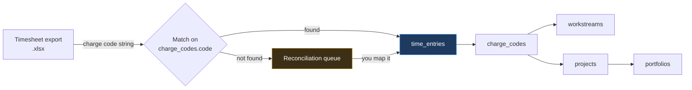
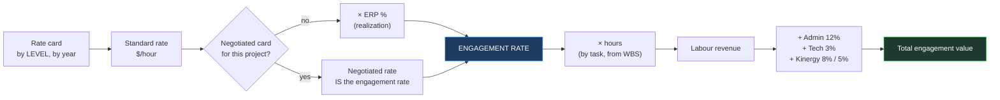
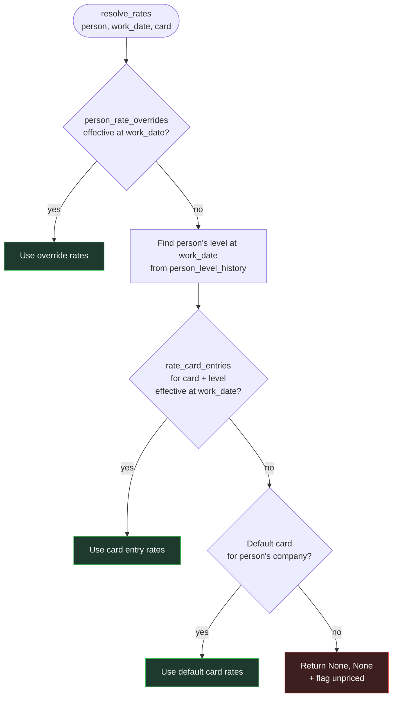
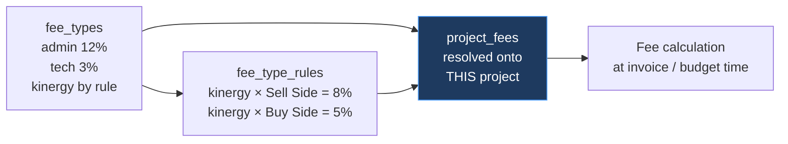
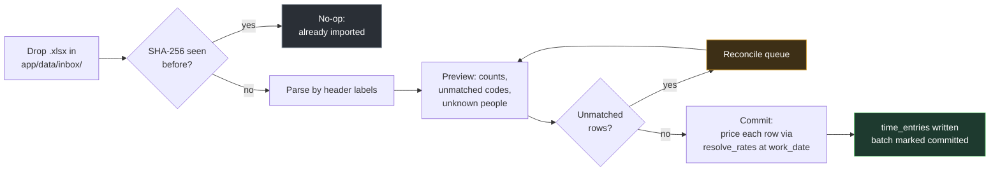

# PersonalOS — Financial Model

Charge codes, rate resolution, budget-to-actual, and reporting. Read before touching anything that turns hours into money.

**The one rule:** every hours-to-money calculation in the application goes through `resolve_rates()` in `app/core/rates.py`. No inline rate lookups anywhere. This is what makes plan and actual comparable by construction rather than by convention.

---

## 1. Charge Codes — the Reconciliation Key

A project has **one or more** charge codes. The charge code, not the project, is:

- what you book time against
- what the firm's timesheet export carries
- what external reporting rolls up by
- where lead partner and engagement manager are actually recorded

So `time_entries.charge_code_id` is the foreign key, and project and workstream are **derived** by joining through it.



### Lifecycle

| Status | Meaning |
|---|---|
| `active` | Open for time booking. Appears in "My Active Charge Codes" |
| `inactive` | Temporarily closed; historical time preserved; hidden from booking lists |
| `closed` | Permanently closed; `closed_on` set; import against it raises a warning |

### Leadership fallback

`charge_codes.lead_partner_person_id` and `engagement_manager_person_id` fall back to the project's defaults when null:

```sql
COALESCE(cc.lead_partner_person_id, p.lead_partner_person_id) AS lead_partner_id
```

Distinct leadership across codes on one project is normal — a project with three codes under different partners is a supported case, not a workaround.

### Reporting grain

The same `time_entries` rows roll up at four grains without restatement:

```
charge code  →  workstream  →  project  →  portfolio
```

External reporting runs at charge-code grain because that is what the firm recognises.

---

## 2. Rate Resolution

### The full chain



### Standard rate → engagement rate

The rate card carries **standard rates by level, by fiscal year**. The year is
recorded on the card itself — `rate_cards.fiscal_year`, with `effective_from`
and `effective_to` for the dates it is in force — rather than being inferred
from its entries' dates. FY2026 runs 1 October 2025 to 30 September 2026, from
`app_settings.fiscal_year_start`.

**The card's dates decide which of its entries apply.** An entry's window is
intersected with its card's — the later of the two starts, the earlier of the
two ends — so `resolve_rates()` has one window rather than two date filters
that could disagree and resolve a rate to the wrong year. A NULL bound on
either side is unbounded, which is why a card carrying no dates prices exactly
what it always did. An entry dated outside its card is refused when saved: it
could never price anything.

Two things can turn a standard rate into the rate actually billed:

| Mechanism | When | Effect |
|---|---|---|
| **ERP** — Engagement Realization Percentage | Standard card in use | `engagement_rate = standard_rate × erp_pct ÷ 100` |
| **Negotiated card** | Client-agreed rates for this project | The card rate *is* the engagement rate |

ERP is a **discount**: it brings the rate down. An ERP of 85 on a $500 standard rate yields a $425 engagement rate. `erp_pct` defaults to `100.0`, meaning full standard rate.

`projects.erp_pct` sets it; `charge_codes.erp_pct` overrides for a single code when null-or-set. A negotiated card normally carries `erp_pct = 100` because the negotiation already happened — but the model does not forbid applying both, since a further courtesy discount off a negotiated card is a real thing.

> **Cost rates are never touched by ERP.** ERP is a realization concept on the billing side. Applying it to cost would silently inflate margin on every engagement — the error would look like good news, which is the worst kind.

### The algorithm

```python
def resolve_rates(person_id, work_date, project_id=None, charge_code_id=None):
    """Return (standard_rate, erp_pct, engagement_rate, cost_rate)."""
```

Returning all four rather than just the final number is deliberate: a budget line reading *"$500 standard × 85% ERP = $425"* is auditable, and a bare $425 is not. All four are snapshotted onto `time_entries` and `budget_lines`.

Resolution order, first match wins:



An unpriced result is **never silently zero.** It returns `None` and the row is flagged in the reconciliation view, because a zero rate that looks like a real rate is far more dangerous than a visible gap.

### The nine rate card levels

| # | Level | Note |
|---|---|---|
| 1 | Intern / Paraprofessional | |
| 2 | Associate | |
| 3 | Senior Associate | |
| 4 | Manager | |
| 5 | Director (< 3 years) | **tenure split** |
| 6 | Senior Director (3+ years) | |
| 7 | Managing Director | |
| 8 | Partner / Principal (< 5 years) | **tenure split** |
| 9 | Partner / Principal (5+ years) | |

### Why level and not job title

The directory gives job titles. The seed file contains 13 distinct ones, encoding three different things at once — ladder rank, function, and specialist status:

> Advisory Managing Director · Specialist MD, Advisory · Director Advisory · Specialist Dir, Analytics · Manager Advisory · Assistant Manager · Sr Associate Advisory · Sr Associate Audit · Associate Advisory · Associate Audit · Associate Consultant · Consultant · Contractor

Note that **three of these have no rate card row at all** — `Assistant Manager`, `Consultant` and `Contractor`. `job_title_map` resolves each title to one of the nine billing levels plus a `function`. If rates attached to title instead, every variant HR invents would need duplicate rate rows and any unmapped new title would price at nothing.

### Tenure splits, and why they need watching

Director and Partner split on **time in role**, not on title. Two people both titled `Director Advisory` bill at different rates depending on when they made Director, so job title alone cannot determine level — `person_level_history` is authoritative.

`person_levels.auto_promote_after_months` (36 for Director, 60 for Partner) lets the application flag a due transition:

> *"Jane Doe reaches 36 months as Director on 1 March. Move to Senior Director?"*

**Flagged, never applied automatically** — a level change reprices every subsequent hour. But missing one is a quiet failure: the person keeps billing at the junior rate for months and nothing announces it. The prompt is the point.

> **Four mappings need confirmation before Phase 9** (see `DATABASE_SCHEMA.md` 0002): `Assistant Manager` and `Consultant` have no card row and were defaulted; `Contractor` has no rate at all and needs an override per person; and the two Specialist titles may or may not bill at their ladder level.

### Why company scopes the card

The seed contains two entities: `KPMG United States of America` and `KPMG Global Services Private Limited`. KGS is the offshore delivery centre, and its cost rates differ from US rates by a large multiple.

`rate_cards.company` scopes the card, and resolution selects on the person's company. Getting this wrong understates cost on every blended engagement — and blended engagements are exactly the ones where margin matters most.

### Worked example — a promotion mid-project

Kim Park works on charge code `ACME-2026-01` from January to June. She is promoted from Senior Associate to Manager effective 1 April.

**`person_level_history`:**

| level | effective_from | effective_to | reason |
|---|---|---|---|
| senior_associate | 2024-10-01 | 2026-03-31 | annual |
| manager | 2026-04-01 | *(null)* | promotion |

**`rate_card_entries`** (US standard card, FY26 effective 2025-10-01):

| level | bill_rate | cost_rate |
|---|---|---|
| senior_associate | 285.00 | 118.00 |
| manager | 375.00 | 162.00 |

The project uses the **standard card with ERP = 85%**.

**Result — the same person, the same charge code, priced correctly across the boundary:**

| work_date | hours | resolved level | standard | ERP | **engagement** | cost | revenue | cost $ |
|---|---|---|---|---|---|---|---|---|
| 2026-03-30 | 8.0 | senior_associate | 285.00 | 85% | **242.25** | 118.00 | 1,938.00 | 944.00 |
| 2026-03-31 | 8.0 | senior_associate | 285.00 | 85% | **242.25** | 118.00 | 1,938.00 | 944.00 |
| 2026-04-01 | 8.0 | **manager** | **375.00** | 85% | **318.75** | **162.00** | 2,550.00 | 1,296.00 |
| 2026-04-02 | 8.0 | manager | 375.00 | 85% | 318.75 | 162.00 | 2,550.00 | 1,296.00 |

No manual intervention. The promotion is one history row; the arithmetic follows. Note the cost rate steps up with the level but is **not** touched by ERP.

### Rate snapshotting

`time_entries` stores the **resolved** `bill_rate`, `cost_rate`, `revenue` and `cost` on the row at insert. `budget_lines` does the same for planned rates.

This is deliberate. A later edit to a rate card must not silently restate booked history or an approved budget. If rates genuinely need restating, that is an explicit re-pricing action that writes an activity log entry — not a side effect of editing a card.

---

## 3. Budgets

### Grain

`budget_lines` can be written at any combination of project, workstream, charge code, level, person and month. The common shapes:

| Shape | Use |
|---|---|
| project + level + month | Top-down engagement budget |
| charge code + level | Budget that mirrors how time is booked |
| workstream + level + month | Detailed delivery plan |
| person + month | Named-resource plan for a small team |

Roll-ups sum across whichever dimension the view needs; there is no separate summary table to keep in sync.

### Template pricing

A template pack's budget sheet gives hours by level and phase. On import, each row is priced through `resolve_rates()` **at the project's start date** with the project's rate card, producing real `budget_lines`.

Because plan and actual are priced by the same function, budget-to-actual is apples-to-apples by construction. This is the payoff of rule one.

---

## 4. Fees

Uplifts applied on top of labour revenue. The requirement is that **adding a new fee is a data change, never a code change** — so fees are modelled as types, rules and resolved instances rather than hard-coded percentages.

### The three tables



| Table | Holds |
|---|---|
| `fee_types` | The catalogue — what fees exist, how they calculate, in what order |
| `fee_type_rules` | Rate variation by project type |
| `project_fees` | The resolved instance for one project, **rate copied at resolution** |

### Seeded fees

| Order | Fee | Method | Rate | Basis | Applies |
|---|---|---|---|---|---|
| 10 | Administrative | percent | **12%** | labour revenue | always |
| 20 | Technology | percent | **3%** | labour revenue | always |
| 30 | Kinergy | percent | **8%** Sell Side · **5%** Buy Side | labour revenue | by project type |

A project type with no Kinergy rule simply does not attract the fee.

### Resolution

On project create — and on project-type change — the resolver walks active `fee_types`:

1. `applies_when = 'always'` → create a `project_fees` row at `default_rate`, `source = 'default'`
2. `applies_when = 'by_project_type'` → look for a matching `fee_type_rules` row. Found → create at that rate, `source = 'rule'`. Not found → **no row**
3. `applies_when = 'manual'` → nothing; you add it yourself

The resolved rate, basis and sort order are **copied onto the project row**, not read live. Changing the firm's admin fee next year must not silently restate a signed engagement — the same discipline as rate snapshotting on `time_entries`.

You can then edit, disable or add fees per project; edits set `source = 'manual'` or `'negotiated'` so the provenance stays visible.

### Calculation

Fees apply in `sort_order`, each against its declared `basis`:

| Basis | Applies the percentage to |
|---|---|
| `labor_revenue` | Labour revenue only — **the default** |
| `labor_plus_prior_fees` | Labour revenue plus fees already applied (compounding) |
| `expenses` | Expense lines only |
| `labor_plus_expenses` | Labour revenue plus expenses |

> **⚠ Confirm before Phase 9: fees are seeded as non-compounding.** All three seeded fees use `labor_revenue`, so each is a percentage of labour only. If your firm's convention is that Technology compounds on Admin, change those rows' `basis` to `labor_plus_prior_fees`. On a $100,000 engagement the difference is $360 — small proportionally, wrong absolutely, and it accumulates. This is a one-field change per fee, no migration. Logged in `DESIGN_DECISIONS.md` as F5.

### Worked example — a sell-side engagement

Labour revenue $420,000 (already at engagement rates, i.e. after ERP). Expenses $18,000.

| Step | Calculation | Amount |
|---|---|---|
| Labour revenue | 1,400 hrs at blended engagement rate | **420,000.00** |
| Administrative Fee | 12% × 420,000 | 50,400.00 |
| Technology Fee | 3% × 420,000 | 12,600.00 |
| Kinergy Fee (Sell Side) | 8% × 420,000 | 33,600.00 |
| **Fees subtotal** | | **96,600.00** |
| Expenses | pass-through | 18,000.00 |
| **Total engagement value** | | **534,600.00** |

Had the fees compounded, the total would be $535,596 — the $996 difference being Technology and Kinergy charging on top of Admin.

### Adding a fee later

One row in `fee_types`, plus rules if the rate varies by type. No migration, no code, no template change. That is the whole design requirement, and it is why the percentages live in data rather than in a formula.

---

## 5. Budget-to-Actual

### Definitions

| Metric | Formula |
|---|---|
| Actual hours | `Σ time_entries.hours` |
| Actual revenue | `Σ time_entries.revenue` |
| Actual cost | `Σ time_entries.cost + Σ expense_lines.amount WHERE NOT is_planned` |
| Budget hours | `Σ budget_lines.planned_hours` |
| Budget cost | `Σ budget_lines.planned_cost + Σ expense_lines.amount WHERE is_planned` |
| Budget revenue | `Σ budget_lines.planned_revenue` |
| **Burn %** | `actual_cost ÷ budget_cost` |
| **Elapsed %** | `(today − baseline_start) ÷ (baseline_end − baseline_start)` |
| **Margin %** | `(actual_revenue − actual_cost) ÷ actual_revenue` |
| **ETC** | `Σ remaining_hours × resolved_rates` (remaining from staffing requirements not yet worked) |
| **EAC** | `actual_cost + ETC` |
| **Variance at completion** | `budget_cost − EAC` |

### The on-budget signal

Burn alone says nothing — 62% burn is fine at 70% elapsed and alarming at 20%. The signal compares the two:

```
burn_ratio = burn% ÷ elapsed%
```

| `burn_ratio` | Signal | Chip |
|---|---|---|
| `≤ 1.05` | Tracking or ahead | On budget (green) |
| `1.05 – 1.20` | Running hot | Watch (amber) |
| `> 1.20` | Materially over | Over budget (red) |
| EAC > budget | Forecast overrun regardless of ratio | Over budget (red) |

Configurable in `app_settings`. Every chip is clickable and traces to the underlying rows (§6).

### Realization

Where a fixed fee exists rather than pure T&M:

```
realization % = fees_billed ÷ (actual_hours × standard_bill_rate)
```

Reported at charge-code grain, since fees are agreed at that level.

---

## 6. Timesheet Import

### Parsing

Label-driven via `openpyxl`: columns are located by **header text, not position**, so a column inserted upstream does not silently shift every value one to the left. Header synonyms are configurable per import profile.

Expected fields: charge code · person identifier (email preferred, name fallback) · work date · hours · optional description and external reference.

### Idempotency

`import_batches.file_sha256` is unique per batch type. Re-importing an identical file is a no-op that reports as such rather than duplicating 400 rows.

Within a file, `time_entries` has `UNIQUE (charge_code_id, person_id, work_date, external_ref)`, so partial re-imports converge rather than duplicate.

### Reconciliation

Nothing is dropped silently. Two queues:

| Problem | Resolution |
|---|---|
| Charge code not found | Map to an existing code, create a new one against a project, or mark ignorable |
| Person not recognised | Match to a person by email or name, or import from GAL |

Rows stay in the batch as `unmatched` until resolved. The batch reports `rows_read / imported / skipped / unmatched`, and the wizard will not commit while unmatched rows exist unless you explicitly choose to defer them.

### Flow



---

## 7. Traceability

Every figure above is rendered as a traceable control (see `UI_DESIGN_SYSTEM.md` §3.6). Clicking shows the inputs, the formula, and a link to the underlying rows.

This is a hard requirement, not a nicety. A budget number you cannot decompose is a number you will re-derive in Excel before quoting to a partner — at which point the application has failed at its actual job.

---

## 8. Currency

**Everything is USD. There is no multi-currency handling, and none should be built.**

This is a real simplification, not a deferral — it removes currency selectors from every money form, per-currency subtotals from every roll-up, a conversion table with effective-dated FX rates, and the question of which rate applies to a cost incurred in one period and billed in another.

Concretely:

- Money is formatted `$1,234.56`, with negatives in parentheses: `($1,234.56)`
- Roll-ups sum freely across projects, charge codes and portfolios — a single total is always correct
- No currency column is rendered anywhere in the UI, and no form asks for one
- `app_settings.default_currency` stays `USD` and is not user-editable in V1

The `currency` columns remain in the schema on `rate_cards`, `projects`, `charge_codes`, `expense_lines`, `change_requests` and `pipeline_opportunities`, all `NOT NULL DEFAULT 'USD'`. They are **system-managed and not user-facing**. Keeping a defaulted text column costs nothing at runtime, while re-adding one later would mean altering six tables and every insert path — cheap insurance against an international engagement, with zero cost today.

If multi-currency ever becomes real, the extension is a `fx_rates` table following the same effective-dated pattern as `rate_card_entries`, resolved at transaction date. Nothing in the current design blocks that. Until then, do not write branching logic for a case that does not exist.
