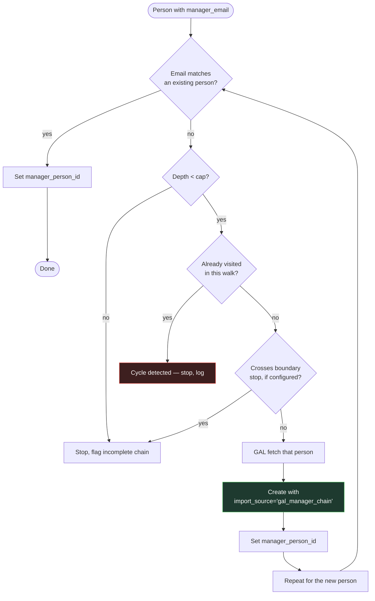
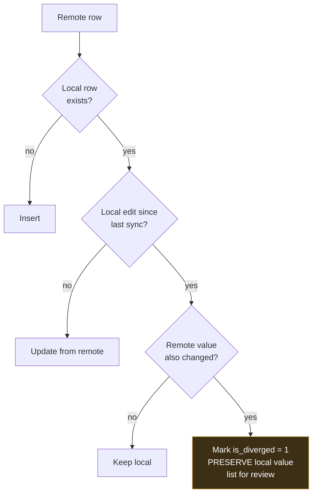

# PersonalOS — Integration Rules

Hard boundaries for Outlook, the GAL, Smartsheet and timesheet import. Read before building anything that touches data outside the database.

**Core principle:** PersonalOS mirrors and reasons over external systems. It never becomes their authoritative source, and it never takes the last irreversible step on your behalf.

---

# Part 1 — Outlook

## 1.1 Architecture

All COM runs in **standalone subprocesses** invoked by `app/integrations/outlook/client.py` via `subprocess.run` with a timeout, communicating by JSON on stdout.

```
app/integrations/outlook/
├── client.py                    adapter: run helper, parse JSON, handle failure
├── _helper_calendar.py          read calendar range
├── _helper_write_events.py      write PersonalOS-folder appointments
├── _helper_mail.py              read mail metadata
├── _helper_gal.py               resolve GAL users, walk manager chain
├── _helper_contacts.py          read Contacts folder
├── _helper_draft_email.py       create + Display() a draft
└── _helper_draft_invite.py      create + Display() a meeting invite
```

> **Never `import win32com` inside a Flask request handler.** COM's apartment threading model conflicts with Flask's worker pool and produces intermittent, unreproducible failures. The subprocess boundary eliminates the entire class of problem.

Each helper is runnable standalone for debugging:

```bash
python -m app.integrations.outlook._helper_gal --email jane.doe@kpmg.com --depth 3
```

## 1.2 Permitted and prohibited

| Action | Status |
|---|---|
| Read calendar items | ✅ |
| Read mail metadata | ✅ |
| Read mail body | ✅ only with explicit per-message opt-in |
| Read GAL / Contacts | ✅ |
| Write appointments to the `PersonalOS` folder | ✅ zero attendees only |
| Create drafts and `Display()` them | ✅ |
| **Call `Send()`** | ❌ never, under any circumstance |
| **Modify or delete anything outside the `PersonalOS` folder** | ❌ |
| **Accept, decline or respond to invitations** | ❌ |
| **Delete or archive mail** | ❌ |
| **Create or modify rules or folders** (other than the one `PersonalOS` folder) | ❌ |
| **Access another mailbox** | ❌ |
| **Background polling of mail** | ❌ — mail intake is user-triggered only |
| **Microsoft Graph, MSAL, OAuth** | ❌ — local COM only |

The prohibitions are not stylistic. Each names an action that is irreversible, invisible to the user, or capable of sending something to a client.

## 1.3 Universal rules

1. **User-triggered.** Every Outlook action starts from a button press. The single exception is the opt-in interval calendar sync (`CALENDAR_SYNC.md` §5), which is off by default.
2. **Dedup by `EntryID`.** Importing the same item twice is a no-op.
3. **Graceful absence.** No `pywin32`, or Outlook not running: show a clear message, disable the feature, break nothing else.
4. **Metadata over content.** Store subject, sender, dates and extracted structure. Full bodies only on explicit opt-in.
5. **Log every run** to `outlook_sync_log` with direction, item type, result and detail.
6. **Timeout everything.** 120 seconds default; kill and report rather than hang.
7. **Skip bad items, don't abort.** One malformed calendar entry must not cost the whole import.

## 1.4 Calendar

Covered in full by `CALENDAR_SYNC.md`. The two invariants worth repeating: **writes go only into the `PersonalOS` folder**, and **written items carry zero attendees** so no invitation can ever be generated.

## 1.5 Mail intake

Read-only, metadata by default.

```python
folder = namespace.GetDefaultFolder(6)          # olFolderInbox
items  = folder.Items
items.Sort("[ReceivedTime]", True)
restricted = items.Restrict(
    "[ReceivedTime] >= '" + since.strftime("%m/%d/%Y %H:%M %p") + "'"
)
```

Captured per message: `Subject`, `SenderEmailAddress`, `ReceivedTime`, `EntryID`, `ConversationID`, folder name, and recipient lists. `Body` **only** when the user ticks "store full body" for that message.

Sender addresses in Exchange format (`/O=…/CN=…`) are resolved to SMTP via `AddressEntry.GetExchangeUser().PrimarySmtpAddress`, falling back to the raw value when resolution fails.

### Triage

An intake row converts to a task, note, calendar event, or draft reply. Conversion links back to the email via `entity_links` so the origin is always traceable.

## 1.6 GAL sync and the manager chain

The GAL is the source for people attributes. `ExchangeUser` maps almost exactly onto the seed spreadsheet's columns:

| `ExchangeUser` property | `people` column |
|---|---|
| `FirstName` | `first_name` |
| `LastName` | `last_name` |
| `PrimarySmtpAddress` | `email` |
| `JobTitle` | `job_title` → `job_title_map` → `level_id`, `function` |
| `Department` | `department` |
| `CompanyName` | `company` |
| `BusinessTelephoneNumber` | `business_phone` |
| `MobileTelephoneNumber` | `mobile_phone` |
| `City` | `city` |
| `StateOrProvince` | `state_province` |
| `GetExchangeUserManager()` | `manager_email` → `manager_person_id` |

`GetExchangeUserManager()` returns the manager as another `ExchangeUser`, so walking the chain needs no separate lookup. `GetDirectReports()` fills the org chart downward.

### The manager chain resolver



Bounded by four controls:

| Control | Default | Why |
|---|---|---|
| Depth cap | 10 | Unbounded, the walk reaches the chief executive |
| Cycle detection | always on | A reports to B reports to A occurs in real directory data |
| Boundary stop | off | Optionally halt at department or company edge |
| `import_source` tag | `gal_manager_chain` | Auto-pulled managers stay reviewable and removable as a group |

Runs as a **queued job**, not inline in a request — a chain walk is many COM round-trips.

> **The one sanctioned exception to "never auto-create people."** Scraped email addresses go to `contact_candidates` for review; chain managers are created directly, because a reporting chain with a hole in it produces no org chart at all. The `import_source` tag is what keeps that exception honest.

## 1.7 Drafts

Composed in PersonalOS, opened in Outlook for the user to review and send.

```python
mail = outlook.CreateItem(0)     # olMailItem
mail.Subject = subject
mail.Body    = body
mail.To      = to_recipients
mail.Save()
mail.Display()                   # opens for review — NEVER Send()
```

Meeting invites use the same pattern with a quality gate: title, date, duration, attendees, purpose, desired outcome and agenda must all be present, because a meeting invitation without a stated purpose is how calendars get ruined.

**A codebase-wide grep for `.Send(` must return nothing.** Make it part of the Phase 7 acceptance check.

---

# Part 2 — Smartsheet

## 2.1 Boundaries

| Property | Value |
|---|---|
| Methods | **`GET` only** |
| Host | `api.smartsheet.com` — the only permitted external host for this integration |
| Auth | Personal access token from `app/data/secrets.json`, or `PERSONALOS_SMARTSHEET_TOKEN` |
| Direction | Read-only. **V1 never writes back** |

A codebase-wide check for `POST`, `PUT`, `DELETE` against the Smartsheet client must return nothing.

## 2.2 Source kinds

| Kind | Feeds |
|---|---|
| `pipeline` | `pipeline_opportunities` |
| `roster` | `people`, `person_status_events` (disposition) |
| `allocations` | `weekly_allocations` (confirmed staffing) |
| `resources` | `person_capacity` |

## 2.3 Column mapping

Each source stores a `column_map_json` mapping Smartsheet column titles to PersonalOS fields, configured in Admin.

A column rename upstream becomes an Admin edit, not a code change and not a silent failure. On sync, a mapped column that no longer exists produces a **clear error naming the missing column**, and the run aborts without partial writes.

## 2.4 Upsert and divergence

Rows upsert by `smartsheet_row_id`.



**A divergence is never resolved automatically.** Silently discarding a deliberate local edit is worse than showing a conflict, so the local value is kept and the row is listed for you to decide.

## 2.5 Secrets and proxies

`secrets.json` is gitignored, never logged, never rendered, masked in the UI. The token is read at call time and never stored in the database or in `activity_log`.

Corporate proxies: honour `HTTPS_PROXY`, support a custom CA bundle via `REQUESTS_CA_BUNDLE` for TLS-inspecting proxies. The connectivity diagnostic reports exactly which hosts are reachable — guessing wastes more time than checking.

## 2.6 Sync runs

Every run writes a `sync_runs` row: rows read, upserted, diverged, status, error. A failed sync leaves prior data intact — no partial commits.

---

# Part 3 — Timesheet Import

## 3.1 Parsing

Files land in `app/data/inbox/`. Parsed with `openpyxl`, **located by header text rather than column position**.

```python
HEADER_SYNONYMS = {
    "charge_code": ["charge code", "engagement code", "job code", "wbs"],
    "person":      ["employee email", "email", "resource", "employee name"],
    "work_date":   ["date", "work date", "time entry date"],
    "hours":       ["hours", "qty", "time"],
}
```

Position-based parsing breaks silently when a column is inserted upstream — every value shifts one to the left and the import "succeeds" with wrong data. Label-based parsing fails loudly instead, which is the correct behaviour.

Synonyms are configurable per import profile in Admin.

## 3.2 Idempotency

`import_batches.file_sha256` is unique per batch type. Re-importing an identical file is a no-op that **reports itself as one** rather than silently doing nothing.

`time_entries` carries `UNIQUE (charge_code_id, person_id, work_date, external_ref)`, so a partial re-import converges rather than duplicating.

## 3.3 Reconciliation

Nothing is dropped silently.

| Problem | Queue action |
|---|---|
| Charge code not found | Map to existing, create against a project, or mark ignorable |
| Person not recognised | Match by email or name, or import from GAL |
| Rate unresolvable | Flag as unpriced — **never price at zero** |

The wizard will not commit while unmatched rows exist, unless you explicitly choose to defer them — in which case they stay in the batch as `unmatched` and remain visible.

## 3.4 Pricing at commit

Each row is priced through `resolve_rates(person_id, work_date, rate_card_id)` and the resolved rates are **snapshotted onto the row**. A later rate-card edit does not restate booked history. See `FINANCIAL_MODEL.md` §2.

---

# Part 4 — Checklist for Any New Integration

- [ ] Is it read-only? If not, what exactly can it change, and can that action reach a person outside this machine?
- [ ] Is it user-triggered? If a background job, is it off by default and documented?
- [ ] Does it run outside the Flask request (subprocess or queued job) if it is slow or uses COM?
- [ ] Is there a dedup key, and is re-running a no-op?
- [ ] Does it degrade gracefully when the dependency is missing?
- [ ] Are unmatched or unresolvable rows queued rather than dropped?
- [ ] Are secrets read at call time, never logged, never rendered?
- [ ] Is every run logged with counts and errors?
- [ ] Does a failure leave prior data intact?
- [ ] Is the new external host explicitly documented here and in `PersonalOS_Spec.md` §10?
