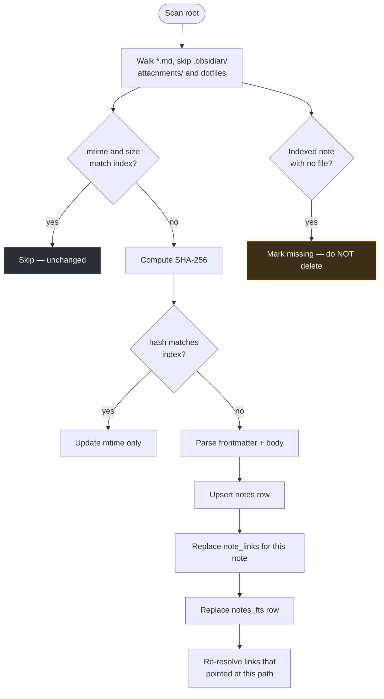

# PersonalOS — Notes Vault Specification

Obsidian-style markdown notes on disk, bound to structured SQLite records.

**The governing rule:** the `.md` file on disk is the truth. Everything in the database is a **rebuildable index**. If the index and the files disagree, the files win — delete the index and rescan.

---

## 1. Vault Roots

Multiple roots, each independently configured in `vault_roots`.

| Root key | Path | Writable | Purpose |
|---|---|---|---|
| `projects` | `<app_root>/projects` | yes | Project and workstream notes |
| `docs` | `<app_root>/docs` | yes | The application's own specifications |
| `templates` | `<app_root>/template_library` | **no** | Template packs, browsable but not editable here |

The `docs` root exists so this specification is readable and editable inside the application it describes. The `templates` root is read-only because packs are edited as packs, through the Template Library, not as loose files.

## 2. Folder Layout

```
projects/
└── Client Delivery/                    ← portfolio.folder_slug
    └── acme-sell-side-diligence/       ← project slug
        ├── _project.md                 ← project home note
        ├── meetings/
        │   └── 2026-08-14-kickoff.md
        ├── attachments/                ← not indexed; referenced by path
        ├── status/
        │   └── 2026-08-week-33.md      ← generated status reports
        └── data-migration/             ← workstream slug
            ├── _workstream.md
            └── cutover-plan.md
```

`_project.md` and `_workstream.md` are conventional home notes, created on provisioning from the template scaffold or a default stub.

### Slug rules

Folder names derive from record names. Windows is the constraining platform:

1. Lowercase; spaces and underscores → hyphens
2. Strip characters illegal on Windows: `< > : " / \ | ? *` and control characters
3. Collapse repeated hyphens; trim leading and trailing hyphens
4. Reject **reserved device names** — `CON`, `PRN`, `AUX`, `NUL`, `COM1`–`COM9`, `LPT1`–`LPT9`, with or without extension. A collision gets `-1` appended
5. No trailing dot or space (Windows silently strips these, which breaks path round-tripping)
6. Truncate to 60 characters; total path kept under 240 to leave room inside the 260-character limit
7. On collision within a parent, append `-2`, `-3`, …

The slug is stored in `folder_path`. Renaming a record **moves the folder and preserves contents**; it does not create a new one.

### Path confinement

Every path derived from a request is checked before any filesystem operation:

```python
target = (root.abs_path / rel_path).resolve()
if not target.is_relative_to(root.abs_path.resolve()):
    abort(400)
```

`resolve()` before the check — symlinks and `..` segments must be collapsed first. This applies to read, write, rename, move, and delete without exception.

---

## 3. Frontmatter

YAML at the top of the file. All keys optional; the indexer tolerates absence and malformed blocks.

```yaml
---
title: Cutover Plan
type: plan
project: acme-sell-side-diligence
workstream: data-migration
tags: [cutover, risk, phase-2]
people: [jane.doe@kpmg.com, kim.park@kpmg.com]
date: 2026-08-14
status: draft
---
```

| Key | Effect |
|---|---|
| `title` | Overrides the H1 or filename as display title |
| `type` | Free text, indexed into `notes.note_type` |
| `project` / `workstream` | Slug binding to `notes.project_id` / `workstream_id` |
| `tags` | List or comma string → `notes.tags` |
| `people` | Emails resolved to person links in `note_links` |
| `date`, `status` | Stored in `frontmatter_json`, available to search |

**Unknown keys are preserved verbatim** in `frontmatter_json` and written back untouched on save. The application never discards data it does not understand.

A malformed YAML block is a warning on the note, not a parse failure — the body still indexes.

---

## 4. Link Grammar

### Note links

| Syntax | Meaning |
|---|---|
| `[[cutover-plan]]` | Note by filename within the same root |
| `[[data-migration/cutover-plan]]` | Note by relative path |
| `[[cutover-plan\|the plan]]` | Aliased display text |

Resolution order: exact relative path → unique filename match within the root → unresolved.

An unresolved link renders distinctly and appears in the unresolved-links report. Clicking it offers to create the note at the implied path — the standard wiki behaviour.

### Typed record links

The extension that binds the vault to the database:

| Syntax | Target |
|---|---|
| `[[project:acme-sell-side-diligence]]` | `projects.code` or slug |
| `[[workstream:data-migration]]` | Workstream within the note's project |
| `[[task:412]]` | Task by id |
| `[[person:Jane Doe]]` | Person by name, or `[[person:jane.doe@kpmg.com]]` by email |
| `[[charge:ACME-2026-01]]` | Charge code by code |
| `[[meeting:2026-08-14-kickoff]]` | Meeting by slug or id |
| `[[risk:88]]` | RAID item by id |
| `[[milestone:112]]` | Milestone by id |

Each resolves to a `note_links` row with `target_kind = 'record'`, which is what lets a project page display every note that mentions it.

Namespaces are a closed set defined in `app/core/notes_index.py`. An unknown namespace is treated as plain text rather than an error.

### Tags

`#cutover`, `#phase-2`. Extracted from body and frontmatter, merged, stored on `notes.tags`. Not extracted from inside code fences.

### External links

Standard markdown `[text](https://…)` recorded with `target_kind = 'external'`. Never fetched.

---

## 5. The Indexer

`app/core/notes_index.py`, invoked at startup, on demand, and by `reindex_notes.py`.



**Two-stage change detection** — mtime and size first, hash only when they differ. A vault of a few thousand notes rescans in well under a second when nothing has changed, which is what makes scan-on-page-load viable.

**A missing file marks the note, never deletes the row.** A network drive hiccup or an editor's atomic-save window must not destroy backlinks. Missing notes appear in a report for explicit cleanup.

### FTS5

An ordinary FTS5 table keyed on `rowid = notes.id`. Snippets come from `snippet()` at query time, with the highlight delimiters escaped before they reach a template.

**This was specified as a contentless table (`content=''`) and that turned out to be wrong.** SQLite refuses `DELETE` on a contentless FTS5 table — `cannot DELETE from contentless fts5 table` — so re-indexing an edited note is impossible, which is the single most common operation the indexer performs. Deleting from a contentless table requires supplying the *original* column values, which is precisely what a contentless table does not keep. SQLite 3.43 added `contentless_delete=1`, but that would pin the application to a SQLite version newer than several Python builds ship.

The cost of an ordinary table is a second copy of the note text inside the FTS index. For a personal vault that is megabytes, and it does not weaken the governing rule: the file on disk is still the truth, `notes_fts` is still derived, and dropping the whole index and rescanning still reproduces it exactly.

The body text is still never written into the `notes` table itself.

---

## 5A. Managed Blocks

Some notes — the workstream charter above all — need to show live data. A team list that was accurate two weeks ago is *actively misleading* to someone onboarding, which is worse than no list at all.

Managed blocks are HTML-comment-delimited regions that PersonalOS refreshes from the database. Everything outside them is yours and is never touched.

```markdown
## 2. People

<!-- personalos:team -->
| Name | Title | Level | Company | Location | Role | Email |
|---|---|---|---|---|---|---|
| Kim Park | Manager Advisory | Manager | KPMG US | Chicago | Workstream Lead | kim.park@kpmg.com |
| Sam Rivera | Sr Associate Advisory | Senior Associate | KGS | Bangalore | Data | sam.rivera@kpmg.com |
<!-- /personalos:team -->

### Who to ask about what
Kim owns the client relationship. Sam knows the extract pipeline
end to end — ask him before touching anything in `/scripts`.
```

The prose under "Who to ask about what" survives every refresh. The table is regenerated.

### Available blocks

| Block | Renders | Source |
|---|---|---|
| `team` | Name, title, level, company, location, role, email | `assignments` → `people`, plus workstream lead |
| `milestones` | Name, forecast date, status, major flag | `milestones` for this workstream |
| `tasks` | Open tasks, high priority first, then due date | `tasks` for this workstream |
| `dependencies_inbound` | What we need, from whom, by when | `dependencies` where `from_workstream_id = this` |
| `dependencies_outbound` | What others need from us | `dependencies` where `to_workstream_id = this` |
| `locations` | Physical sites with building, floor, room, access | `locations` via `entity_links` |
| `resources` | Digital resources grouped by role | `work_resources` for this workstream |
| `charge_codes` | Codes, status, leadership | `charge_codes` for this workstream |
| `budget_summary` | Budget, actual, burn, coverage | `health.py` |

Block names are a closed set in `app/core/notes_index.py`. An unrecognised block name is **left completely alone** — a typo must never eat content.

### Refresh rules

1. Replace only the text **between** the markers. The markers themselves and everything outside them are preserved byte-for-byte.
2. Triggered by an explicit **"Refresh live sections"** action, and optionally on note open (`app_settings.notes_autorefresh_blocks`, default off).
3. **Never** as a side effect of an unrelated save.
4. If the closing marker is missing, the block is skipped and a warning is shown — never guess where it ends.
5. If the underlying data does not exist yet, render a placeholder: *"No team assigned yet."* This is what lets the charter template ship at Phase 3 and fill in as later phases land.
6. Every refresh writes an `activity_log` entry naming the note and which blocks changed.
7. Deleting the markers **opts that section out permanently** — the built-in escape hatch.

### The risk, stated plainly

> This is the **only** place PersonalOS writes into a file the user also edits by hand. If the marker-boundary logic is ever wrong, it destroys prose someone wrote.
>
> Consequences for implementation: parse markers with an exact-match regex anchored to line starts, never a fuzzy match. Write atomically. Refuse to refresh a file whose hash changed since it was read. Unit-test the boundary logic against nested markers, missing closers, markers inside code fences, and CRLF line endings before this ships.

Markers inside a fenced code block are **not** treated as blocks — otherwise documenting this feature would rewrite the documentation.

## 6. Editor

Split edit/preview, with preview rendered **server-side** through the same `markdown` + `nh3` pipeline as the read view. One renderer means preview and saved output cannot diverge — a client-side previewer would eventually disagree with the server about something and produce a surprise on save.

Preview posts the buffer to `/notes/preview` on a 300ms debounce.

### `[[` autocomplete

Typing `[[` opens a picker over **notes and records simultaneously**, grouped:

```
[[cut
 ─ Notes ────────────────────────
   cutover-plan                     data-migration/
   cutover-risks                    data-migration/
 ─ Records ──────────────────────
   project:acme-sell-side-diligence
   task:412  Draft cutover runbook
```

Keyboard-navigable; Enter inserts with the correct namespace prefix.

### Conflict handling

On save, compare the file's current hash against the hash loaded into the editor. If they differ, the file changed on disk underneath you — present a three-way choice: keep yours, take theirs, or open a side-by-side diff. **Never silently overwrite.** Editing the same note in VS Code and the app simultaneously is a realistic accident, not an edge case.

### Save

1. Validate path confinement
2. Serialise frontmatter, preserving unknown keys
3. Write atomically — temp file then `os.replace`
4. Re-index that note synchronously so backlinks are immediately correct
5. Write an `activity_log` entry

---

## 7. Search

Two engines, merged:

| Engine | Strength |
|---|---|
| FTS5 keyword | Exact terms, names, codes, phrase matching |
| Semantic embeddings *(Phase 21)* | Meaning — "what did we decide about cutover" |

Results merge with keyword matches ranked first when the query looks like an identifier (contains digits, uppercase runs, or hyphens), semantic first otherwise. Each result shows which engine matched it.

Filters: root, project, workstream, tag, type, date range.

Semantic search is **always local**. Embedding the vault means sending all of it, so the operation is pinned to a local provider in code, not merely defaulted there.

---

## 8. Provisioning & Rename

**On project create:** portfolio folder if absent, project folder, `_project.md` from the template scaffold or a default stub with frontmatter pre-bound.

**On workstream create:** workstream folder, `_workstream.md`.

**On rename:** compute the new slug, move the folder with `shutil.move`, update `folder_path` on the record and `rel_path` on every affected note, then re-resolve inbound links that referenced the old path. Wikilinks that used the old folder name are rewritten in the referring files, and every rewrite is logged.

**On archive:** the folder is **never deleted**. The record archives; files stay. This is deliberate — a year of client notes must not vanish because someone archived a project.

---

## 9. Anti-Patterns

| Don't | Because | Instead |
|---|---|---|
| Store note body in `notes` | Two sources of truth that will diverge | FTS5 contentless; read the file |
| Delete index rows for missing files | Destroys backlinks over a transient glitch | Mark missing, report it |
| Render markdown client-side | Preview and saved output eventually disagree | One server-side renderer |
| Skip `resolve()` before confinement check | `..` and symlinks escape the root | Always resolve first |
| Write the file without atomic replace | A crash mid-write truncates the note | Temp file then `os.replace` |
| Silently discard unknown frontmatter | Loses data the user put there deliberately | Preserve in `frontmatter_json` |
| Hard-fail on malformed YAML | One bad note blocks the whole index | Warn on the note, index the body |
