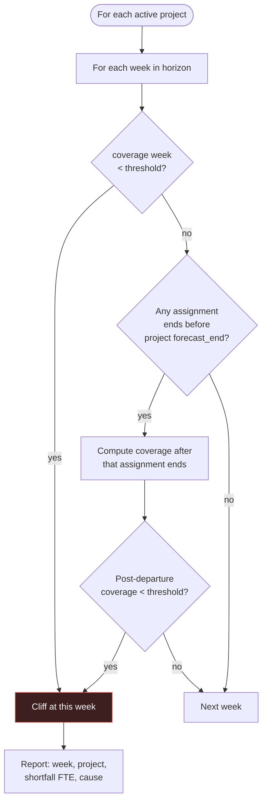

# PersonalOS — Resource Model

Capacity, coverage, cliffs, the Staffing Board, the Morning Report, and the org chart.

**Governing idea:** availability, utilization, coverage and cliffs are all **computed** from source data. None of them is a field anybody has to remember to update, because a staffing picture maintained by hand is a staffing picture that is wrong by Wednesday.

---

## 1. Definitions

Everything below resolves at **weekly grain**, weeks starting Monday.

### Capacity

```
capacity(person, week) = weekly_hours(person, week)          # person_capacity, effective-dated
                       − out_of_office_hours(person, week)   # person_status_events
```

`person_capacity` is effective-dated, so a move to four days a week is a new row, not an edit. Absence of any `person_status_events` row for a date means available.

Out-of-office hours are prorated: three days of leave in a five-day week removes 60% of that week's capacity.

### Allocation

```
allocated(person, week) = Σ (assignment.allocation_pct ÷ 100 × capacity(person, week))
                          for assignments overlapping that week
```

Assignments overlap partial weeks. An assignment ending Wednesday contributes three-fifths of its weekly allocation.

### Utilization and availability

```
utilization(person, week) = allocated ÷ capacity
available(person, week)   = capacity − allocated
```

`available_from(person)` is the first week in the horizon where `available ≥ 0.5 × capacity` — the answer behind "Available from Oct 28" on a staff card. Half capacity rather than full, because nobody rolls off cleanly and waiting for a fully empty week reports availability that never arrives.

### Utilization bands

Four bands. The fourth exists because someone at 30% is a **bench** problem — actionable, and precisely the person you are hunting for when staffing. Collapsing it into "green, good capacity" hides exactly what you opened the board to find.

| Utilization | Band | Colour | Label |
|---|---|---|---|
| `< 60%` | Bench | blue | "Available" |
| `60–95%` | Good | green | "Good" |
| `95–110%` | Full | amber | "Full" |
| `> 110%` | Over | red | "Over" |

Thresholds live in `app_settings.utilization_bands`. Every bar renders its numeral — **never colour alone**.

### Coverage

The demand side is `staffing_requirements`; the supply side is `assignments`.

```
coverage(project, week) = Σ assigned_fte(week) ÷ Σ required_fte(week)
```

where `assigned_fte = allocation_pct ÷ 100` for assignments overlapping the week, matched to the requirement they fill.

Reported two ways: **current-week coverage** (the tile bar) and **project-window coverage** (the average across the project's forecast span).

**Understaffed** is `coverage < app_settings.understaffed_threshold`, default `1.0`. This drives the dashed border and warning label — and it is arithmetic, not opinion.

---

## 2. Resource Cliffs

A cliff is the earliest point in the horizon where a project's supply drops below its demand. Two triggers:



The second trigger is the important one: **an assignment ending before its project's forecast end is a cliff you can see months out.** That is the "upcoming resource outage" signal, and it is why `assignments.end_date` is a real field that gets extended rather than an open-ended assumption.

Cliff output names the week, the shortfall in FTE, and the cause — either "requirement grows" or "Kim Park rolls off 14 Nov."

### Assignment extensions

`assignments.end_date` is the current end. Every extension writes an `assignment_extensions` row with the previous end, the new end, a reason and a timestamp.

This gives the audit trail of how a three-month assignment became eleven — a pattern that is invisible when the end date is simply edited in place, and that matters when you are arguing for more people next time.

"Rolling off in N days" on a staff card is derived from `end_date`, never stored.

---

## 3. Demand

Three sources, summed by week **and by level** — because "we need a Senior Manager in nine weeks and have none free" is a different problem from "we are short two people."

| Source | Contribution |
|---|---|
| **Committed** | `staffing_requirements` on active projects |
| **Templated-unstaffed** | Requirements created by a template import, not yet filled |
| **Pipeline** | `pipeline_opportunities.est_hours × probability`, spread across `est_start`–`est_end` |

Probability weighting is what lets a cliff appear before the work is sold. Unweighted pipeline would make everything look like a crisis; ignoring it entirely means finding out about the crisis when the engagement letter is signed.

---

## 4. Master Staffing Board

Screen specification. See `UI_DESIGN_SYSTEM.md` for tokens and components, `PersonalOS_Spec.md` §6.3 for the layout sketch.

### Left rail

**Daily summary:** active headcount · out-of-office count · aggregate capacity bar (team `allocated ÷ capacity` for the current week).

**Staff cards**, one per person in scope, sorted by utilization descending so problems surface first:

```
┌──────────────────────────┐
│ (KP) Kim Park            │
│ Manager · Advisory       │
│ ▓▓▓▓▓▓▓▓▓▓▓░ 118%  Over  │
│ Acme Sell Side      75%  │
│ Beta Restate        43%  │
│ Available from  2 Feb    │
└──────────────────────────┘
```

Scope is configurable: my team by `manager_person_id` downline, my department, or everyone.

### Project tiles

Anatomy in `UI_DESIGN_SYSTEM.md` §3.4. Data behind each element:

| Element | Source |
|---|---|
| Header image | `projects.cover_image`, else deterministic gradient from `hash(id)` |
| Status / priority badges | `projects.status`, `projects.priority` |
| Timeline strip | `baseline_start`–`forecast_end`, today marker |
| Skill tags | `project_skill_requirements` joined to `skills` |
| Coverage bar | §1 coverage, current week |
| Avatars | `assignments` active this week, with `allocation_pct` |
| Burn chip | `health.py` on-budget signal |
| Understaffed | dashed border + label when below threshold |

### Assign Team

Opens pre-filled from the requirement being filled — role, level, dates already set (P8).

Candidate list is **ranked, not alphabetical**:

1. Meets `min_proficiency` on the requirement's essential skills
2. Has available capacity across the requirement's date range
3. Same company (US/offshore) if the project's rate card is scoped
4. Not already over-allocated

Each candidate shows current utilization and what it becomes if assigned. **The resulting utilization is visible before commit** — assigning someone to 130% should be a decision, not a discovery.

### Scenarios

`assignments.scenario_id IS NULL` is the live plan. A scenario writes assignments with its own id; every live query filters `scenario_id IS NULL`.

Comparison renders two coverage/utilization sets side by side with deltas. Applying a scenario promotes its assignments to `scenario_id = NULL` inside a single transaction, archiving any live assignments it supersedes.

Using a nullable column rather than a parallel allocation table means no query is duplicated and no aggregation logic exists twice.

---

## 5. Morning Report

The full-detail page behind the board's left rail, **sharing the same query** — one data model, two presentations, no duplicated logic.

Borrowed from the Marine Corps daily disposition report: the point is knowing where every member of the team actually is before the day starts.

### Per person

| Field | Source |
|---|---|
| Disposition | `person_status_events` active today, else Active & Ready |
| Detail | e.g. "Rotating to Beta Restate 1 Mar" |
| Current assignments | project, allocation %, end date |
| This-week utilization | §1, with band |
| Availability strip | next N weeks, one cell per week |
| Rolling off | derived when `end_date` is within 30 days |

**Disposition values:** Active & Ready · On Leave · Sick · In Training · Rotating to X · Unassigned · Overbooked · Rolling off in N days.

The last three are **derived**, not stored: Unassigned when no active assignment, Overbooked when utilization > 110%, Rolling off from `end_date`.

### Roll-ups

Headcount by disposition, total available hours in the horizon, count over-allocated, count on bench, and cliffs in the next four weeks.

### Data source

Disposition comes from the **Smartsheet roster sheet** (`smartsheet_sources.kind = 'roster'`), synced read-only. Manual `person_status_events` rows may be added with `source = 'manual'`; where both exist for a date, manual wins and the row is flagged as diverged so the sheet can be corrected.

---

## 6. Resource Horizon

Person × week heat map. Kept separate from the board because a horizon grid answers a different question than a roster rail.

```
              W36  W37  W38  W39  W40  W41  W42  W43
Kim Park      ███  ███  ███  ▓▓▓  ▓▓▓  ░░░  ░░░  ░░░
Jane Doe      ▓▓▓  ▓▓▓  ███  ███  ███  ███  ▓▓▓  ▓▓▓
Sam Rivera    ░░░  ░░░  ▒▒▒  ▒▒▒  ▓▓▓  ▓▓▓  ▓▓▓  ███
─────────────────────────────────────────────────────
Demand (FTE)  4.0  4.0  4.5  5.0  5.0  5.5  5.5  6.0
Supply (FTE)  3.0  3.0  3.0  3.0  2.5  2.5  2.5  2.5
Gap                          ⚠    ⚠    ⚠    ⚠    ⚠
```

- Horizon selector: 4 / 8 / 12 / 26 weeks
- Cell colour by utilization band; **cell text shows the percentage** — never colour alone
- Demand and supply rows overlay on the same axis, so the gap is visually obvious
- Any cell drills through to that person's week: which assignments, which projects
- Filter by level to answer "which Senior Managers are free in Q2"

---

## 7. Org Chart

Recursive CTEs over `people.manager_person_id`.

```sql
-- Full downline
WITH RECURSIVE downline(id, depth) AS (
    SELECT id, 0 FROM people WHERE id = :root
    UNION ALL
    SELECT p.id, d.depth + 1
    FROM people p JOIN downline d ON p.manager_person_id = d.id
    WHERE d.depth < 20
)
SELECT p.* FROM people p JOIN downline d ON p.id = d.id WHERE d.depth > 0;
```

The `depth < 20` guard is not decoration — directory data contains circular references often enough that an unguarded recursive CTE will eventually hang the application.

**Reports:** reporting chain upward · full downline · direct reports · span of control · rendered tree.

> **`manager_person_id` is the administrative reporting line from the directory. It is not the counselee relationship**, which lives in `performance_tracks`. People routinely report to one person and are counselled by another; merging the two would corrupt both the org chart and the performance module.

---

## 8. Smartsheet Precedence

| Data | Master | PersonalOS role |
|---|---|---|
| Roster and disposition | Smartsheet | Read-only, plus manual overlay |
| Confirmed staffing | Smartsheet | Read-only, `source='smartsheet'` |
| Planning and what-if | PersonalOS | `source='manual'`, scenarios |
| Assignment extensions | PersonalOS | Audit trail |

Every allocation row carries `source`. On sync, a locally-edited row whose remote value has changed is marked `is_diverged = 1` and **the local value is preserved**. Divergences are listed for review rather than resolved automatically — silently discarding a deliberate local edit is worse than showing a conflict.

---

## 9. Worked Example — a cliff

Acme Sell Side Diligence, forecast end **31 March**.

**Requirements:** 1 Manager and 2 Senior Associates, 1 Jan – 31 Mar → 3.0 FTE.

**Assignments:**

| Person | Level | Alloc | Start | End |
|---|---|---|---|---|
| Kim Park | Manager | 100% | 1 Jan | 31 Mar |
| Jane Doe | Senior Associate | 100% | 1 Jan | **31 Jan** |
| Sam Rivera | Senior Associate | 100% | 1 Jan | 31 Mar |

**Result:**

| Period | Assigned FTE | Required | Coverage | State |
|---|---|---|---|---|
| Jan | 3.0 | 3.0 | 100% | Covered |
| Feb – Mar | 2.0 | 3.0 | **67%** | **Understaffed** |

**Cliff reported:** *week of 2 February · Acme Sell Side · shortfall 1.0 FTE (Senior Associate) · cause: Jane Doe rolls off 31 Jan, 59 days before project forecast end.*

Visible in January. That is the entire point of the model: the shortfall is arithmetic available today, not a surprise in February.
