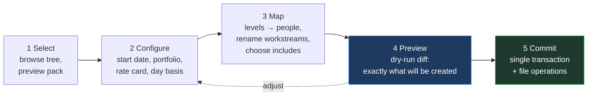

# PersonalOS — Template Library

Reusable engagement packs: task plan, resource plan, budget, note scaffold and governance starters, organised by service offering and project type.

**The point:** starting a sell-side engagement should produce a fully scaffolded project — dated tasks, level-based demand, priced budget, documentation skeleton and the risks that engagement type always carries — rather than an empty shell you populate from memory.

---

## 1. Folder Tree

Root is `<app_root>/template_library/` — deliberately **not** `app/templates/`, which belongs to Jinja.

```
template_library/
└── Transaction Services/           ← service_offering
    ├── Sell Side/                  ← project_type
    │   ├── template.yaml           manifest — required
    │   ├── plan.xlsx               Tasks · Resources · Budget · Milestones
    │   ├── governance.yaml         RAID · stakeholders · comms · charge codes
    │   └── notes/                  markdown scaffold
    │       ├── _project.md
    │       ├── meetings/.gitkeep
    │       └── Diligence/
    │           └── _workstream.md
    └── Buy Side/
        └── …
└── Accounting Advisory/
    ├── Restatement/
    └── Accounting Error/
```

Folder names map directly onto the `service_offering` and `project_type` values in `config_options`, so the taxonomy is shared between templates, project fields, filtering and reporting. A folder whose name has no matching config option is indexed with a warning rather than skipped.

---

## 2. The Manifest

`template.yaml` is required and declares everything the importer needs.

```yaml
name: Sell Side Diligence
version: "1.2"
description: Standard sell-side financial due diligence engagement
pack_kind: project         # project | workstream | note
service_offering: Transaction Services
project_type: Sell Side

pack_format: xlsx          # or yaml_csv
plan_file: plan.xlsx

defaults:
  duration_weeks: 14
  day_basis: working       # working | calendar
  portfolio: Client Delivery
  rate_card: US Standard

anchors:                   # named offsets other rows can hang from
  kickoff:   0
  data_room: 10
  signing:   85

includes:
  tasks: true
  milestones: true
  resources: true
  budget: true
  notes: true
  governance: true
```

`version` is recorded on import, so you can see which engagements came from which revision of a pack and spot drift when the pack later changes.

---

## 3. Pack Formats

Both are supported; the manifest declares which. They normalise to the same internal structure, so a pack authored either way produces identical results.

### 3.1 Excel workbook

One `.xlsx` with named sheets. Columns are found by **header text, not position** — the same label-driven approach as the timesheet import, for the same reason.

**Sheet `Tasks`**

| Column | Meaning |
|---|---|
| `key` | Stable identifier for dependencies |
| `workstream` | Workstream name; blank means project level |
| `title` | Task title |
| `offset_days` | Start offset from project start or `anchor` |
| `anchor` | Optional named anchor from the manifest |
| `duration_days` | Length |
| `depends_on` | `key` of a predecessor (finish-to-start) |
| `level` | Suggested level for the doer |
| `estimate_hours` | Optional |
| `priority` | high / medium / low |

**Sheet `Milestones`** — `key`, `name`, `offset_days`, `anchor`, `is_major`, `milestone_type`

**Sheet `Resources`** — `role`, `level`, `allocation_pct`, `start_offset_days`, `end_offset_days`, `workstream`, `skills` (comma-separated)

**Sheet `Budget`** — `workstream`, `phase`, `level`, `hours`, `month_offset`

Excel is the recommended authoring surface for the budget sheet specifically, because that is where you already build budgets, formulas and all. The importer reads computed values, not formulas.

### 3.2 YAML / CSV pack

`tasks.csv`, `milestones.csv`, `resources.csv`, `budget.csv` with the same column names, plus `governance.yaml`. Diffable, hand-editable, scriptable — better for simple packs and for version control.

### 3.3 Governance starters

```yaml
raid:
  - type: risk
    title: Data room completeness delays diligence
    probability: 3
    impact: 4
    mitigation: Agree a data request list before kickoff; track weekly
  - type: assumption
    title: Management available for weekly Q&A sessions

stakeholders:
  - role: Deal Partner
    influence: high
    interest: high
    contact_frequency_days: 7
  - role: CFO (target)
    influence: high
    interest: medium
    contact_frequency_days: 14

comms:
  - audience: Deal team
    message: Weekly status and findings
    channel: Email + call
    rrule: "FREQ=WEEKLY;BYDAY=FR"

charge_codes:
  - name: Diligence fieldwork
    is_default: true
  - name: Report preparation
```

Stakeholders are created as **role placeholders** with no `person_id` until you assign one — the register tells you who you need to identify, which is more useful than an empty list.

---

## 4. Relative Dates

**Absolute dates never appear in a pack.** Everything is an offset resolved at import against the project's start date.

```
resolved_date = anchor_date + offset_days
where anchor_date = project.start_date + anchors[anchor]   (or project.start_date)
```

| Field | Meaning |
|---|---|
| `offset_days` | Days from the anchor (or project start) |
| `anchor` | Named anchor from the manifest |
| `duration_days` | Length of the task |
| `depends_on` | Predecessor `key`; start = predecessor end + `offset_days` |
| `day_basis` | `working` skips weekends; `calendar` does not |

Working-day arithmetic skips Saturday and Sunday. Holidays are not modelled in V1 — a holiday calendar is a reasonable extension, but pretending to handle it badly would be worse than a documented gap.

**Dependency resolution** is a topological sort over `depends_on`. A cycle is a **validation error that blocks import**, reported with the keys involved — a partially-imported plan with tangled dates is harder to clean up than a refused import.

### Worked example

Pack: `day_basis: working`, anchor `data_room: 10`.
Project start: **Monday 2 March 2026**.

| Task | anchor | offset | duration | Resolved start | Resolved end |
|---|---|---|---|---|---|
| Kickoff meeting | — | 0 | 1 | Mon 2 Mar | Mon 2 Mar |
| Data request list | — | 1 | 3 | Tue 3 Mar | Thu 5 Mar |
| Data room review | `data_room` | 0 | 10 | Mon 16 Mar | Fri 27 Mar |
| Draft findings | `data_room` | 10 | 5 | Mon 30 Mar | Fri 3 Apr |

Ten working days from 2 March is 16 March, not 12 March — the weekend skip is doing real work here, and getting it wrong shifts every downstream date.

---

## 5. Resources Are Planned by Level

A pack says *"1 Manager at 60% for weeks 1–12"*, never *"Kim Park."* A template naming individuals is a template usable exactly once.

On import each resource row becomes a **`staffing_requirements`** row. The mapping step then offers, per row:

| Choice | Result |
|---|---|
| Assign a person | `assignments` row created, requirement partially or fully filled |
| Leave unstaffed | Requirement stands alone as **demand** |

**Leaving rows unstaffed is the useful default.** Unfilled requirements feed the Resource Horizon as demand, which is what surfaces a resource cliff *before* the engagement is staffed — the whole reason the demand side exists as its own table.

The candidate list is ranked by skill match against the row's `skills` and by available capacity across its date range, exactly as the Staffing Board's Assign Team does.

---

## 6. Budgets Price at Import

Each `Budget` row — hours by level and phase — is priced through `resolve_rates(level, project.start_date, project.rate_card_id)` and written as a real `budget_lines` row with rates snapshotted.

**Plan and actual are priced by the same function**, so budget-to-actual is apples-to-apples by construction rather than by convention. This is the direct payoff of the single-rate-engine rule.

Where a level has no rate on the project's card, the line imports **unpriced and flagged** rather than at zero.

---

## 7. Note Scaffold

The pack's `notes/` subtree is copied into the project's vault folder, with placeholders substituted:

| Placeholder | Value |
|---|---|
| `{{project_name}}` | Project name |
| `{{project_code}}` | Project code |
| `{{client}}` | `client_org` |
| `{{start_date}}` / `{{end_date}}` | Formatted dates |
| `{{workstream_name}}` | Within a workstream folder |
| `{{charge_code}}` | Default charge code |
| `{{lead_partner}}` / `{{engagement_manager}}` | Resolved names |
| `{{today}}` | Import date |

Substitution runs over file **contents and names**, so `{{workstream_name}}-plan.md` resolves too.

Copied files are indexed immediately, so backlinks work the moment the import completes.

---

## 8. The Import Wizard

Five stages. Nothing is written before Commit.



The preview states the effect precisely:

```
This import will create:

  3  workstreams        Diligence · Quality of Earnings · Reporting
 47  tasks              first 2 Mar, last 14 Jun
  8  milestones         3 major
  5  staffing requirements   4.2 FTE peak — 2 unstaffed
 24  budget lines       412 hours · $138,400 planned revenue
  2  charge codes       1 default
  6  RAID items         4 risks · 2 assumptions
  4  stakeholder placeholders
  1  comms plan item    weekly, Fridays
 11  files              into projects/Client Delivery/acme-sell-side/

  ⚠  Level "Consultant" has no rate on US Standard — 2 budget lines
     will import unpriced.

Nothing is written until you press Commit.
```

Warnings appear **before** commit, not after.

### Transaction boundary

Database writes happen in a single transaction. File operations happen after a successful commit, and a file failure is reported without rolling back the database — the records are correct and the folder can be re-provisioned, which is far preferable to losing a completed import over a locked file.

### Additive re-import

A pack can be imported into an **existing** project — the normal way to add a workstream that follows a standard shape.

Re-import is additive, matching on `key` where present. Existing records are left untouched; only new ones are created. The preview names how many rows will be skipped as already-present, so re-import is a safe thing to try.

---

## 8A. The Workstream Start-Up Pack

A second pack kind. Where a project pack scaffolds a whole engagement, a **workstream pack** scaffolds one workstream — and its central artifact is the **workstream charter**, the note that lets someone joining mid-flight get productive without a two-hour handover call.

```
template_library/
└── _shared/
    └── workstream-startup/
        ├── template.yaml           pack_kind: workstream
        └── notes/
            └── _workstream.md      the charter
```

`pack_kind: workstream` packs carry no `service_offering` or `project_type` — they apply to any workstream in any project. Project packs may reference one as their default workstream scaffold.

**The charter is created automatically when a workstream is created**, from the default pack. It is the workstream's first note, and it is the thing the Workstreams tab links to first.

### The charter

Sections follow the capture list, with live blocks where data exists in the database and prose where judgement lives:

```markdown
---
title: {{workstream_name}} — Workstream Charter
type: workstream_charter
project: {{project_slug}}
workstream: {{workstream_slug}}
owner: {{workstream_lead}}
status: active
created: {{today}}
tags: [charter, onboarding]
---

# {{workstream_name}}

> **New here?** This page is the entry point. Read sections 1–3, skim the
> rest, then talk to the workstream lead. Anything stale — fix it.

## 1. Objective & Problem Statement
**The problem we are solving:**
**What "done" looks like:**
**In scope:**
**Explicitly out of scope:**
**Why this workstream exists separately:**

## 2. People
<!-- personalos:team -->
<!-- /personalos:team -->

**Who to ask about what:**
**Client-side counterparts:**
**Escalation path:**

## 3. Timeline & Deadlines
<!-- personalos:milestones -->
<!-- /personalos:milestones -->

**Hard deadline:**            (and what is driving it)
**Immovable external dates:**
**Critical path through this workstream:**

## 4. Major Tasks
<!-- personalos:tasks -->
<!-- /personalos:tasks -->

**Sequence and why:**

## 5. Dependencies
### What we need from others
<!-- personalos:dependencies_inbound -->
<!-- /personalos:dependencies_inbound -->

### What others need from us
<!-- personalos:dependencies_outbound -->
<!-- /personalos:dependencies_outbound -->

### Internal to this workstream
**Sequencing constraints, shared resources, single points of failure:**

## 6. Assumptions & Things to Consider
| # | Assumption | If wrong, then… | Owner | Validated? |
|---|---|---|---|---|
| 1 | | | | |

**Known unknowns:**
**Prior attempts and why they went the way they did:**

## 7. Where the Work Happens
### Physical
<!-- personalos:locations -->
<!-- /personalos:locations -->

**Getting in:**       (badge, escort, security desk, who to call)
**Practicalities:**   (parking, hours, wifi, floor layout)

### Digital
<!-- personalos:resources -->
<!-- /personalos:resources -->

**Where decisions actually get made:**  (which channel, which thread)
**Naming and versioning conventions:**
**What NOT to touch:**

## 8. Validation Checks
| # | Check | How | Frequency | Owner | Evidence |
|---|---|---|---|---|---|
| 1 | | | | | |

**Definition of done for a deliverable leaving this workstream:**
**Known failure modes and how they show up:**

## 9. Charge Codes
<!-- personalos:charge_codes -->
<!-- /personalos:charge_codes -->

**What books where:**

## 10. Other Pertinent Information
**Glossary and acronyms:**
**Client-specific context:**
**Gotchas — things that have already bitten someone:**
```

### Why this shape

**Live blocks handle what the database knows.** Team, milestones, tasks, dependencies, locations, resources and charge codes are all real records. Rendering them as prose would guarantee they go stale, and a charter listing a team member who rolled off six weeks ago actively misleads the person it exists to help.

**Prose handles what only a person knows.** "Sam knows the extract pipeline end to end — ask him before touching `/scripts`" is not a database field and never will be. Neither is "the client's Q3 close is immovable because of a covenant test."

**Section 7 is the one people skip and shouldn't.** Building access logistics and *where the decision threads actually live* are the two things that cost a new joiner the most time and that nobody thinks to write down — because the people who know have long since stopped noticing they know it.

**Section 8 exists because validation is where accounting work is won or lost.** A markdown table rather than a schema: checks vary too much by engagement type to model, and a table you can edit in ten seconds gets maintained where a form does not. Promote any check to a recurring task if it needs tracking.

### Placeholders

Beyond the standard set in §7: `{{workstream_lead}}`, `{{workstream_slug}}`, `{{project_slug}}`, `{{workstream_objective}}`, `{{start_date}}`, `{{end_date}}`.

### Import behaviour

Applying a workstream pack to an **existing** workstream is additive and safe: the charter is created only if absent, and any tasks, dependencies or resources in the pack are appended. Re-applying will not overwrite a charter you have written into — the preview says so explicitly.

### Engagement-type variants

Project packs may override the default charter with their own — a restatement charter can pre-populate section 8 with the tie-outs that engagement type always needs, and section 6 with the assumptions it always makes. The variant lives in the project pack's `notes/` tree and takes precedence over `_shared/workstream-startup/`.

**This is where the library compounds.** After three restatements, your charter template carries the validation checks you learned the hard way — and every subsequent restatement starts with them.

---

## 9. Save as Template

The reverse operation, and how the library actually grows past its first packs.

Exporting a live project generalises it:

| Live data | Generalised to |
|---|---|
| Absolute dates | `offset_days` from project start, with anchors inferred from major milestones |
| Named people | Their **level** at the time of assignment |
| Actual hours | Planned hours |
| Real client names | Placeholders |
| Charge codes | Names and structure only, never real codes |
| Notes | Optional — you choose which to include |

Review-before-write: the export screen shows the generalised pack and lets you edit names, drop rows and set the version before it is written to disk.

> **Check exported notes before committing a pack.** Generalisation removes client names from *fields*; it cannot reliably remove them from free-text prose. Note inclusion is opt-in per file for exactly this reason.

---

## 10. The Indexer

`reindex_templates.py`, and on demand from the Template Library page. Same mtime-plus-hash pattern as the notes vault.

Validation per pack, with results stored on `project_templates.is_valid` and `validation_error`:

- `template.yaml` present and parseable
- Declared `plan_file` exists
- Required columns present in each included sheet
- `depends_on` keys all resolve
- No dependency cycles
- Referenced anchors exist in the manifest
- `notes/` paths are within the pack

An invalid pack stays listed with its error visible rather than disappearing — a template that silently vanishes is much harder to debug than one that says what is wrong with it.

---

## 11. Seed Packs

Four ship with the application, matching the taxonomy you named:

| Service offering | Project type |
|---|---|
| Transaction Services | Sell Side |
| Transaction Services | Buy Side |
| Accounting Advisory | Restatement |
| Accounting Advisory | Accounting Error |

These are **starting points, deliberately thin** — a plausible workstream breakdown, the milestones that type always has, a level-based resource shape, and the risks that recur. They are meant to be replaced by your own via Save as Template once real engagements have run through the system, because a template shaped by your actual delivery beats a generic one every time.
