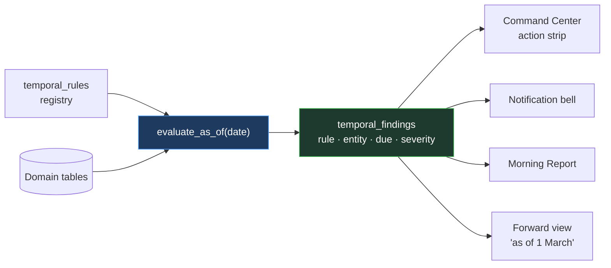

# PersonalOS — The Temporal Model

**Status: design theme, partially implemented.** Individual mechanisms ship in their own phases; the unified engine described in §4 is a future consolidation. This document exists so the concept is captured before the scattered version calcifies.

---

## 1. Why This Deserves Its Own Document

An unusual proportion of what PersonalOS knows is **true only as of a date**, and an unusual proportion of what it must *tell you* is triggered by **a date having passed**.

That is not incidental. It is the shape of the domain:

- A rate is correct for a fiscal year — recorded on the card as
  `fiscal_year` plus the `effective_from`/`effective_to` it is in force for,
  and the card's range decides which of its entries apply. An entry's window is
  intersected with its card's, so there is one window rather than two date
  filters that could disagree. A NULL bound is unbounded.
- A level is correct until a promotion
- An assignment is real until its end date
- A training certificate is valid until it expires
- A stakeholder is "recently contacted" until they aren't
- A milestone is on track until the day it isn't
- A resource cliff is a future week that becomes a present problem

Every one of these is currently a separate query written in a separate module. That works, and it is how the first phases will ship. But it has three failure modes that compound:

1. **Each new time-based signal is written from scratch**, so they drift in behaviour — one uses `>=`, another `>`, a third forgets to exclude archived rows.
2. **Nobody can answer "what will be true in March?"** because the logic is welded to `date.today()`.
3. **A missed transition is silent.** Nothing announces that a Director passed 36 months seven weeks ago. The absence of a signal looks identical to everything being fine.

The third one is the dangerous one, and it is why this is worth designing rather than accreting.

---

## 2. Two Distinct Temporal Patterns

Keeping these separate is most of the clarity.

### Pattern A — Effective-dated truth

*"What was true on this date?"* A lookup, not an event. Nothing needs to fire; you query with a date and get an answer.

| Concept | Table | Resolved by |
|---|---|---|
| Person's level | `person_level_history` | `effective_from` / `effective_to` |
| Bill and cost rates | `rate_card_entries` | `effective_from` / `effective_to` |
| Person rate override | `person_rate_overrides` | `effective_from` / `effective_to` |
| Weekly capacity | `person_capacity` | `effective_from` / `effective_to` |
| Project fee rates | `project_fees` | `effective_from` / `effective_to` |
| Approved baseline | `baselines` | `approved_on` + version |

**Rule:** these are never mutated in place. A change is a new row with a new effective range. This is what lets a promotion reprice future hours without restating past ones, and it is already load-bearing in `FINANCIAL_MODEL.md` §2.

**Invariant to enforce in application code:** effective ranges for one subject must not overlap. SQLite cannot express this as a constraint, so it is a write-path check — and a `health_check.py` assertion, because a silent overlap makes rate resolution non-deterministic.

### Pattern B — Threshold transitions

*"What has become true because a date passed?"* An evaluation that produces findings.

| Signal | Source | Threshold |
|---|---|---|
| Tenure promotion due | `people.level_start_date` | `+ auto_promote_after_months` |
| Assignment rolling off | `assignments.end_date` | within 30 days |
| Resource cliff | coverage by week | first week below threshold |
| Task overdue | `tasks.due_date` | `< today` |
| Milestone slipping | `milestones.forecast_date` | past, no `actual_date` |
| Stakeholder contact due | `stakeholders.next_contact_date` | `<= today` |
| Training expiring | `training_records.expires_on` | within 60 days |
| Training overdue | `training_requirements.due_date` | `< today` |
| Charge code closing | `charge_codes.closed_on` | within 14 days |
| Dependency at risk | `dependencies.needed_by_date` | approaching, status not `satisfied` |
| Fiscal year roll | `performance_cycles.end_date` | approaching |
| Rate card expiring | `rate_card_entries.effective_to` | approaching, no successor row |
| Resource pointer stale | `work_resources.last_verified_at` | older than 90 days |
| Note stale | `notes.mtime` | configurable, per note type |
| Recurring occurrence due | `calendar_event_occurrences` | horizon materialisation |
| Backup age | last backup timestamp | older than N days |
| Sync stale | `smartsheet_sources.last_synced_at` | older than N days |

**Seventeen and counting.** Written seventeen times, they will disagree with each other. Written once, they become a feature.

---

## 3. The Principle: `as_of` Is a Parameter, Never an Assumption

> **No function in `app/core/` calls `date.today()`. The evaluation date is passed in.**

This single constraint is what makes everything else in this document possible.

```python
# Wrong — the clock is ambient, the function is untestable,
# and the answer can only ever be about today
def get_overdue_tasks():
    return db.execute("... WHERE due_date < ?", (date.today(),))

# Right — the clock is a dependency
def get_overdue_tasks(as_of: date):
    return db.execute("... WHERE due_date < ?", (as_of,))
```

The route layer supplies `as_of = date.today()` by default. Everything below it takes the date as an argument.

Three things this buys, and only the first is obvious:

**Testability.** "A Director hits 36 months" is a one-line test instead of a mocked clock.

**Forward views become free.** If every temporal query accepts `as_of`, then *"show me the Morning Report as of 1 March"* and *"which tenure promotions fall in FY27?"* and *"what will be overdue when I get back from leave?"* are the same code with a different argument. That last one is a genuinely useful feature that costs nothing once the discipline is in place — and is essentially impossible to retrofit.

**Backdating works.** Importing a timesheet for a prior period prices at that period's rates, because the pricing function was already taking a date.

---

## 4. Future: The Unified Evaluator

Not built in the current phase plan. Recorded here so that when the seventeenth ad-hoc query is written, the consolidation is a known destination rather than a rediscovery.

### Shape



```sql
CREATE TABLE temporal_rules (
    id            INTEGER PRIMARY KEY AUTOINCREMENT,
    rule_key      TEXT NOT NULL UNIQUE,
    label         TEXT NOT NULL,
    entity_type   TEXT NOT NULL,
    query_key     TEXT NOT NULL,   -- names a registered evaluator function
    threshold_days INTEGER,
    severity      TEXT CHECK (severity IN ('info','warn','urgent')),
    action        TEXT CHECK (action IN ('flag','notify','propose')),
    is_active     INTEGER NOT NULL DEFAULT 1,
    sort_order    INTEGER NOT NULL DEFAULT 0
);
```

`query_key` names a Python evaluator rather than storing SQL — storing SQL in a table is how a local-first app acquires an injection surface and an untestable one at that. The table configures *thresholds and presentation*; the queries stay in code where they can be reviewed.

### What consolidation earns

| Today (scattered) | Consolidated |
|---|---|
| 17 hand-written queries | 17 registered evaluators, one runner |
| Inconsistent boundary handling | One convention, tested once |
| Thresholds hard-coded per module | Configurable per rule in Admin |
| No forward view | `evaluate_as_of(future)` for free |
| Findings can't be dismissed uniformly | One `alert_dismissals` key scheme |
| No way to ask "what did I miss?" | Evaluate as of a past date, diff against dismissals |

That last row deserves emphasis. *"What became due while I was on leave and nobody told me?"* is a question this design answers and the scattered version structurally cannot.

### When to build it

The trigger is not a date, it is a smell: **the third time a new time-based signal requires copying an existing query and adjusting the comparison.** By Phase 14 there will be roughly a dozen. Consolidating then is a refactor of known scope; consolidating at thirty is a rewrite.

---

## 5. Rules for the Current Phases

Until the evaluator exists, follow these so the eventual consolidation is mechanical:

1. **Every temporal query takes `as_of: date` as its first parameter.** No exceptions, no defaults inside `core/`.
2. **Put them in one place per module** — a `temporal.py` or a clearly marked section — rather than scattered through `models.py`. Consolidation should be a move, not an archaeology exercise.
3. **Name them consistently:** `get_<thing>_due(as_of)`, `get_<thing>_overdue(as_of)`, `get_<thing>_expiring(as_of, within_days)`.
4. **Boundaries are inclusive of today.** "Due today" is due. Pick it once and never re-litigate: `due_date <= as_of` is overdue-or-due; `due_date < as_of` is strictly overdue. Write the comparison you mean.
5. **Always exclude archived and completed rows.** The single most common bug in this class of query.
6. **Every finding carries a stable identity** — `<rule>:<entity_type>:<id>:<due_date>` — so dismissal, deduplication and "what changed since yesterday" all work later without redesign.
7. **Timezone: local dates throughout.** No UTC conversion for date-only comparisons. A due date is a wall-calendar concept; converting it through UTC is how a task becomes overdue at 7pm the evening before. Only `calendar_events` carries times, and those are local wall-clock (`CALENDAR_SYNC.md` §2).

---

## 6. Known Temporal Hazards

Recorded because each has a specific way of going wrong.

| Hazard | Failure | Mitigation |
|---|---|---|
| **Overlapping effective ranges** | Rate resolution becomes non-deterministic — the same query returns different answers depending on row order | Write-path check plus a `health_check.py` assertion |
| **Missed tenure transition** | Months of billing at the junior rate, silently | `auto_promote_after_months` flag; surfaced, never auto-applied |
| **Fiscal year roll** | New FY arrives with no rate card rows; every hour prices as unpriced | Flag an expiring card with no successor **before** the boundary |
| **DST in recurrence** | A 9:00 reminder drifts to 8:00 or 10:00 | Expand in local time, never UTC (`CALENDAR_SYNC.md` §2) |
| **Backdated timesheet import** | Hours priced at today's rates instead of the period's | `resolve_rates()` already takes `work_date` — never substitute today |
| **Assignment silently expired** | Person shows as available while still working, or vice versa | "Rolling off in N days" derived, plus a past-end-date check |
| **Stale resource pointers** | A charter lists three dead folder paths | `last_verified_at` plus a verify action |
| **Clock skew across the WSL/Windows boundary** | Files appear modified in the future; mtime comparison misbehaves | Compare with a tolerance; never assume monotonic mtime |

---

## 7. Related

| Where the temporal model already shows up |
|---|
| `FINANCIAL_MODEL.md` §2 — effective-dated rates, promotion repricing, tenure splits |
| `RESOURCE_MODEL.md` §2 — cliff detection as a forward-looking coverage drop |
| `CALENDAR_SYNC.md` §2 — RRULE expansion, DST, occurrence materialisation |
| `NOTES_VAULT_SPEC.md` §5 — mtime-based change detection |
| `DATABASE_SCHEMA.md` 0002 — `level_start_date`, `last_promoted_on`, `auto_promote_after_months` |
| `DESIGN_DECISIONS.md` F7 — tenure transitions flagged, never automatic |
